# LUPO Online-Hilfe

! Mit den Pfeiltasten (Icons oben oder Tastatur-Pfeile) kann bequem durch die einzelnen Seiten geblättert werden.

# Inhaltsverzeichnis


<a href="{{p.link}}"><h5>{{ p.title }}</h5></a>

---
# Setup ausführen'

---

!!! Der Windows-Benutzer, mit welchem LUPO später verwendet wird, muss während der Installation über Administrator-Rechte verfügen.

Starten Sie die Datei **Setup_Lupo2019_de.exe** um mit der Installation zu beginnen. Falls die Windows Benutzerkontensteuerung nachfragt, ob die Software installiert werden soll, beantworten Sie dies mit Ja. Folgen Sie nun den Anweisungen des Setup-Assistenten, welcher sie durch die Installation führen wird.

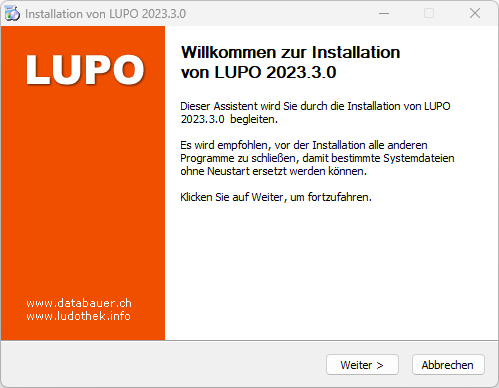

Klicken Sie auf **Weiter** ⭢ bis folgendes Fenster angezeigt wird:

Ist unter Komponenten LUPO 11 entfernen angewählt so wird der Programmordner (C:\Lupo11) und die Access Runtime Installation vor der Installation von LUPO 11 entfernt. Benutzer Dateien (Datenbank und Logos) bleiben dabei erhalten. Dasselbe gilt für eine allfällige ältere LUPO-Installation.

Zusammen mit LUPO kann optional auch die Software für EPSON Bondrucker (detaillierte Informationen dazu sind in der separaten Anleitung zu finden), WinRAR (ein Tool zum Öffnen von LUPO-Datensicherungen) und der Adobe Reader (um pdf-Dateien anzuzeigen) installiert werden. Aktivieren Sie dazu im Dialog Komponenten auswählen die gewünschten Komponenten.

#### Der Installationsassistent erstellt folgende Ordner:

| Ordner | Funktion |
| ------ | ----------- |
|C:\Lupo12 | Das Programmverzeichnis: Hier sind alle von LUPO benötigen Dateien gespeichert. |
|C:\Lupo_Daten | Das Datenverzeichnis mit Ihren persönlichen Daten: Die Datenbank mit den Adressen, Ausleihen, Spielen usw. (Lupo12_Daten.accdb) und die Logo-Dateien sind hier gespeichert. |
|C:\Lupo_Daten\Spiele-Fotos | Im diesem Unterordner werden die Fotos der Spiele gespeichert |

---
# Daten Update'

---

## Office-Updates Dialog beim ersten Start:

Falls Microsoft Office 2010 vor der LUPO-Installation noch nie gestartet wurde erscheint beim ersten Start von LUPO ein Fenster Microsoft Office schützen und verbessern. Wählen Sie Empfohlene Einstellungen verwenden oder Nur Updates installieren.

##Daten einer alten LUPO Installation übernehmen

LUPO 2019 kann nicht mit den Original-Daten einer Vorgängerversion arbeiten. Deshalb muss die Daten-Datei einmalig ins aktuelle Datenbank-Format (accdb-Datei) konvertiert werden.
Starten Sie dazu das LUPO Update Programm ( -Taste drücken, dann nach LUPO Daten-Update suchen):

Normalerweise müssen hier keine Einstellungen angepasst werden. Klicken Sie auf  Tabellenupdate STARTEN um den Vorgang auszuführen.
Erscheint nachstehende Meldung und Sie bestätigen diese mit Ja,dann wird eine bereits vorhandene LUPO 2019 Daten-Datei überschrieben.

!! Beachten Sie das Updateprotokoll. Dort werden allfällige Probleme oder Fehler aufgelistet. Da LUPO 2019 die Daten teilweise ein bisschen anders speichert als bisher, kann es vorkommen, dass einige Datensätze nicht importiert werden können. Dabei handelt es meistens um verwaiste und somit nicht mehr benötigte Daten. (z. B. die Tabelle ‚Adressen Kinder‘ enthält oftmals solche Datensätze)

Nun sollten Sie das LUPO-Programm starten und kontrollieren, ob Ihre Daten übernommen wurden und ob es sich dabei um die aktuelle Datenbank handelt.

!!! Überprüfen Sie ob auch wirklich alle alten LUPO 8/9/10/11 Desktop-Verknüpfungen entfernt wurden. Falls die alte Version beim Start von Windows automatisch gestartet wurde, muss die Verknüpfung in Autostart-Programmordner eventuell angepasst werden.

---
# Update anzeigen'

---

Etwa alle ein bis zwei Monate erscheint ein Update mit Fehlerkorrekturen und neuen Funktionen. Wenn der Computer mit dem Internet verbunden ist, wird im Übersichtsfenster ein Hinweis eingeblendet:

Mit dem ersten Download Button kann die Update-Datei **direkt** aus LUPO heruntergeladen werden. Bevor der Download startet kann festgelegt werden, ob die Datei gespeichert oder ausgeführt werden soll.

Mit dem zweiten Download Button wird die Webseite **www.ludothekprogramm.ch** geöffnet, auf welcher die Update-Installationsdatei heruntergeladen werden kann. Zudem kann online die komplette Liste aller Korrekturen und Neuerungen (Release-Notes) en werden.

Je nach Browser und Windows-Sicherheitseinstellungen muss noch die eine oder andere Warnung bestätigt werden, bevor die Installationsdatei **Update_Lupo2019_de.exe** ausgeführt werden kann.

!! Das Update kann nur installiert werden, wenn LUPO geschlossen ist. Falls LUPO im Netzwerk verwendet wird muss das Update auf jedem PC installiert werden.

---
# Stammdaten erfassen'

---

## Bevor Sie mit dem Datenerfassen beginnen...

… sollten Sie sich bewusst sein, was Sie erfassen wollen. Überlegen Sie sich, welche Spielkategorien, Alterskategorien, Gebühren und Spielnummer-Kreise benötigt werden. Ein späteres Ändern oder Hinzufügen dieser Daten kann zu einer uneinheitlichen Spieldatenbank führen. Z. B. merken Sie erst während dem Spiele Erfassen, dass Ihnen eine Spielart fehlt. Sie erfassen diese neu. Folglich kann es sein, dass Sie bereits erfasste Spiele der neuen Spielart zugeordnet hätten, wäre diese beim Erfassen bereits vorhanden gewesen.

## Vorgehen beim Erfassen der Stammdaten

1. Ergänzen der Angaben der Ludothekadresse (Diese Adresse wird benötigt und darf nicht gelöscht werden)
2. Erfassen der Altersgruppen, Spielarten, Spielgebühren, Abo-Beiträge, Mahngebühren und der restlichen Einstellungen
3. Anpassen der Briefeinstellungen (Mahnung, Reservationsbrief und Quittung)
4. Passen Sie die Buchungstexte für die Fenster Manuell Buchen und Einzelbuchungen Ihrer Ludothek an
5. Erfassen der Adressen und Spiele
6. Kontobestände einbuche

---
# Stammdaten Beispiele'

---

## Stammdaten Beispiele

Bevor Sie mit dem Erfassen der Spieldaten beginnen, sollten Sie wissen, welche Spieleigenschaften Sie vergeben wollen. Hier sehen Sie wie die Tabellen der Spielgebühren und -arten aussehen könnte.

### Spielgebühren

| **Gebühr** |  **Spielpreiskategorie** |
| --- 		 | --- 						|
| 0.50 |  Kaufpreis < 10.00 |  
| 1.00 |  Kaufpreis 10.00 - 50.00 |  
| 2.00 |  Kassetten |  
| 2.00 |  Kaufpreis 51.00 – 100.00 |  
| 3.00 |  Kaufpreis 101.00 – 150.00 |  
| 4.00 |  Kaufpreis 151.00 – 200.00 |  
| 5.00 |  Kaufpreis 201.00 – 250.00 |  
| 6.00 |  Kaufpreis 251.00 – 300.00 |  
| 7.00 |  Kaufpreis 301.00 – 350.00 |  
| 8.00 |  Kaufpreis > 350.00 | 

Es kann von Vorteil sein, eine Gebühr doppelt zu erfassen (im Beispiel Fr. 2.00 für Kassetten). So halten Sie sich die Möglichkeit offen, zu einem späteren Zeitpunkt die Gebühr der einen Preiskategorie (nur die Kassetten kosten neu Fr. 3.00, die anderen Spiele bleiben Fr. 2.00) zu erhöhen ohne die andere, zuvor gleich teure Gebühr zu ändern.

### Spielarten

| **Nummer** |  **Spielart** |
| --- 		 | --- 						|
| 1000 |  Fahrzeuge / Spiele für draussen |  
| 2000 |  Bauspiele |  
| 3000 |  CD-ROM |  
| 3000 |  Elektronische Spiele |  
| 4000 |  Für die Kleinen |  
| 5000 |  Gesellschaftsspiele |  
| 6000 |  Kassetten |  
| 7000 |  Konstruktionsspiele |  
| 7500 |  Musik |  
| 8000 |  Puzzle / Geduld |  
| 8500 |  Spielen - Lernen |  
| 9000 |  Werken / Basteln |  
| 10000 |  Spielkiste / Geburtstagskiste | 

Der einer Spielart zugeordnete Nummernkreis dient lediglich zum Berechnen der Nummer eines neuen Spiels. Es ist jedoch auch möglich, ein Spiel mit der Nummer 1234 (1000er = Aussenspiele) der Gruppe 5000 (Gesellschaftsspiele) zuzuordnen.

Wenn Sie eine neue Spieleigenschaft erfassen wollen, welche zwischen zwei bestehenden liegt (z.B. 4500) dann müssen Sie diese in ein neues, leeres Feld unten in der Liste erfassen. **Fügen Sie die neue Gruppe NICHT in der Mitte der Liste ein**, indem Sie eine bestehende Gruppe überschreiben. Würde 5000 mit 4500, 6000 mit 5000 usw. überschreiben werden wären alle bisherigen 5000er Spiele neu der Kategorie 4500 zugeordnet.

### Spielnummer-Vergabe

**Vergeben Sie die Spielnummern der 1000er Gruppen fortlaufend.**

Es ist nach meinem Erachten nicht sinnvoll die Spielnummer sprechend zu machen. Nach VSL-Vorgabe zeigt die erste Ziffer (1000er Stelle) die Spielart an, die zweite (100er) die Altersgruppe. Nach dieser Variante können Nummernbereiche schnell aufgefüllt sein und das Erfassen ist aufwendiger. Der sicher einfachste Weg ist die fortlaufende Nummerierung, speziell dann, wenn Sie mit Barcode arbeiten und die Nummern sowieso keine grosse Rolle mehr spielen.

---
#Installation
---

---
# LUPO Starten'
---

| Verknüpfung | Programm |
| ------------- | ------------- |
| LUPO |  LUPO, das Ludothekprogramm. Gleiche Verknüpfung wie auf dem Desktop. |  
| LUPO Datensicherung |  Zurücklesen (Wiederherstellen) von Datensicherungen |    
| LUPO Daten-Update |  Konvertiert die LUPO Datenbank ins aktuelle Format. Nötig beim Update. | 
| LUPO Installation reparieren |  Falls LUPO nicht mehr gestartet werden kann hilft dies oftmals |  
| TeamViewer |  Startet die Software für eine Fernwartung |  

---
#Notizblock

---

Starten Sie **LUPO** mit dem Desktop-Icon oder über das Startmenü Als erstes Fenster öffnet Sich die **Übersicht**, dann darüber der **Notizblock**.

Im Notizblock können allgemeine Informationen wie z. B. das nächste Sitzungsdatum der Ludothek vermerkt werden. Ist das Kontrollkästchen Notizblock beim Start anzeigen angewählt, wird der Notizblock beim nächsten Start von LUPO automatisch geöffnet. Um den Notizblock erneut zu öffnen, muss der entsprechende Knopf in der Symbolleiste gedrückt werden.

---
#Übersicht

---

Die **Übersicht** wird automatisch beim Starten von **LUPO** geöffnet. Sie kann auch via [Menüband](/start/menuband-symbolleiste) oder mit der Taste <kbd>F12</kbd> geöffnet werden.

Die Übersicht besteht aus fünf Seiten: Der **Hauptübersicht, Stammdaten, Drucken, Buchhaltung** und der **Einstellungen** Übersicht. Sie können von jeder Unterseite wieder zur Hauptübersicht zurückkehren.
* Spiele Ausleihen/Zurücknehmen
* Spiele, Adressen und Mitarbeiter
    * Spiele erfassen
    * Adressen erfassen
    * Mitarbeiter
    * Arbeitszeiten
* Listen und Etiketten drucken...
    * Spielinhalte drucken
    * Spiel Barcode-Etiketten drucken
    * Kunden Barcode-Etiketten drucken
    * Mahnungen drucken
    * Reservationen drucken
* Buchhaltung
    * Tagesjournal speichern und drucken
    * Konto auswerten (Kontenblätter anzeigen)
    * Kontobestände
    * Manuell buchen (mit Vorgaben)
    * Manuell buchen (Individuell)
    * Buchungstexte bearbeiten
* Statistik und Listen
* Einstellungen
    * Programmeinstellungen
    * Briefeinstellungen
    * Netzwerkeinstellungen
    * Passwörter
    * LUPO registrieren
    * Übungsversion
---
#Übungsversion

---

Meistens lernt man ein Computerprogramm am einfachsten kennen, indem man die verschiedenen Funktionen ausprobiert und mit dem Programm spielt. Deshalb besteht in LUPO die Möglichkeit mit Übungsdaten zu arbeiten. Damit Sie auf keinen Fall versehentlich in der Übungsversion arbeiten oder umgekehrt, unterscheiden sich die beiden Versionen durch das Übersichtsbild Übungsversion anstelle dem Logo ihrer Ludothek und die Fenster-Titelbalken werden **rot anstatt blau oder grau** dargestellt.

Das Übersichtsfenster mit aktivierten Übungsdaten

---
# Übungsdaten starten / verlassen'

---

Die Übungsversion kann über den Menübefehl **Übungsdaten** aktiviert bzw. desaktiviert werden.

Ist das Häkchen gesetzt, dann wird die aktuelle Daten-Datenbank in die Übungsversion kopiert.

Die Übungsversion verlassen um wieder mit den „echten" Daten zu arbeiten.

#### Übungsdaten beim Starten von LUPO

Bevor beim Start von LUPO die Übungsdaten geladen werden erscheint folgende Warnung:

Klicken Sie auf Ja um mit den 'richtigen' Daten zu arbeiten oder wählen Sie Nein um weiterhin mit den Übungsdaten zu spielen.

---
# Menüband / Symbolleiste'

---

Das LUPO-Menüband (Ribbon) bietet direkten Zugriff auf die wichtigsten Fenster und Funktionen.

Im Tools-Tab liegen Funktionen zur Sortierung von Datenblättern und zur Formatierung von Rich-Text Feldern.

Wenn ein Bericht geöffnet ist wird das Menüband Seitenansicht angezeigt. Hier finden Sie Funktionen um die Seite und Druckausgabe anzupassen. Mit den Befehlen der Gruppe Daten-Export kann der Seiteninhalt als pdf-, Word- oder Excel-Datei gespeichert werden.

Das Menüband kann eingeklappt werden. Um die Anzeige wiederherzustellen muss auf den Pfeil links im Fenster geklickt werden:

---
# Allgemeine Bedienung'

---

#### Fenster schliessen (Registerkarte)

Das X rechts auf Höhe der Registerkarten schliesst das Fenster.

#### Statusleiste

Die Statusleiste befindet sich am unteren Bildschirmrand. Dort wird für die meisten Steuerelemente eine kurze Beschreibung angezeigt.

#### Datensatz-Navigator

Mit diesen Steuerelementen kann zwischen dem ersten, vorherigen, nächsten und letzten Datensatz im aktuellen Datenblatt geblättert werden. Die Schaltfläche  erstellt einen neuen Datensatz.

#### Rich-Text Felder

Einige Textfelder – z.B. das Spielmemo oder der Spielinhalt – können formatierten Text enthalten. Sobald Text markiert wird, wird eine Symbolleiste zum Formatieren eingeblendet:

#### Kalender

Immer wenn hinter einem Datum das Kalendersymbol angezeigt wird können Sie durch Klicken den Kalender öffnen. Mit Heute wechseln Sie im Kalender zum aktuellen Datum, mit Übernehmen wählen Sie das angwählte Datum aus.

Ferientage werden im Kalender rot dargestellt

#### Barcodes

Strichcodes können in folgenden Fenstern eingelesen werden:

Adress-Strichcodes: **Ausleihfenster, Adressen, Adressen Suchen**

Spiel-Strichcodes: **Ausleihfenster, Spiele, Spiele Suchen**

#### Auswahlfeld / Kombinationsfeld

Das Feld kann mit der Maus oder durch Drücken der <kbd>F4</kbd>-Taste aufgeklappt werden. Wenn Sie in ein leeres Auswahlfeld schreiben, wird der angezeigte Eintrag durch drücken von <kbd>Enter</kbd> ausgewählt. Es gibt zwei Arten von Auswahlfeldern: Die einen lassen jede Texteingabe zu, die andern erlauben nur Eingaben aus der vorhandenen Auswahl.

#### Bedienung mit der Tastatur

In Windows gibt es wichtige Tastaturbefehle, welche in fast jedem anderen Programm verwendet werden können und die Bedienung erleichtern. Darunter zählen unter andern:

<kbd>Ctrl</kbd> + <kbd>c</kbd> um die Markierung in die Zwischenablage zu kopieren.

<kbd>Ctrl</kbd> + <kbd>x</kbd> um die Markierung auszuschneiden und in die Zwischenablage zu kopieren.

<kbd>Ctrl</kbd> + <kbd>v</kbd>um den Inhalt der Zwischenablage einzufügen.

<kbd>Ctrl</kbd> + <kbd>f</kbd> öffnet das Suchfenster, nützlich in einem Datenblatt.

<kbd>Ctrl</kbd> + <kbd>h</kbd> öffnet das Suchen und Ersetzen Fenster, nützlich in einem Datenblatt.

<kbd>Ctrl</kbd> + <kbd>z</kbd> um die letzte Aktion rückgängig zu machen

<kbd>Ctrl</kbd> + <kbd>a</kbd> um alles auszuwählen.

<kbd>ESC</kbd> um die letzte Eingabe rückgängig zu machen und teilweise um ein Fenster zu schliessen.

<kbd>ESC</kbd> <kbd>ESC</kbd> um alle Änderungen in allen Feldern desselben Datensatzes rückgängig zu machen.

---
# Datenblatt filtern und sortieren'

---

Datenblätter enthalten eine tabellarische Darstellung von Daten. Der angezeigte Inhalt kann sortiert und mit einem Filter eingeschränkt.

Um eine Spalte zu Filtern oder um die Datensätze zu sortieren kann auf den kleinen Pfeil im Spaltentitel geklickt werden.

Um den Filter zu entfernen klicken Sie auf den Knopf Gefiltert im Datensatznavigator:

Mit dem Feld Suchen kann nach Text im Datenblatt gesucht werden. Schreiben Sie dazu ihr Suchbegriff in das Textfeld und navigieren dann durch mehrfaches drücken von <kbd>Enter</kbd> zu den einzelnen Datensätzen welche den Suchbegriff enthalten.

**Hinweis**  
Die Filter- und Sortiereinstellungen gehen nach dem **Schliessen** des Formulars **verloren!**

**Tipp**  
**Nutzen Sie diese Filter- und Sortierfunktionen!** Es sind vielseitig einsetzbare und einfach zu handhabende Funktionen. Sie können so zum Beispiel in den Listen des **Statistikfensters** die Daten sortieren und filtern um sie nachher via Zwischenablage in Excel zu kopieren um dort Summen zu berechnen, Diagramme zu erstellen usw.

#### Datensätze markieren

Datensätze können durch Klicken auf den Datensatzmarkierer links im Datenblatt ausgewählt werden, um diese anschliessend zu kopieren oder löschen.

---
# Adresse Suchen'

---

Das **Adresse suchen** Fenster kann via dem **Menüband** oder dem Feldstecher-Button geöffnet werden.

Schreiben Sie in die gelben Felder das Suchkriterium für die entsprechende Spalte. Starten Sie die Suche indem Sie auf Suchen klicken. Die Liste kann durch einen Klick auf den Knopf im Spaltentitel entsprechend sortiert werden.

**Beispiel:** Wird im 'Ort' Suchfeld **z**, und im 'Name' Suchfeld **bau** eingegeben, werden alle Adressen, die mit **z** und **bau** beginnen angezeigt.

Übernehmen schliesst das Such-Fenster und öffnet die Adresse im **Adressen**\- oder **Ausleihen und Zurücknehmen**-Fenster mit der in der Suchliste markierten Adressen. Einen Doppelklick auf eine Adresse in der Suchliste hat die gleiche Wirkung.

Kundengeschichte öffnet den Bericht mit der Kundengeschichte der markierten Adresse in Seitenansicht.

---
#Spielsuchen

---

Das **Spiel suchen** Fenster kann via dem **Menüband** oder dem Feldstecher-Button geöffnet werden.

Schreiben Sie in die gelben Felder das Suchkriterium für die entsprechende Spalte. Starten Sie die Suche indem Sie auf Suchen klicken. Die Liste kann durch einen Klick auf den Knopf im Spaltentitel entsprechend sortiert werden.

**Beispiel:**Wird im Bezeichnung Suchfeld **game** eingegeben, werden alle Spiele, die mit dieser Bezeichnung beginnen (wie Game Boy, ...) angezeigt.

#### Spielnummer mit *

Bei Spielnummern mit einem * (z.B. 3012*) am Schluss der Nummer handelt es sich um eSpiele.

#### Ausleihstatus (Rückgabedatum)

Wählen Sie aus, welche Spiele in der Liste angezeigt werden sollen. Ist Aktuelle ausgewählt werden alle Spiele, welche nicht liquidiert sind, angezeigt. Durch Drücken des Diskettensymbols wird die Auswahl als Vorgabe für das nächste Öffnen des Fensters gespeichert.

Übernehmen: schliesst das Fenster und aktualisiert das Spiel im **Spiele**\- oder **Spiele Ausleihen und Zurücknehmen** Fenster mit dem in der Suchliste markierten Spiel. Einen Doppelklick auf ein Spiel in der Suchliste hat die gleiche Wirkung.

Spieldetails anzeigen öffnet ein Fenster mit detaillierten Informationen zum Spiel.

---
#Start
---

# Start


<a href="{{p.url}}"><h5>{{ p.title }}</h5></a>


---
# Ausleihen und zurücknehmen'

---

Das **Spiele ausleihen und zurücknehmen** Fenster können Sie mit der Übersicht oder der Symbolleiste öffnen.
* Die wichtigsten Aktionen, welche Sie in diesem Fenster durchführen können sind:
    * Spiele ausleihen und zurücknehmen
    * Spiele verlängern
    * Spiele reservieren
    * Abonnement (Mitgliederbeitrag) verkaufen
    * Dem Kunden einen Betrag verrechnen oder zurückerstatten
    * Gutscheinkarte (Vorauszahlung) verkaufen und einlösen
    * Die Adressdaten des Kunden verändern
    * Einen neuen Kunden erfassen

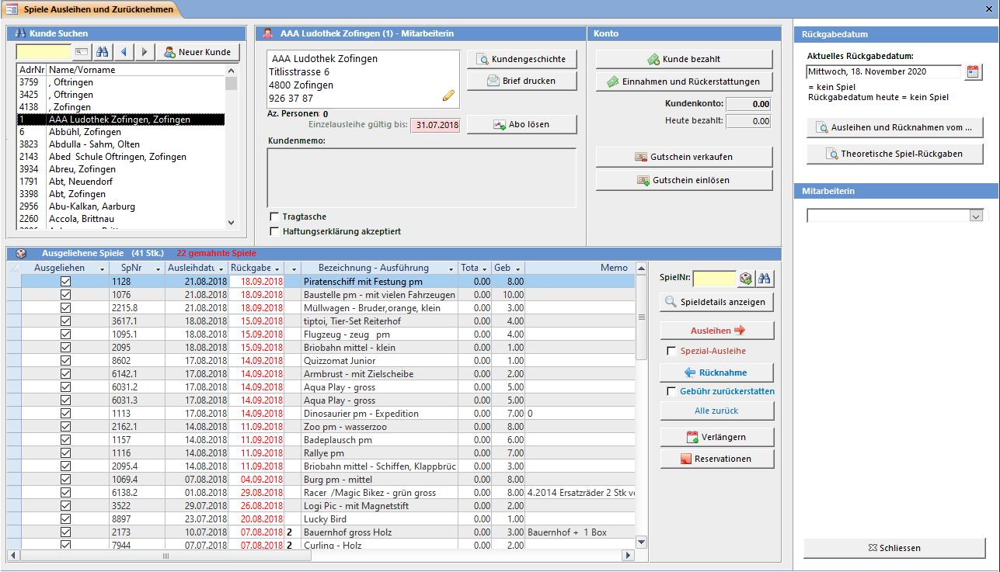

#### Rückgabedatum bestimmen (Stempeldatum)

Die Spiele, welche Sie ausleihen, erhalten das im Feld Aktuelles Rückgabedatum eingetragene Datum. Das Rückgabedatum wird standardmässig auf **[heute] + [Anzahl eingestellte Tage]** vorgeschlagen. Die Anzahl der vorgeschlagenen Ausleihtage können Sie in den **Einstellungen → Ausleihen** ändern. Sie können das vorgeschlagene Rückgabedatum auf ein x-beliebiges Datum ändern. Doppelklicken Sie auf das Datum um den **Kalender** zu öffnen.

Unter dem Rückgabedatum werden die Anzahl Spiele angezeigt, welche heute ausgeliehen wurden. In der zweiten Zeile bei Rückgabedatum heute wird die Summe der Spiele, welche theoretisch am heutigen Tag zurückgebracht werden angezeigt.

!!! Wenn ein Spiel nicht die Normalausleihdauer (meistens 28 Tage) hat, wird das Rückgabedatum immer aus **[heute] + [Anzahl Ausleihtage des Spiels]** berechnet.

#### Rückgabedatum fällt vor oder in die Ferien

Wenn das automatisch berechnete Rückgabedatum kurz vor oder in die Ferien fällt, erscheint eine Meldung.

! **Einstellung Ferienplan**  
! Der Ferienplan kann in den Allgemeinen Programmeinstellungen definiert werden.

#### Alle Ausleihen und Rücknahmen von …

Dieser Knopf zeigt eine Liste mit den Spielausleihen und -rücknahmen eines bestimmten Datums an.

#### Theoretische Spiel-Rückgaben

Zeigt jedes Rückgabedatum und die Anzahl der zu erwartenden Spiel-Rückgaben an.

#### Mitarbeitern

Die am PC arbeitende Mitarbeiterin. Die hier eingetragene Person wird zu jeder Ausleihe, Rückgabe oder Buchung gespeichert.

Ist in den Einstellungen im Reiter Mitarbeiterinnen die Option Erfassen welche Mitarbeiterin Spiele ausleiht und zurücknimmt aktiviert, dann ist diese Information Pflicht. Wenn keine Person ausgewählt ist, dann erscheint vor der Ausleihe folgendes Fenster:

#### Spielliste des Kunden

Die Liste mit den ausgeliehenen Spielen des aktuellen Kunden zeigt verschiedene Farbcodes an.

| **Farbe** |  **Status** |
| --- |---				  |
| Ausleihdatum blau |  Das Spiel wurde heute ausgeliehen |  
| Ausleihdatum pink |  Die Ausleihfrist wurde verlängert |  
| Rückgabedatum orange |  Die Ausleifrist ist abgelaufen, es wurde aber noch nicht gemahnt |  
| Rückgabedatum rot |  Das Spiel wurde gemahnt |  
| Spielname grün |  Dies ist ein eSpiel |  
| Memo gelb |  Ersatzteile sind vorhanden |  
| Memo rot |  Das Spiel ist reserviert | 

---
# Kunden suchen und erfassen'

---

Alle Aktionen (wie Abo lösen, Spiel ausleihen, reservieren, ...) die Sie im Fenster Spiele ausleihen und zurücknehmen ausführen, beziehen sich auf den rechts im Fenster angezeigten Kunden. Die linke Seite mit der Adressliste dient zum Suchen bestehender und Erfassen neuer Adressen.

Sie können den Nachnamen, Vornamen, Ort oder einen Teil davon oder die Adressnummer in das Suchfeld eingeben. Durch Drücken von <kbd>Enter</kbd> oder des Such-Buttons rechts vom Suchfeld wird die Suche gestartet. Wählen Sie den gewünschten Name durch klicken in die Suchergebnisliste aus.

**Phonetische Suche:**  
Wenn Sie einen Namen falsch eintippen und die Suche nichts findet wird automatisch ein zweite phonetische Suche gestartet. So wird bei einer Suche nach Abüehl trotz falscher Schreibweise der Name Abbühl gefunden.

Wenn Sie Kundenkarten mit Barcodes verwenden kann irgendein Feld im Ausleihfenster aktiv sein wenn Sie den Strichcode einscannen. Der Cursor muss dazu nicht vorher in das Kunden-Suchfeld gesetzt werden.

Die Feldstecher-Taste öffnet das Suchfenster, mit den Pfeiltasten können Sie in den bereits angezeigten Kunden vor und zurückblättern.

Wenn Sie ein **Spiel zurücknehmen**, wechselt das Programm automatisch zum Kunden, welcher das Spiel zurückbringen will. Es ist nicht notwendig, die Adresse vor der Rücknahme durch Suchen anzuzeigen.

Wird die Adressnummer eines gelöschten Kunden eingeben, erscheint folgende Meldung:

#### Neuer Kunde erfassen

Der Knopf Neuer Kunde öffnet das Fenster um eine Adresse zu erfassen. Die Adressnummer wird automatisch vorgeschlagen, kann aber verändert werden.

Ist das Kontrollkästchen **Nach dem Speichern der Adresse ein Abo lösen** aktiviert, so öffnet sich automatisch das **Abo lösen** Fenster.

Barcode drucken wird angezeigt, wenn Sie die Barcodes mit dem Etiketten-Drucker ausdrucken.

Das LUPO-Programm prüft während der Eingabe der Adresse ob ein Duplikat vorhanden ist. Stimmen Name, Vorname und Strasse mit einer bereits gespeicherten Adresse überein, so erscheint folgende Meldung:

Merken Sie sich die Adressnummer und brechen die Erfassung des Kunden ab.

---
#Kundendaten

---

Bei der im weissen Adress-Feld angezeigten Adresse handelt es sich jeweils um den aktiven Kunden.

#### Kundenmemo

Bei Kunden mit Text im Memofeld wird dieses rot dargestellt. Um ein neues Memo zu schreiben oder ein bestehendes zu bearbeiten einfach in das Feld klicken.

Schreiben Sie am Anfang des Memos ein ! (Ausrufezeichen), um das Memo beim Aufruf des Kunden in einem separaten Fenster angezeigt zu bekommen:

! **Automatische Kundenmemos**  
! Beim Mahnen wird automatisch ein Memo geschrieben. Die kann in den Einstellungen deaktiviert werden.

Der Knopf  Kundengeschichte zeigt alle Adressdetails und alle jemals vom Kunden ausgeliehenen Spiele an.

Mit  Bon Drucken  wird ein Bon auf den Kassendrucker ausgegeben. Normalerweise muss dieser Knopf nicht gedrückt werden da der Bon automatisch beim Bezahlen ausgedruckt wird.

#### Brief drucken

Sie haben die Möglichkeit einen Brief mit den Ausleihen und optional den dazu angefallenen Kosten (Abonnement, Reservation, ...) auszudrucken.

Um den Brieftext zu ändern muss in den **Briefeinstellungen** der Textkörper Quittung angepasst werden.

Wird der Brieftext abgeändert speichert LUPO diesen und er wird beim nächsten Öffnen des Fensters wieder angezeigt. Mit Standard-Texte laden werden die in den Brief-Einstellungen definierten Texte geladen.

#### Abonnement lösen

Damit der Kunde Spiele ausleihen kann, muss er ein gültiges Abo besitzen (Falls ein gültiges Abo zur Ausleihe nicht zwingend ist, muss dies in den Einstellungen, Registerkarte Beiträge definiert werden).

Sie müssen sich keine Gedanken darüber machen, ob der Kunde ein gültiges Abo hat oder nicht. Sobald Sie ein Spiel an jemanden ausleihen möchten, dessen Abo abgelaufen ist, öffnet sich automatisch das Fenster zu erneuern des Abos:

Die Gültigkeitsdauer und Preise können in den **Einstellungen** definiert werden.

Hat der Kunde den Jahresbeitrag bereits per Einzahlungsschein bezahlt, so kann das Häkchen Dem Kunden nichts verrechnen aktiviert werden. Soll diese Funktion nicht zur Verfügung stehen, so kann diese in den Einstellungen deaktiviert werden.

Der Verkauf eines Abos kann durch Drücken der Zurücktaste rückgängig gemacht werden. Diese Funktion steht nur einmal für das zuletzt verkaufte Abo zur Verfügung.

---
# Spiele ausleihen'

---

Die Spiele, welche Sie ausleihen, werden der Spielliste des aktuellen Kunden hinzugefügt.

#### Ausleihen Button

Leiht das in das Spielnummerfeld eingetragene Spiel aus. Klicken Sie dazu auf den Ausleihen Button oder drücken Sie die <kbd>Enter</kbd>-Taste.

Falls Sie mit Barcodes arbeiten kann beim Einscannen irgendein Feld im Ausleihfenster aktiv sein. Der Cursor muss vor dem Scannen nicht in das Spiel-Suchfeld gesetzt werden.

! **Verhalten der Enter-Taste**  
! Ob Spiele mit <kbd>Enter</kbd> ausgeliehen oder zurückgenommen oder immer ausgeliehen werden kann unter **Einstellungen → Ausleihen → Spiele Ausleihen / Zurücknehmen** definiert werden.

#### Einschränkung Anzahl Spiele

Die maximale Anzahl Spiele und / oder eSpiele pro Kunde kann eingeschränkt werden. Die Anzahl ist beim Abo vorgegeben und wird beim Verkauf eines solchen beim Kunden gespeichert. Beim Überschreiten der definierten Anzahl erscheint folgende Meldung:

#### Spezial-Ausleihe

Mit Hilfe einer Spezial-Ausleihe kann ein Spiel mit einer **veränderten Ausleihdauer und einer veränderten Gebühr** in einem Schritt ausgeliehen werden.

Durch Drücken auf den Knopf  Spezial Ausleihe  oder wenn das Häkchen Spezial-Ausleihe aktiviert ist, wird vor der Spielausleihe folgendes Fenster angezeigt:

Die zur Auswahl stehenden Spezial-Ausleihen können in den Einstellungen definiert werden. Ist nur eine aktive Spezial-Ausleihe definiert, so wird diese beim Ausleihen automatisch angewandt und das Fenster nicht angezeigt.

#### Einzelteil Ausleihe

Wenn beim Spiel die Eigenschaft Einzelteil gesetzt ist, erscheint beim Ausleihen folgender Dialog:

Geben Sie die Anzahl Stück ein und drücken Sie  Ausleihen . Die Spielgebühr wird mit der Stückzahl multipliziert und dem Kunden verrechnet. Die Anzahl wird ins Spielkind-Memo geschrieben.

#### Stempeldatum manuell ändern

Manchmal ist es notwendig, das Rückgabedatum zu verändern, ohne das Spiel zu verlängern (eine Verlängerung ist normalerweise kostenpflichtig). Doppelklicken Sie auf das Ausleih- oder Rückgabedatum in der Spielliste um folgendes Fenster angezeigt zu bekommen:

Nachdem Sie das Rückgabedatum verändert haben, wird das Mahndatum automatisch neu berechnet.

Aktivieren Sie Alle Spiele mit diesem Rückgabedatum ändern um die restlichen Ausleihdaten des aktuellen Kunden auch anzupassen. Hat ein Spiel eine spezielle Mahnfrist, so wird dies berücksichtigt.

---
# Spiele zurücknehmen'

---

Tragen die Spielnummer in das Spielnummernfeld ein und drücken dann den Button  Rücknahme oder <kbd>Enter</kbd>. Es wird automatisch zum Kunden, welcher das Spiel ausgeliehen hat, gewechselt.

#### Zurücknehmen

Die Spiele können auch durch „abhaken" in der **Kundenspielliste** einzeln zurückgenommen werden oder indem Sie die Spielnummer ins Spielnummernfeld schreiben und auf den Knopf Rücknahme drücken.

Ist das Spiel an einen anderen Kunden als dem aktuell angezeigten ausgeliehen so wechselt LUPO automatisch zum Kunden welcher das Spiel ausgeliehen hat

  
! Wenn Sie die Spielnummer in das Spielnummernfeld eingetragen haben drücken Sie <kbd>Enter</kbd>. Je nachdem ob das Spiel ausgeliehen oder in der Ludo liegt wird durch <kbd>Enter</kbd> der Ausleihen oder der Zurücknehmen Button betätigt. (Gilt nur, wenn in den Einstellungen unter **Einstellungen → Ausleihen → Erweitere Ausleiheinstellungen** die <kbd>Enter</kbd>-Taste zum Zurücknehmen von Spielen erlaubt ist.)

#### Häkchen „Gebühr zurückerstatten"

Setzen Sie dieses Häkchen, wenn die Ausleihgebühr beim Zurücknehmen dem Kunden zurückerstattet werden soll.

#### Alle zurück

Es werden alle Spiele des aktuellen Kunden zurückgenommen (Es gibt eine Einstellung um diesen Knopf auszublenden).

#### Rückgabedatum entspricht dem Ausleihdatum

Wenn Sie ein Spiel am gleichen Tag zurücknehmen, an welchem Sie dieses ausgeliehen haben, dann erscheint folgende Meldung:

Wenn Sie auf Ja klicken wird das Spiel zurückgenommen und die Ausleihgebühr dem Kunden zurückerstattet. Klicken Sie auf Nein, wird das Spiel ebenfalls zurückgenommen, jedoch bleibt die verrechnete Ausleihgebühr dem Kundenkonto belastet. Mit Abbrechen bleibt das Spiel ausgeliehen.

---
# Ausleihdauer Verlängern'

---

Klicken Sie auf Verlängern im Spiele Ausleihen und Zurücknehmen Fenster um den folgenden Dialog angezeigt zu bekommen:

Falls reservierte Spiele vorhanden sind erscheint zuerst folgende Meldung:

Danach sind in der Spalte Info die Besonderheiten wie Ferien oder Reservationen des Spieles ersichtlich.

Der Knopf Markierte Spiele verlängern am unteren Fensterrand ändert das Rückgabedatum der markierten Spiele auf das beim Spiel in der Spalte Verlängern bis aufgelistete Datum.

Die Spielgebühr wird dem Ausleihkonto verrechnet, ist dieses leer **(Null)**, dem Kundenkonto.

#### Spezielle Verlängerungen

Klicken Sie auf Spezielle Verlängerungen um weitere Optionen zur Verlängerung anzuzeigen. Um eine spezielle Verlängerung anzuwenden, verwenden Sie den entsprechenden Knopf.

!!! Beachten Sie auch Möglichkeiten in den **Einstellungen → Ausleihen**. Je nach Konfiguration wird das neue Rückgabedatum aus dem alten + 28 Tage berechnet oder es wird das aktuell eingestellte Stempeldatum verwendet.

Wenn Sie ein Spiel nur für wenige Tage verlängern wollen, können Sie dies auch über die Funktion **Rückgabedatum manuell ändern** tun. Dabei wird dem Kunden keine Gebühr verrechnet.

---
# Spiele reservieren'

---

Sie können Spiele auf den im Fenster **Spiele ausleihen und zurücknehmen** angezeigten Kunden reservieren. Geben Sie die Spielnummer in das Feld ein, und drücken Sie den Reservieren Button.

Eine Reservation kann sich auf mehrere Spiele beziehen. Es kann nicht nur ein einzelnes Spiel, sondern die ganze Spielfamilie (3371.X), oder nur bestimmte davon auf eine Reservation genommen werden.

Sobald das erste aller reservierten Spiele (einer Reservation) eintrifft, gelten die andern als nicht mehr reserviert.

#### Spielnummer

Nummer der Spielfamilie. Verwenden Sie das Spielsuchfenster um eine Spielnummer aus der Liste auszuwählen.

#### Reservieren ab

Aktuelles Datum (voreingestellt = heute) Ab diesem Datum beginnt die Reservation. Wird das reservierte Spiel vor diesem Datum ausgeliehen, gilt es als nicht reserviert und es erscheint auch keine Meldung beim Ausleihen. Ist ein Spiel mehrmals reserviert, wird die Reservation mit dem ältesten Reservationsdatum zuerst berücksichtigt.

#### Spielfamilie / Spielkinder

Es kann die gesamte Spielfamilie oder ein Spielkind aus der Liste reserviert werden. In der Liste werden alle Spiele der Spielfamilie angezeigt. Die Liste enthält die Spielkinder mit Nummer, Ausführung und dem **(soll)** Rückgabedatum. Ist das Spiel nicht ausgeliehen, wird in Ludothek! angezeigt.

Um ein einzelnes, oder mehrere einzelne Spiele zu reservieren, müssen die entsprechenden Spielkinder in der Liste markiert werden.

#### Kosten

Die Kosten für die Reservation beim Erstellen der Reservation. Neben diesem kann auch ein Betrag beim Ausleihen des reservierten Spiels verrechnet werden.

#### Reservation löschen

Löscht die in der Liste markierte Reservation. Bei einer Spielfamilienreservation wird die ganze reservierte Familie gelöscht.

#### Reserviertes Spiel trifft ein

Sobald ein reserviertes Spiel eintrifft, erscheint eine Meldung auf dem Bildschirm:

Wenn Sie diese Meldung mit Ja bestätigen kann ab jetzt der Mitteilungsbrief (Spiel ist eingetroffen) an den Kunden gedruckt werden. Das Spiel gilt als so lange reserviert, wie in den **Einstellungen → Ausleihen** eingetragen ist.

Falls ein Bondrucker angeschlossen ist, kann ein jetzt ein Bon mit Informationen zur Spielreservation ausgedruckt und am Spiel befestigt werden.

---
# Kunden- und Ausleihkonto'

---

Jeder Kunde hat zwei Konten, ein Kundenkonto und ein Ausleihkonto. Das Geld auf dem Ausleihkonto wird über das Einlösen eines Gutscheins deponiert und kann nur für Ausleihgebühren verwendet werden. Der Kunden¬konto¬stand kann mit dem Knopf Kunde bezahlt auf 0 gesetzt werden. Der Kunde bezahlt in Bar.

! **Einstellung**  
! Das Feld Ausleihkonto und die Knöpfe **Gutschein verkaufen** und **Gutschein einlösen** können im Fenster **Einstellungen → Wertkarte** ein- bzw. ausgeblendet werden.

### Kunde bezahlt

Der Kunde bezahlt 20.00 Fr. Sein Kontostand wird wieder zu 0.00. Bezahlt er einen anderen Betrag, so können Sie diesen in das Textfeld eintragen. Bezahlt er zu wenig wird diese Zahlung als Teilzahlung, bezahlt er zu viel, als Vorauszahlung im Journal eingetragen.

Normalerweise bezahlt der Kunde in Bar und es wird vom Kunden-Debitorenkonto (1100) in die Tageskasse (1000) gebucht. Wurde das Geld aber per Überweisung eingezahlt, so kann das Soll-Konto auf die Hauptkasse (PC- oder Bankkonto) geändert werden.

Falls Sie LUPO mit der Option Bondrucker installiert haben, besteht die Möglichkeit direkt nach dem Bezahlen den Bon auszudrucken.

!!!! Wenn z.B. das Bondrucker-Papier ausgegangen ist, so kann der aktuelle Zustand des Häkchens durch Klicken auf das kleine Diskettenbild gespeichert werden.

### Einnahmen und Rückerstattungen

Mit dem Button Einnahmen und Rückerstattungen öffnen Sie das Fenster **Buchung für Kunde**.

In diesem Fenster kann dem Kunden (z.B. für ein verlorenes Spiel) ein Betrag verrechnet oder gutgeschrieben werden.

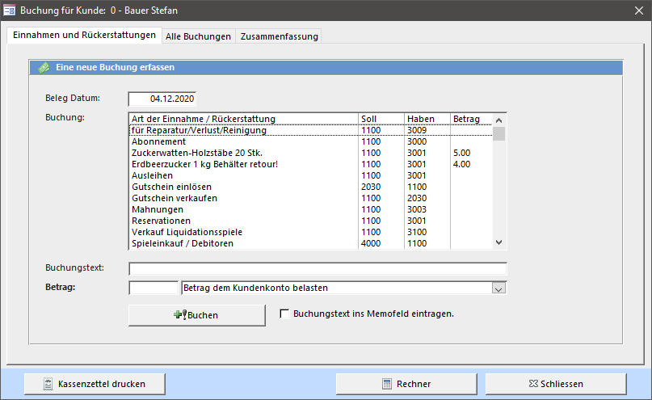

Die Buchungen, welche Sie erfassen werden dem Kunden- oder Ausleihkonto belastet bzw. gutgeschrieben.

Um dem Kunden eine Gutschrift zu machen, wählen Sie im Auswahlfeld rechts des Betrages Betrag dem Kundenkonto gutschreiben oder schreiben Sie eine negative Zahl in Feld.

Buchen speichert die Buchung und verrechnet den Betrag dem Kunden. Der Buchungstext kann automatisch ins Kundenmemo übertragen werden.

! **Einstellung**  
! Die Buchungs-Vorgaben können im Fenster **Übersicht → Buchhaltung → Buchungstexte** bearbeiten definiert werden.

### Liste aller Buchungen

Klicken Sie auf den Reiter Alle Buchungen um die Journaleinträge des aktuellen Kunden angezeigt zu bekommen.

Bei Buchungen von heute wird das Buchungsdatum blau dargestellt.

#### Kassenzettel Drucken

Druckt alle Buchungen eines definierten Zeitraums auf den Bondrucker aus.

#### Markierte Buchung stornieren

Markieren Sie eine Buchung in der Liste und klicken Sie auf den Knopf Markierte Buchung stornieren um die ausgewählte Buchung zu stornieren.

Wird eine Buchung storniert, welche den Kunden- oder Ausleihkontostand des aktuellen Kunden betrifft, so wird dieser angepasst.

!!!! Anstatt eine Buchung zu stornieren, kann auch eine neue Buchung mit einer Gutschrift erfasst werden.

### Gutscheine verkaufen und einlösen

Jeder Kunde hat ein 'normales' Konto mit Bargeld-Schulden oder -Guthaben und ein Ausleih-Konto für vorausbezahlte Ausleihgebühren. Das Ausleih-Konto wird solange mit den Ausleihgebühren belastet bis es aufgebraucht (0) ist. Kauft ein Kunde einen Gutschein, so leistet er eine Vorauszahlung für die Ausleihgebühren. Der Gutschein ist unpersönlich solange sie nicht eingelöst wird.

! **Einstellung**  
! Das Ausleihkonto und die Funktionen zum Verkaufen und Einlösen von Gutscheinen können in den Einstellungen deaktiviert werden.

#### Gutschein verkaufen

Aktivieren Sie das Kontrollkästchen Dem Ausleihkonto von Kunde xxx Verrechnen um den Gutschein direkt dem aktuellen Kunden seinem Ausleihkonto gutzuschreiben.

Falls der Kunde Schulden auf seinem Kundenkonto hat (die Spiele wurden bereits ausgeliehen und erst jetzt will der Kunde eine Gutscheinkarte kaufen) und diese nachträglich mit dem Ausleihkonto bezahlt werden sollen, aktivieren Sie das Kontrollkästchen Bar-Kontostand (Schulden) jetzt dem Ausleihkonto abziehen.

#### Gutschein einlösen

Drücken Sie Gutschein einlösen um dem Kunden eine Gutschrift auf sein Ausleihkonto zu buchen. Geben Sie den effektiven Wert (also inkl. Rabatt) der Karte ein.

#### Manuelle Sammelbuchung für Wertkarten-Verkauf

Sie haben (z.B. am Weihnachtsmarkt) 12 Karten als Geschenk verkauft, Sie wissen also noch nicht wer die Gutschrift einlöst. Wenn Sie diese Einnahmen in die Tageskasse legen müssen Sie das Geld auch verbuchen.

Öffnen Sie dazu das Fenster **Übersicht → Buchhaltung → Einzelbuchung (mit Vorgaben)** und führen Sie folgende Buchung durch.

---
# Spiele ausleihen' 
---

# Spiele ausleihen


<a href="{{p.url}}"><h5>{{ p.title }}</h5></a>


---
# Spiele erfassen und bearbeiten'

---

In LUPO werden die Spiele als Spielfamilien mit Kindern verwaltet. Eine Spielfamilie hat eine Spielnummer, meistens 4- oder 5-stellig. Die Kinder erben diese Familiennummer und kennzeichnen sich durch Ihren Index. Das erste Kind bekommt den Index 0 (Null). Bei Spielnummern mit .0 wird nur die Hauptnummer angezeigt.

Fügen Sie einer Familie alle gleichen oder stark ähnlichen Spiele (andere Ausführung, alt und neu, ...) als Kinder hinzu. Wird ein Spiel ersetzt, dann sollte das neue Spiel als weiteres Spielkind erfasst werden.

Beim Reservieren eines Spiels kann so die ganze Familie reserviert werden. Sobald ein Exemplar der Spielfamilie zurückgebracht wird löst die Reservation aus und die anderen reservierten Spielkinder werden freigegeben.

Das **Spiele erfassen und bearbeiten** Fenster können Sie mit der **Übersicht** oder der **Symbolleiste** öffnen.

#### Spiel suchen

Geben Sie den Spielnamen oder die Spielnummer in das Suchfeld ein. In der Liste unter dem Suchfeld werden alle gefundenen Spiele angezeigt. Wählen Sie das gewünschte aus. Sie können auch Spiele über das Spiele Suchen Fenster suchen.

Unterhalb links werden alle Spielkinder der oben ausgewählten Spielfamilie angezeigt.

#### Der Familiennummer zugeordnet sind:

Diese Felder enthalten Informationen die für alle Spielkinder gelten.

#### Spielfamiliennummer

Spielnummer (Nummer ohne Index). Normalerweise vier- oder fünfstellig.

#### Bezeichnung

Spielname für die ganze Spielfamilie.

#### Spielart

Es können die in den Einstellungen eingetragenen Spielarten ausgewählt werden.

#### Ab Alter

Altersgruppe. Es können die in den Einstellungen eingetragenen Altersgruppen ausgewählt werden.

#### Ausleihdauer (in Tagen)

So viele Tage beträgt die Ausleihdauer eines Spiels. Die Normalausleihdauer welche vorgeschlagen wird, kann in den Einstellungen bestimmt werden.

#### Verlängerbar

Spiele ohne dieses Häkchen können nicht verlängert werden.

#### Hersteller / Verlag

Der Verlag oder Hersteller des Spiels. Alle bereits vorhandenen Einträge stehen zu Auswahl.

#### Spieldauer

Spieldauer in Minuten. Versuchen Sie verschiedene Werte möglichst einheitliche einzutragen.

#### Anzahl Spieler

Anzahl Personen, welche mitspielen können. Erfassen Sie die Anzahl Spieler vor allem bei Spielen, die alleine oder in grossen Gruppen gespielt werden können.

#### Lagerort

Kann das Gestell oder eine andere Angabe zum Aufbewahrungsort des Spiels enthalten.

#### Einzelteile

Wenn Sie Spiele wie Backförmli, Zinngiessfiguren oder ähnliches haben, muss nicht für jedes Stück eine einzelne Nummer gelöst werden. Wenn Sie 50 Stück haben und damit rechnen dass, wenn alle ausgeliehen sind, jeder Kunde im Durchschnitt 5 Stück hat, sollten Sie etwa 10 Spielkinder erstellen. Beim Ausleihen eines Einzelteils erscheint ein Dialog welcher Sie zum Eingeben der Anzahl auffordert. Für jedes Stück wird die Gebühr verrechnet.

#### ProLitteris

Das schweizerische Urheberrechts-gesetz (URG) verlangt die Abgabe eines Teils der von den Benützern bezahlten Entgelte. Davon betroffen sind die Einnahmen aus Ausleihen von Ton- und Tonbildträger sowie Büchern. Bei ProLitteris pflichtigen Spielen wir bei jeder Ausleihe der abgabepflichtige Teil (12%) der Spielgebühr berechnet. (Nachträgliches Berechnen unter **Einstellungen → ProLitteris** möglich)

#### Nicht exportieren

Spiele mit diesem Attribut werden beim Internetexport (XML und HTML) ausgeschlossen.

#### eSpiel

Als eSpiel werden elektronische Spiele, z.B. GameBoy Kassetten oder PS3 CDs verstanden. eSpiele haben keine Ausleihgebühr dafür muss der Kunden zum Ausleihen ein spezielle eAbo besitzen.

#### Memo / Ersatzteile

Ein Feld für Bemerkungen, welche hauptsächlich zur Spieladministration interessant sind. Der hier eingetragene Text ist in der Liste der Spiele im Ausleihfenster nicht direkt sichtbar. Ist das Häkchen Ersatzteile vorhanden gesetzt so ist dies im Ausleihfenster durch einen gelben Hintergrund des Spielkind-Memo ersichtlich.

#### Beschreibung / Ziel

Eine Kurzbeschreibung zum Spiel. Wird im Internetexport eingeschlossen und beim Spiel auf der Website angezeigt. Im Feld Titel kann ein kurzer Text definiert werden der auf der Webseite fett oberhalb der Beschreibung angezeigt wird.

#### Genres / Stichwörter

Genres und Stichwörter zum Spiel. Die Webseiten-Suche in der Spielliste berücksichtigt die hier eingetragenen Werte. Bei den Genres kann nur aus einer zuvor in den Einstellungen definierten Liste gewählt werden während die Stichwörter frei eingetragen werden können.

#### Dokumente

Zu jedem Spiel können Dokumente hinterlegt werden. Dabei kann es sich um eine lokale Datei (pdf) oder um einen Link zu einer im Internet verfügbaren Ressource handeln.

Die folgenden Dokument-Typen können gewählt werden:

Mit * gekennzeichnete Einträge sind öffentlich und werden im Internetexport (XML) eingeschlossen. Für YouTube und Vimeo darf nur der Video-Code eingetragen werden, während für die anderen die komplette URL erforderlich ist.

#### Bild

Zu jedem Spiel kann eine Bilddatei hinterlegt werden. Es ist erlaubt grosse Dateien oder hochauflösende Fotos zu verwenden. Die Bilder werden beim Internetexport automatisch in der für die Website ideale Grösse gespeichert. Die Datei muss im Ordner **C:Lupo_DatenSpiele-Fotos** im jpg, gif oder png-Format mit der Spielnummer als Dateiname abgelegt werden.

Wenn ein Spielfoto mit der Google-Bildersuche im Internet gefunden haben, dann kann dieses mit der **rechten Maustaste → Kopieren** in die Zwischenablage kopiert werden. Der Knopf Zwischenablage speichert dann das Bild automatisch mit dem korrekten Dateinamen. Ein Foto des Spiels mit dem Index 0 gilt für alle Spielkinder.

#### Jedem Spielkind kann zugeordnet werden:

Diese Felder können einen anderen Wert als die Spiel-Geschwister derselben Spielfamilie haben.

#### Index (.0 - .XX)

Wird automatisch eingetragen, ein neues Spiel erhält grösster Index +1.

#### Gebühr

Es können die in den Einstellungen eingetragenen Spielgebühren ausgewählt werden. Es wird automatisch die Spielgebühr des letzten (neuer Index -1) Spieles eingetragen. Ausführung

#### Ausführung

Die Ausführung (Version) des Spiels. Kann auch leer gelassen werden.

#### Lieferant

Der Lieferant des Spiels. Alle jemals eingegebenen Lieferanten können ausgewählt werden. Achten Sie darauf, dass der gleiche Lieferant immer genau gleich geschrieben wird.

#### Kaufdatum

Das Kaufdatum des Spiels. Es wird automatisch das heutige Datum vorgeschlagen.

#### Kaufpreis

Tragen Sie hier den Kaufpreis des Spiels ein. Dieser Betrag wird für die Berechnung des Restwertes (Kaufpreis – Summe aller Ausleihgebühren) verwendet.

!!! **Hinweis**  
!!! Der Kaufpreis wird nicht ins Journal eingetragen. Wollen Sie Ihre Spieleinkäufe in der LUPO-Buchhaltung erfassen, dann müssen Sie dies über das Einzelbuchung (mit Vorgaben) Fenster (Öffnen über Übersicht -> Buchhaltung -> Einzelbuchung (mit Vorgaben)) verbuchen

#### Katalogpreis

Der Listenpreis des Spieles.

#### Liquidationsdatum

Ist ein Datum eingetragen gilt das Spiel als liquidiert und kann somit nicht mehr ausgeliehen werden. Ein Doppelklick auf das Feld setzt das heutige Datum ein. Löschen Sie das Datum im Feld um die Liquidation aufzuheben.

#### Memo (Spielkind)

Dieser Memotext wird im **Ausleihen / Zurücknehmen** Fenster in der Spielliste angezeigt und kann dort auch verändert werden. Zeilen welche mit einem * (Stern) beginnen werden auf dem Bon gedruckt.

### Spielinhalt erfassen und drucken

Sie können für jedes Spiel den Spielinhalt (die Ausstattung) erfassen. Schreiben Sie dazu den Text in das dafür vorgesehene Feld oder betätigen Sie den Button Spielinhalt zusammenbauen um das Spielinhalt-Fenster in Grossansicht angezeigt zu bekommen.

In diesem Fenster wird der Spielinhalt erfasst. Sie können den Inhalt ausdrucken um danach am Spiel zu befestigen.

In der Liste Links stehen die zur Auswahl möglichen Spielinhalt-Positionen. Verwenden Sie das Platzhalterzeichen ‚?' um z.B. eine Zahl vor die Vorgabe zu stellen (Bsp.: '- ? Würfel' kann '- 3 Würfel' ergeben).

Durch Doppelklicken auf die Inhalt-Datenzeile wird der Eintrag dem Spielinhalt hinzugefügt. Sie können dazu auch den Pfeil-Button betätigen.

Wenn Sie die dortigen Vorgaben nicht benötigen kann der Spielinhalt auch direkt in diesem Fenster erfasst und ausgedruckt werden.

Drucken / Anzeigen gibt den Spielinhalt im ausgewählten Format auf den Drucker / Seitenansicht aus. Das standardmässig vorgeschlagene Ausgebeformat ist in den Einstellungen definiert.

### Neues Spiel (Neue Spielfamilie)

Um ein neues Spiel zu erfassen müssen Sie den Button Neue Spielfamilie im Spiele Fenster drücken.

Wählen Sie die Spielart des neuen Spiels aus.

Falls Sie dem neuen Spiel eine andere als die vom Computer vorgeschlagene Nummer geben wollen, können Sie diese in das Nummer-Textfeld schreiben. Existiert Ihre Nummer bereits, erscheint eine Fehlermeldung.

Mit OK wird das neue Spiel gespeichert.

### Neues Spielkind

Fügt der Spielfamilie ein weiteres Kind hinzu. Es bekommt die nächste freie Index-Nummer. Ist beim ersten Spiel der Spielfamilie (Spiel mit Index 0) ein Spielinhalt vorhanden, kann dieser übernommen werden. Jedes Spielkind kann einen eigenen Spielinhalt haben.

#### Nummern liquidierter Spiele freigeben

Mit dieser Funktion werden die Familiennummern liquidierter Spiele für die erneute Verwendung freigegeben, ohne dass dabei die statistischen Ausleihdaten verloren gehen.

---
# Adressen erfassen und bearbeiten'

---

Das "Adressen"-Fenster können Sie mit der "Übersicht" oder der "Symbolleiste" öffnen.

#### Adressen suchen

Tippen Sie die Adressnummer oder einen Teil des Nachnamens in das gelbe Suchfeld ein. Auf der rechten Seite im Fenster wird die gefundene Adresse angezeigt.

#### Mitarbeiter

Wenn das Feld angewählt ist, dann ist die Adresse ein Mitarbeiter. Ein Mitarbeiter zahlt z.B. keine Spielgebühren (Wenn so eingestellt) Nur Mitarbeiter können im **Arbeitsrapport** erfasst werden.

#### Kürzel

Das Kürzel / Visum der Mitarbeiterin welches bei der Spielausleihe, Rückgabe oder Buchung angezeigt wird. Ist nichts eingetragen wird das Kürzel automatisch aus den Initialen erstellt.

#### Keine Mahngebühr verrechnen

Falls bei gewissen Kunden (z.B. Institutionen) keine Mahngebühr verrechnet werden soll kann dies hier definiert werden.

#### Keine Werbung

Falls der Kunde keine Werbe-Newsletter auf seine Emailadresse wünscht.

#### Anzahl Spiele / Anzahl eSpiele

Falls die maximale Anzahl ausgeliehener Spiele (pro Kunde) beschränkt ist, dann kann dies mit den Feldern Az. Spiele und Az. eSpiele erreicht werden. Das Feld Az. Spiele ist die Gesamtanzahl und enthält die eSpiele. Ist nur bei Az. eSpiele etwas eingetragen sind nur diese beschränkt und es können beliebig viele andere Spiele ausgeliehen werden.

!! Die Az. Spiele können beim Abo vordefiniert werden. Wird ein Abo dem Kunden verkauf, dann werden die Nummern zum Kunden **kopiert**. Nachträgliche Änderungen in der Abo-Definition wirken sich nicht auf Kunden mit bereits zuvor erfassten Abos aus.

#### Konto

Das Konto des Kunden. Ist der Kontostand negativ, hat der Kunde bei der Ludothek Schulden. Der Kunde kann auch einen positiven Kontostand haben (Er hat eine Vorauszahlung geleistet und somit ein Guthaben). Der Button hinter dem Kontostand-Textfeld zeigt ein Fenster mit allen Buchungen des Kunden an.

!! Änderungen am Kontostand verursachen keine Buchung im Journal. Um den Kontostand korrekt zu ändern, muss dies mit einer Buchung im Fenster **Einnahmen und Rückerstattungen** (im Ausleihfenster) oder **Einzelbuchung** erledigt werden.

#### Ausleihkonto

Das Ausleihkonto kann keinen negativen Kontostand haben. Solange ein positiver Ausleihkontostand vorhanden ist werden die Spielgebühren (beim Ausleihen und Verlängern) abgebucht.

#### Kinder

In dieses Feld können die Kinder mit Vorname und Geburtsdatum / Jahrgang oder die Anzahl Familienmitglieder eingegeben werden.

! **Einstellung**  
! Falls Sie die Kinder der Familie nicht erfassen möchten, so kann diese Tabelle unter **Einstellungen → Diverses** ausgeblendet werden.

#### Neue Adresse

Beim Erfassen einer neuen Adresse wird automatisch die nächst Grösste Nummer vorgeschlagen, jedoch kann auch eine andere, nicht bereits vergebene, Nummer der neuen Adresse zugeteilt werden.

#### Adresse Löschen / Wiederherstellen

Adressen können gelöscht bzw. deaktiviert werden. Wenn Sie eine Adresse löschen, verschwindet diese aus allen Adresslisten. Sie wird aber nur komplett aus der Datenbank gelöscht, wenn mit dieser Adresse nie ein Spiel ausgeliehen wurde, ansonsten wird die Adresse nur versteckt (aus statistischen Gründen).

Versteckte Adressen können Sie anzeigen, indem Sie den Knopf Nur gelöschte Adressen anzeigen unterhalb der Suchliste drücken. Um die Adresse wiederherzustellen drücken Sie den Knopf Adresse wiederherstellen.

#### Adressen endgültig löschen

Im LUPO-Admin Fenster steht eine Funktion zum endgültigen Löschen der Adressen zur Verfügung.

#### Automatische Prüfung auf doppelte Adressen

Wenn Sie eine Adresse erfassen und Name, Vorname und Strasse der neuen Adresse identisch mit einer bereits gespeicherten Adresse sind, erscheint bereits während der Eingabe der Daten folgende Meldung:

---
# Mitarbeiter Ein- und Austritte'

---

Öffnen Sie dieses Fenster mit **Übersicht → Adressen, Spiele und Mitarbeiter → Mitarbeiter**

Wenn Sie im **Adressen**-Fenster das Mitarbeiterin Kontrollkästchen aktivieren, wird die Mitarbeiterin in der Liste oberhalb eingetragen.

Um einen Eintrag zu löschen den Datensatz markieren und mit **[Delete]** löschen. Dabei wird die Mitarbeiterin **NUR** aus dieser Liste gelöscht, der Mitarbeiterinnen-Status (das Häkchen) der Adresse und die Adresse selbst bleibt dabei erhalten.

#### Adressetiketten

Öffnet den Adressetiketten-Bericht in Seitenansicht. Um nur aktive Mitarbeiterinnen angezeigt zu bekommen, müssen zuerst im Datenblatt die aktiven Datensätze gefiltert werden.

---
# Mitarbeiter Arbeitszeiten'

---

Das **Mitarbeiter Arbeitszeiten** Fenster kann mit dem Übersichtsbefehl **Übersicht → Adressen, Spiele und Mitarbeiter → Arbeitszeiten** geöffnet werden.

Sind bereits Arbeitszeiten im aktuellen Monat erfasst worden, so werden diese automatisch gefiltert. In den Filter-Feldern kann ein Monat oder ein ganzes Jahr sowie zusätzlich eine Mitarbeiterin ausgewählt werden.

Anzeigen öffnet den Bericht mit den gefilterten Arbeitszeiten. Ist das Häkchen Zusammenfassung gesetzt, so werden die Arbeitszeiten pro Mitarbeiterin summiert.

Arbeitszeiten erfassen öffnet dasselbe Fenster welches auch vom Beenden-Assistent her geöffnet werden kann.

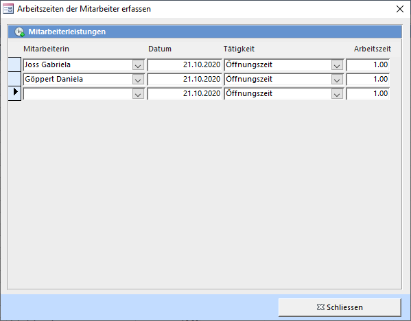

Sie können einen Mitarbeiter und die Tätigkeit auswählen und die Arbeitszeit eintragen (2.50 = 2h 30min). Die Einträge erscheinen auf dem Tagesjournal-Ausdruck.

---
# Spiele und Adressen'

---

# Spiele, Adressen und Mitarbeiter


<a href="{{p.url}}"><h5>{{ p.title }}</h5></a>

---
# Spielinhalte drucken'

---

Das **Spielinhalt Drucken** Fenster kann über die **Übersicht → Drucken → Spielinhalt drucken** geöffnet werden.

#### Spielsuchliste (Links im Fenster)

Suchen Sie die Spiele mit Hilfe der gelben Suchfelder in der Spielliste und markieren Sie die gewünschten Spiele. Mehrere Spiele auf einmal können Sie durch Klicken und gleichzeitiges Halten von **[Ctrl]** auswählen. Die markierten Spiele werden durch Drücken des Pfeil Buttons in die Barcode Druckliste aufgenommen.

Mit den Buttons Alle auswählen und Auswahl aufheben können Sie alle Elemente in der Liste an bzw. abwählen.

Folgende Sortier-Möglichkeiten stehen zur Verfügung:

!!! Verwenden Sie im Suchfeld das Platzhalterzeichen * (Stern) für beliebig viele, das ? (Fragezeichen) für genau ein unbekanntes Zeichen. Beispiel: Wenn Sie alle Spiele mit dem Kaufdatum im Februar 2013 anzeigen wollen, können Sie ??.02.2013 oder *.02.2013 eingeben

#### Ausgabeformat

Definieren Sie die Schriftart, -grösse und das Format des Spielinhaltes. In den Einstellungen können die Vorgabewerte definiert werden.

Druckliste löschen löscht alle in der Druckliste angezeigten Spiele. Einzelne (oder mehrere) Einträge in der Liste können Sie durch markieren und anschliessendem Drücken von **[Del]** aus der Liste löschen.

Spielinhalt drucken druckt die Barcodes der in der Druckliste aufgeführten Spiele auf den Standard-Drucker. Um einen anderen Drucker oder z.B. den manuellen Papiereinzug angeben zu können, öffnen Sie das Dokument mit Anzeigen. Falls als Ausgabeformat ein Etikett gewählt wurde, kann angegeben werden, bei welcher Etiketten-Position der Druck beginnen soll.

---
# Spielbarcodes drucken'

---

Das **Barcode Drucken** Fenster kann über die **Übersicht → Drucken → Barcodes Drucken** geöffnet werden.

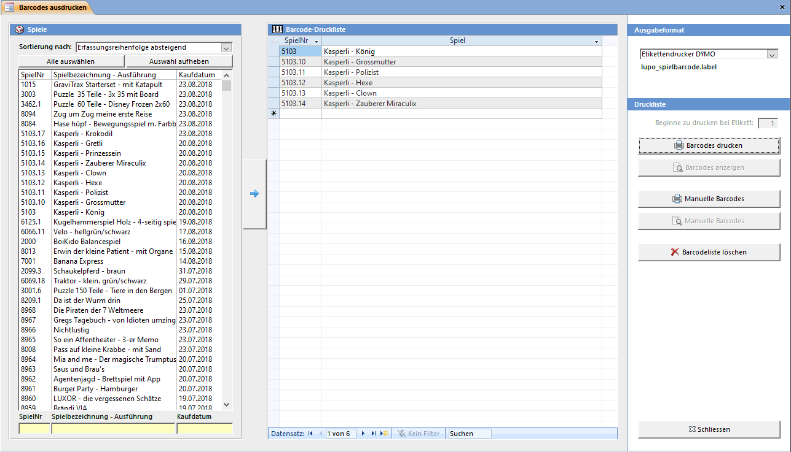

#### Spielsuchliste (Links im Fenster)

Suchen Sie die Spiele mit Hilfe der gelben Suchfelder in der Spielliste und markieren Sie die gewünschten Spiele. Mehrere Spiele auf einmal können Sie durch Klicken und gleichzeitiges Halten der Taste **[Ctrl]** oder **[Shift]** auswählen.

Die markierten Spiele können Sie durch Drücken des Pfeil Buttons in die Barcode Druckliste aufnehmen.   
Mit den Buttons Alle auswählen und Auswahl aufheben können alle Elemente in der Liste an bzw. abwählt werden.

Folgende Sortier-Möglichkeiten stehen zur Verfügung:

!!! Verwenden Sie im Suchfeld das **Platzhalterzeichen * (Stern)** für beliebig viele, das **? (Fragezeichen)** für genau ein unbekanntes Zeichen. Beispiel: Wenn Sie alle Spiele mit dem Kaufdatum im Februar 2014 anzeigen wollen, können Sie **??.02.2014** oder ***.02.2014** eingeben.

Barcodeliste löschen löscht alle in der Druckliste angezeigten Barcodes. Einzelne (oder mehrere) Einträge in der Liste können Sie durch markieren und anschliessendem Drücken von **[Del]** aus der Liste löschen.

Barcode Drucken druckt die Barcodes der in der Druckliste aufgeführten Spiele auf den Standard-Drucker. Um einen anderen Drucker oder z.B. den manuellen Papiereinzug angeben zu können muss sie Liste in der Seitenansicht angezeigt werden. Wenn Sie den Ausdruck nicht beim ersten Barcode-Etikett beginnen wollen, können Sie das Etikett, bei welchem der Druck gestartet werden soll, in das Textfeld oben links eintragen.

Es können nicht nur Barcodes für bestehende Spiele ausgedruckt werden, sondern für jede x-beliebige Nummer. Wenn Sie den Knopf Manuelle Barcodes drücken, werden Sie aufgefordert den Nummernbereich für die zu druckenden Strichcodes einzugeben.

## Abokarten drucken

Dieses Fenster kann mit **Übersicht → Drucken → Abokarten Drucken** geöffnet werden.

#### Adresssuchliste

Suchen Sie die Adressen mit Hilfe der gelben Suchfelder unterhalb der Adressliste und markieren Sie die gewünschten Adressen. Mehrere auf einmal können Sie durch Klicken und gleichzeitiges Halten der Taste **[Ctrl]** oder **[Shift]** ausgewählt werden. Die gewählten Adressen können Sie durch Drücken des Pfeil Buttons in die Barcode Druckliste aufnehmen, einzelne Einträge durch einen Doppelklick.

Mit den Buttons Alle auswählen und Auswahl aufheben können Sie alle Elemente in der Liste an bzw. abwählen.

 
!!! Verwenden Sie im Suchfeld das **Platzhalterzeichen * (Stern)** für beliebig viele, das **? (Fragezeichen)** für genau ein unbekanntes Zeichen. Beispiel: Wenn Sie alle Kunden mit dem Eintrittsdatum im Februar 2014 anzeigen wollen, können Sie **??.02.2014** oder ***.02.2014** eingeben.

Druckliste löschen löscht alle in der Druckliste angezeigten Barcodes. Einzelne (oder mehrere) Einträge in der Liste können Sie durch markieren und anschliessendem Drücken der Taste **[Del]** aus der Liste löschen.

Barcode Drucken druckt die Abokarten der in der Druckliste aufgeführten Adressen auf den Standard-Drucker. Um einen anderen Drucker oder z.B. den manuellen Papiereinzug angeben zu können muss die Liste in der Seitenansicht angezeigt werden. Wenn Sie den Ausdruck nicht beim ersten Barcode-Etikett beginnen wollen, können Sie das Etikett bei welchem der Druck gestartet werden soll in das Textfeld oben rechts eintragen.

Manuelle Barcodes druckt ‚leere' Kunden-Barcodes für Kundennummern die noch gar nicht vergeben sind. Sie werden aufgefordert den Nummernbereich für die zu druckenden Strichcodes einzugeben.

---
# Mahnungen drucken'

---

Das **Mahnungen drucken** Fenster kann mit der **Übersicht** oder beim **Beenden** von LUPO geöffnet werden.

Neue Mahnungen können für Spiele erstellt werden, deren Mahndatum in der Vergangenheit liegt. Bis eine gedruckt oder per Email versendet werden kann, sind vier Schritte vorzunehmen:

<<<< Mahnungen müssen nach dem Ausleihtag erstellt werden. Sonst ist der Kunde bereits gemahnt, auch wenn er das Spiel noch am selben Tag zurückbringt.

### 1\. Mahnliste aktualisieren

Beim Aktualisieren der Mahnliste werden alle fälligen Spiele gefunden und nach Kunden gruppiert aufgelistet.

**ACHTUNG**: Beim Aktualisieren der Mahnliste werden die bestehenden Mahnungen überschrieben!

### 2\. Mahnliste kontrollieren

Alle Kunden in der oberen Liste erhalten eine Mahnung. Soll ein Kunde nicht gemahnt werden, so muss ein Häkchen in der Spalte **Nicht mahnen** gesetzt werden.

### 3\. Gebühren Verrechnen

Nachdem Sie die Gebühren verrechnet haben, können die Briefe angezeigt und Emails gesendet werden.

### 4\. Mahnbriefe drucken / Emails senden

Zeigt die berechneten Mahnungen (Briefe) in Seitenansicht an bzw. sendet das Email. Das Aussehen des Briefes und der Mahntext kann im Fenster **Briefeinstellungen** angepasst werden.

#### Mahnliste drucken

Zeigt eine Liste mit allen neu gemahnten Kunden und eine Liste der gemahnten Spiele in Seitenansicht an.

!!! Die Anzahl Tage bis eine (weitere) Mahnung erstellt wird ist in den **Einstellungen** definiert. Eine erstellte Mahnung kann kein zweites Mal berechnet werden. Eine weitere (z.B. 2. Mahnung) wird erst nach Ablauf der Toleranztage (Die 2. Mahnung ist fällig) erstellt.

---
# Reservationen drucken'

---

Das **Reservationen drucken** Fenster kann mit der **Übersicht** oder beim **Beenden** von **LUPO** geöffnet werden.

Sobald ein Spiel einer Reservation eingetroffen ist, kann der Reservationsbrief erstellt und gedruckt oder per Email an den Kunden geschickt werden.

In der Liste werden verschiedene Farben angezeigt:

| **Farbe** |  **Status** |
| --- |--- |
| Seit 2 Tagen |  Das Spiel ist in der Ludothek und abholbereit |  
| Reserviert ab [Datum] |  Wenn die Reservation nicht ab einem Datum sondern ab sofort gilt |  
| Reserviert ab [Datum] |  Das Datum liegt in der Vergangenheit, das Spiel ist verspätet |  
| Kunde |  Alle reservierten Spiele des Kunden sind eingetroffen → Kunde informieren |  
| Kunde |  Alle reservierten Spiele des Kunden sind eingetroffen → Kunde ist informiert | 

Die Funktionen zum Kunden und die Spiel-Reservationen links im Navigationsbereich sind abhängig von der in der Liste ausgewählten Reservation.

#### Reservationen von Kunde

Das Feld Reservierte Spiele zeigt **[Total Reservationen] / [Eingetroffene Spiele]** an. In der Liste unter den Buttons werden alle Spiel-Reservationen des Kunden aufgeführt.

### Brief anzeigen

Zeigt den Reservationsbrief des Kunden in Seitenansicht an. Ab dem Moment vom Anzeigen des Reservationsbriefes oder senden des Emails gilt der Kunde als informiert und die in den Einstellungen definierte Abholfrist beginnt zu laufen. Wird der Brief erneut angezeigt beginnt die Frist von vorne.

### Email senden

Diese Funktion steht bei aktivierter Email-Unterstützung und für Kunden mit Emailadresse zur Verfügung.

### Reservationen löschen

Entfernt die Reservation. Wurde bereits beim Reservieren eine Gebühr verrechnet, so bleibt diese dem Kundenkonto belastet. In der Liste unterhalb des Knopfes werden alle weiteren Reservationen des aktuellen Spiels angezeigt.

### Reservationsliste anzeigen

Zeigt eine Liste mit allen reservierten Spielen in Seitenansicht an.

---

# Etiketten & Briefe'  

---

# Etiketten & Briefe


<a href="{{p.url}}"><h5>{{ p.title }}</h5></a>


---
#Buchhaltung

---

Die in LUPO integrierten Buchhaltungsfunktionen genügen um eine einfache Vereinsbuchhaltung zu führen. Dieser Programmteil will keiner professionellen Buchhaltung Konkurrenz machen. Mit den gebotenen Möglichkeiten können Sie eine korrekte Buchhaltung erstellen. Genügt dies nicht, können die LUPO Daten von einem professionellen Buchhaltungsprogramm übernommen werden.

Es wird immer davon ausgegangen, dass der Kunde etwas zahlen muss. Wenn dies nicht der Fall ist, muss der Betrag negativ eingegeben werden.

#### Buchungsarten

##### Automatische Buchungen

Wie Ausleihgebühren, Mahnungen, Reservationskosten, Verlängerungen.

##### Manuelle Buchungen vom Spiele Ausleihen und Zurücknehmen Fenster.

Wie Verkauf von Spiel an Kunde, Kosten für Reparaturen verursacht durch Kunde, ... Diese Buchungen beziehen sich auf den angezeigten Kunden.

##### Manuelle Buchungen aus dem Fenster **Übersicht → Buchhaltung → Manuell buchen**

Ähnlich wie die manuellen Buchungen vom Spiele ausleihen und zurücknehmen Fenster, ausser dass aus anderen vordefinierten Buchungssätzen ausgewählt werden kann und sich die sich die Buchung immer auf die Ludothek-Adresse bezieht. (Jede Buchung muss mit einer Adresse verbunden sein.)

#### Kunden- und Ausleihkonto

Jeder Kunde hat ein Kundenkonto und ein (optionales) Ausleihkonto. Ein negativer Kontostand bedeutet, dass der Kunde Schulden hat, ein positiver Betrag, dass er ein Guthaben bei der Ludothek hat.

##### Kundenkonto

Der Betrag auf dem Kundenkonto ist meistens negativ oder Null und selten positiv. Alle Buchungen werden auf dieses Konto verrechnet. Ausgenommen davon sind die Ausleih- und Verlängerungs-gebühren bei einem positiven Ausleihkontostand. Schulden des Kunden (negativer Kontostand) sind auf dem Debitorenkonto (1100) aufgeführt. Bezahlt der Kunde wird der Betrag vom Debitorenkonto auf das Tageskassenkonto gebucht.

##### Ausleihkonto

Das Ausleihkonto kann nur einen positiven Stand haben. Es kann 'aufgeladen' werden indem Sie eine Gutschriftenkarte einlösen. Solange Geld auf dem Ausleihkonto vorhanden ist, werden die Gebühren bei Ausleihen und Verlängerungen diesem Konto abgezogen.

#### Soll und Haben

Zu jeder Buchung sind ein Soll- und ein Habenkonto gespeichert. Das heisst, immer wenn der Inhalt eines Kontos vergrössert wird, muss derselbe Betrag an einem anderen Konto weggenommen werden. Das Sollkonto kann als **Einnahmenspalte**, das Habenkonto als **Ausgabenspalte** verstanden werden.

---
# Tagesjournal speichern und ausdrucken'

---

Das Tagesjournal drucken Fenster kann vom Beenden Assistent her, mit der Übersicht oder der Symbolleiste geöffnet werden.

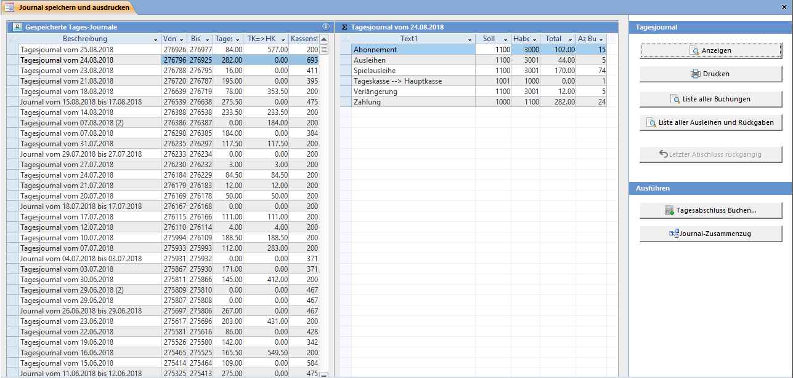

Nach jedem Ausleihtag sollten Sie den Tag abschliessen. Das Tagesjournal enthält Informationen über den Tageskasseninhalt, Mitarbeiterleistungen und Statistiken.

Wenn seit dem letzten Speichern des Tagesjournals neue Buchungen vorhanden sind kann ein neues Journal gespeichert werden. Es können auch mehrere Tagesjournale an einem Tag gespeichert werden.

#### Gespeicherte Tagesjournale (Liste links)

In dieser Liste werden alle gespeicherten Tagesjournale angezeigt. Die Felder Von und Bis zeigen die Buchungsnummer an.

#### Journal Zusammenfassung (Liste rechts)

In dieser Liste werden alle Buchungen des gespeicherten Tagesjournals gruppiert nach Buchungssatz angezeigt.

#### Journal Anzeigen / Drucken

Gibt das ausgewählte Journal in der Seitenansicht oder auf den Drucker aus.

#### Journal Zusammenzug

Sie können ein Journal über eine x-beliebige Zeitspanne ausdrucken. Dabei werden unabhängig von bereits gespeicherten Tagesabschlüssen die Daten zusammengefasst und wie auf einem Tagesjournal angezeigt.

Mit den Plus- und Minus-Buttons können die Daten monatsweise durchgeblättert werden.

### Tagesabschluss

Diese Aktion speichert im Tagesjournal alle Buchungen, die seit dem letzten Speichern neu dazugekommen sind.

Wenn Sie die vorhergehende Frage mit Ja beantwortet haben öffnet sich das Tagesabschluss buchen Fenster:

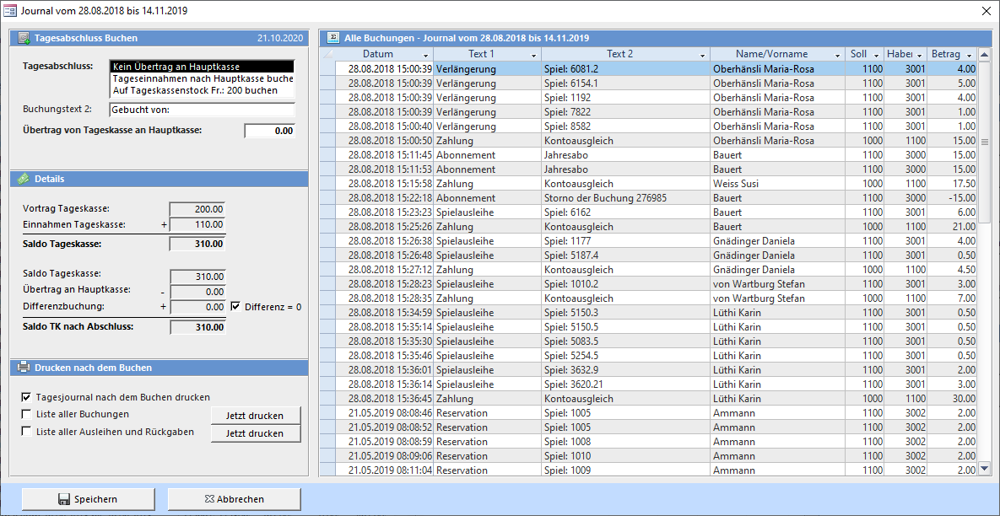

#### Tagesabschluss

Sie können aus drei verschiedenen Tagesabschlussarten auswählen. Die Auswahl beeinflusst nur das Berechnen des Betrages im Feld **Übertrag von Tageskasse an Hauptkasse**.

Wenn Sie die Tageseinnahmen in der Tageskasse belassen wollen, den Tag aber trotzdem abschliessen, müssen den Betrag Übertrag an Hauptkasse auf 0 abändern. Wählen Sie dazu die Abschlussart Kein Übertrag an Hauptkasse. Das Geld bleibt nun in der Tageskasse und ergibt den Saldovortrag für das nächste Tagesjournal.

#### Differenz = 0

Wenn die Kasse nicht stimmt (es ist zu viel oder zu wenig Geld in der Kasse) kann eine Differenzbuchung durchgeführt werden. Wenn Sie auf das Kästchen Differenz = 0 klicken werden Sie gefragt, wie viel Geld Sie aus der Kasse nehmen und wie viel der Kassenstock danach beträgt. Es wird der Betrag, um welcher die Kasse nicht stimmt berechnet und im Feld Differenzbuchung eingetragen.

#### Speichern

Die Tagesabschlussbuchung wird durchgeführt. Wenn das Häkchen Tagesjournal nach dem Buchen drucken gesetzt ist, werden so viele Exemplare wie in den Einstellungen → Diverses definiert sind auf den Drucker ausgegeben.

!
**Einstellung**  
Der Bestand der Tageskasse sowie der Soll-Tageskasseninhalt kann unter **Einstellungen → Diverses** angepasst werden.
---
# Konto auswerten'

---

Das Fenster **Konto-Auswertung** können Sie mit dem Übersichtsbefehl **Buchhaltung → Konto-Auswertung** öffnen.

Sie können die Liste filtern nach Kontonummer und / oder Buchungsdatum.

#### Konto von ... bis ...

Die Kontennummern, welche sie anzeigen wollen (Bsp. 1000 – 2999 = Aktiven /Passiven).

#### Datum von ... bis ...

Der Datumsbereich, über welchen sie die Konti anzeigen wollen.

!!! Es wird mit der genauen Zeit gerechnet. Wenn Sie in beide Felder das gleiche Datum eingeben, werden keine Buchungen angezeigt.

#### Druckerausgabe

Klicken Sie auf Einzelne Buchungen anzeigen um die Sortierung zu bestimmen. Sie können die Kontenblätter nach Buchungsnummer, Buchungstext oder Datum sortieren. Geben Sie die Adressnummer in das Feld AdrNr ein, um nur die Buchungssätze, einer Adresse angezeigt zu bekommen.

Wenn Sie auf Anzeigen klicken, werden die Kontenblätter in der Seitenansicht angezeigt.

---
#Kontobestände

---

Das Fenster **Kontobestände** können Sie mit dem Übersichtsbefehl **Buchhaltung → Kontobestände** öffnen.

Es werden alle Soll-Beträge und alle Haben-Beträge aller jemals gespeicherten Buchungen im Journal zusammengezählt. Der Bestand bildet sich aus **[Summe Haben] – [Summe Soll]**.

#### Bestand ändern

Geben Sie den neuen Bestand ein. Je nach Konto wird der Differenzbetrag auf das Haben- oder Sollkonto verrechnet. Die Gegenbuchung wird entsprechend dem Hilfskonto (8000) belastet.

#### Kontenplan anzeigen

Zeigt den Kontenplan in Seitenansicht an.

#### Konto-Auswertungen

Öffnet das Fenster für Kontoauswertungen.

#### Tagesabschluss

Wechselt zum Fenster Tagesabschluss.

#### Banana-Export

Exportiert alle Buchungen der ausgewählten Zeitspanne ins Textdatei-Format des Buchhaltungsprogrammes Banana. Diese Datei kann dann anschliessend im Banana über den Menübefehl Daten → Zeilen importieren eingelesen werden.

Damit die Konten in Banana mit denen im LUPO korrespondieren, sollte die Buchhaltung auf der bei der LUPO Installation nach C:Lupo_Daten kopierten Datei **buchhaltung-lupo.ac2** basieren.

### Kontenplan

Der von LUPO verwendete Kontenplan entspricht einem KMU Kontenrahmen (nach Käfer).

!! Sie dürfen die Kontobezeichnungen anpassen (z.B. Hauptkasse in PC-Konto ändern) und neue Konten erfassen. Die bestehenden Kontonummern dürfen aber nicht verändert werden.

| **Buchhaltungsklasse** |  **Konntengruppe** |  **Konto Bezeichnung** |  **Konto** |
| --- | --- |--- |--- |
| Aktiven |  100 flüssige Mittel |  Tageskasse |  1000 |  
| Aktiven |  100 flüssige Mittel |  Hauptkasse |  1001 |  
| Aktiven |  100 fküssige Mittel |  Differenzkonto |  1002 |  
| Aktiven |  100 flüssige Mittel |  Bankkonto |  1009 |  
| Aktiven |  110 Forderungen |  Debitoren |  1100 |  
| Aktiven |  110 Forderungen |  Verrechnungssteuern |  1109 |  
| Aktiven |  150 Mobile Sachanlagen |  Spielinventar |  1500 |  
| Aktiven |  150 Mobile Sachanlagen |  Einrichtungen |  1501 |  
| Aktiven |  150 Mobile Sachanlagen |  Computer |  1509 |  
| Aktiven |  180 aktivierter Aufwand / Berichtigungen |  Aufwand Mitarbeiterinnen |  1800 |  
| Passiven |  200 Kreditoren |  Lieferantenschulden |  2000 |  
| Passiven |  200 Kreditoren |  Verrechnungsteuerschulden |  2009 |  
| Passiven |  203 Kreditoren |  Vorauszahlungen |  2030 |  
| Passiven |  203 Kreditoren |  Vorauszahlung Ausleihkonto |  2031 |  
| Passiven |  280 Kapital |  Vereinsvermögen |  2800 |  
| Ertrag |  300 Ausleihen |  Abonnements |  3000 |  
| Ertrag |  300 Ausleihen |  Ausleihgebühren |  3001 |  
| Ertrag |  300 Ausleihen |  Mahngebühren |  3003 |  
| Ertrag |  300 Ausleihen |  Verlust Ausleihgebührenrabatte |  3004 |  
| Ertrag |  300 Ausleihen |  e-Abonnemente |  3007 |  
| Ertrag |  300 Ausleihen |  Abonnemente / e-Abonnemente (kombi.) |  3009 |  
| Ertrag |  300 Ausleihen |  Verrechnung für Reparaturen / Verluste |  3009 |  
| Ertrag |  310 Übrige Einnahmen |  Markteinnahmen / Verkäufe |  3100 |  
| Ertrag |  320 Mitgliederbeiträge |  Spenden |  3200 |  
| Ertrag |  320 Mitgliederbeiträge |  Mitgliederbeitrag |  3201 |  
| Aufwand Spiele / Material |  400 Spielkauf |  Spieleinkauf |  4000 |  
| Aufwand Spiele / Material |  400 Spielkauf |  Spielreparatur / Ersatzteile |  4001 |  
| Aufwand Spiele / Material |  460 Verpackungsmaterial / Kopien |  Verpackungen / Kopien |  4600 |  
| Aufwand Mitarbeiterinnen |  500 Leistungen Mitarbeiterinnen |  Arbeitsleistung Mitarbeiterinnen |  5000 |  
| Aufwand Mitarbeiterinnen |  580 Weiterbildung / Vereinsanlässe |  Weiterbildung / Information |  5800 |  
| Aufwand Mitarbeiterinnen |  580 Weiterbildung / Vereinsanlässe |  Ausflug / Geschenke |  5809 |  
| Sonstiger Aufwand |  630 Versicher. / Abgaben / Bewilligungen |  Versicherungen |  6300 |  
| Sonstiger Aufwand |  630 Versicher. / Abgaben / Bewilligungen |  Bewilligungen |  6301 |  
| Sonstiger Aufwand |  650 Büromaterial / Telefon / Beiträge |  Büromaterial |  6500 |  
| Sonstiger Aufwand |  650 Büromaterial / Telefon / Beiträge |  Telefon / Porti |  6501 |  
| Sonstiger Aufwand |  650 Büromaterial / Telefon / Beiträge |  Beiträge |  6507 |  
| Sonstiger Aufwand |  650 Büromaterial / Telefon / Beiträge |  EDV / Computer |  6509 |  
| Sonstiger Aufwand |  660 Werbung |  Inserate |  6600 |  
| Sonstiger Aufwand |  680 Zinsen und Spesen |  Zinsen / Spesen |  6800 |  
| Sonstiger Aufwand |  690 Abschreibungen |  Amortisation Spiele |  6900 |  
| Sonstiger Aufwand |  690 Abschreibungen |  Amortisation Einrichtungen |  6901 |  
| Bestände |  800 Bestände |  Ausgleichkonto Bestände erfassen |  8000 | 
---
# Manuell buchen (mit Vorgaben)'

---

Das **Einzelbuchung** Fenster können Sie mit **Übersicht → Buchhaltung → Manuell buchen** öffnen.

#### Buchung

Auswählen des vordefinierten Buchungssatzes. Buchungssätze können unter **Übersicht → Buchhaltung → Buchungstexte bearbeiten** erstellt oder bearbeitet werden.

#### Buchung betrifft

Buchungen die in diesem Fenster ausgeführt werden beziehen sich immer auf die Ludothek. Wollen Sie eine Buchung durchführen, welche dem Kunden einen Betrag auf seinem Konto belastet, so müssen Sie dies über Einzelbuchung im Spiele ausleihen und zurücknehmen Fenster durchführen.

---
# Manuell buchen (Individuell)'

---

Das **Einzelbuchungen individuell** Fenster können Sie mit dem Übersichtsbefehl **Übersicht → Buchhaltung → Manuell buchen (individuell)** öffnen.

Im **Einzelbuchung individuell** Fenster können Sie Buchungen von einem frei wählbaren Konto nach einem frei wählbaren Konto erfassen. Hier übernimmt der Computer keine Kontrolle über Ihre Buchungen. Was Sie eingeben wird gebucht!

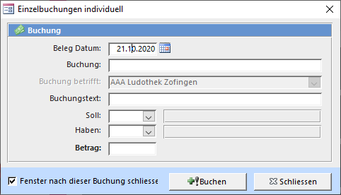

---
# Buchungstexte bearbeiten'

---

Das Fenster **Buchungstexte** können Sie mit **Übersicht → Buchhaltung → Buchungstexte bearbeiten** öffnen. Diese Buchungstexte sind die Auswahlmöglichkeiten in den **Buchen – Fenster** (Spiele ausleihen und zurücknehmen und Einzelbuchungen (manuell buchen)).

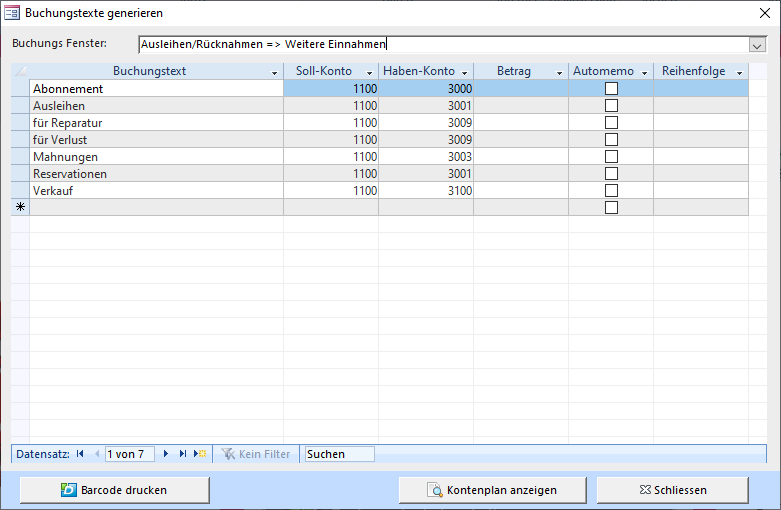

#### Buchungs-Fenster

Es kann ausgewählt werden für welches Fenster der Text vordefiniert werden soll: Spiele ausleihen und zurücknehmen oder Einzelbuchungen (manuell buchen)

#### Buchungstext

Der Buchungstext wird hier vorgegeben. Jeder Buchung kann ein zweiter Text angefügt werden.

#### Soll-Konto (Ein)

Aus dem Kontenplan muss ein Konto für die Soll-Buchung gewählt werden.

#### Haben-Konto (Aus)

Aus dem Kontenplan muss ein Konto für die Haben-Buchung gewählt werden.

#### Betrag

Wenn ein Betrag erfasst ist, so wird dieser im Buchungsfenster automatisch eingetragen. Falls der Kunden z.B. Buttons für die Buttonmaschine kaufen kann und zehn Stück Fr. 5.- kosten kann dies so erfasst werden.

#### Automemo

Wenn angewählt, dann wird bei einer Buchung im Ausleihfenster automatisch die Checkbox Buchungstext ins Memofeld eintragen gesetzt.

#### Reihenfolge

In dieser Reihenfolge werden die Buchungen angezeigt. Ist nichts eingetragen so wird die Liste alphabethisch sortiert.

---
#Buchhaltung
---

# Buchhaltung


<a href="{{p.url}}"><h5>{{ p.title }}</h5></a>


---
# Spiel-, Ausleih- und Kundenstatistiken'

---

Dieses Fenster kann mit **Übersicht → Statistik und Listen** oder direkt aus der Symbolleiste geöffnet werden. In der ersten Registerkarte des **Statistik** Fensters können Sie vordefinierte Statistiken und Listen ausdrucken. Die hinteren 6 Karten enthalten Listen, welche alle wesentlichen Felder der entsprechenden Tabelle zeigen.

Diese Datumsspanne (Statistik von … bis …) gilt für die grün geschriebenen Statistiken (bei Ausleihen gilt das Ausleihdatum als Referenz)

Markieren Sie das Kontrollkästchen für die Statistiken, welche Sie Anzeigen oder Drucken wollen.

---
#Adressen

---

Die Liste zeigt alle aktiven Adressen. Gelöschte Adressen werden nicht angezeigt.

Mit Adress-Etiketten Zweckform 3664 werden alle angezeigten Adressen (ihr Filter wird beachtet!) in Seitenansicht zum Drucken auf Etiketten angezeigt.

!!!! In allen Listen können Sie die Datensätze sortieren und filtern und in die Zwischenablage kopieren. Um den Listeninhalt zu kopieren, markieren Sie alle Datensätze indem Sie auf die linke Ecke oben in der Liste klicken. Danach drücken Sie <kbd>Ctrl</kbd>+<kbd>c</kbd> um die Daten in die Zwischenablage zu kopieren und danach in ein anderes Programm wie z.B. Word oder Excel um und von dort her formatiert auszudrucken, als Serienbrief-Datenquelle oder sonst wie zu nutzen.

### Adressliste drucken

Das **Adressen drucken** Fenster kann mit **Adressliste drucken** geöffnet werden:

Bestimmen sie durch ankreuzen der entsprechenden Optionen welche Adressen angezeigt werden sollen. Gewisse Optionen können miteinander kombiniert werden.

### Email Massenversand

Wenn Sie auf Emailadressen kopieren klicken, werden Sie aufgefordert die Paketgrösse der Emailadressen anzugeben. Die meisten Emailanbieter akzeptieren nur eine bestimmte Anzahl Email-Adressen in einem Email (zum Schutz vor Spamversand). Geben Sie deshalb eine Zahl kleiner als 100 ein. Es werden alle Emailadressen der Adressliste in Blöcke an X Emailadressen aufgelistet. Erstellen Sie für jeden Block eine einzelne Email. Die Emailadressen sollten Sie in das BCC-Feld (Blindkopie) kopieren.

Falls Sie im Adress-Datenblatt einen Filter gesetzt haben wird dieser berücksichtigt.

### Serienbrief in Word

Bei der Installation des LUPO wird die Serienbrief-Vorlage **C:\Lupo_Daten\Serienbrief.dotx** kopiert. Der Knopf Word Serienbrief öffnen exportiert alle angezeigten Adressen (gesetzte Filter werden beachtet) in die Datei **C:\Lupo_Daten\Serienbrief_Datenquelle.docx** und öffnet ein neues Dokument basierend auf der Vorlage in Microsoft Word (sofern installiert).

Bevor der Serienbrief angezeigt wird muss folgende Frage mit Ja bestätigt werden:

---
#Spiele

---

Zeigt alle Spielkinder an. Jedes Spielkind enthält auch die Daten seiner Spielfamilie.

### Spielekatalog und Inventar drucken

Spielekatalog und Inventar drucken öffnet folgendes Fenster. Diese kann auch direkt aus dem Spiele-Fenster geöffnet werden.

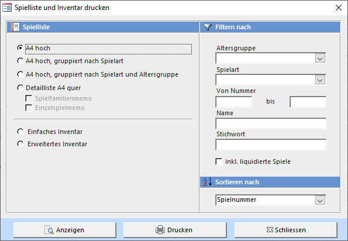

#### A4 hoch

Die Spielliste wird im A4 Hochformat angezeigt. Wenn Sie eine gruppierte Spielliste wählen, werden alle Spiele mit derselben Eigenschaft zusammengefasst.

#### Detailliste A4 quer

Die Spielliste wird mit allen Spielinformationen im A4 Querformat angezeigt. Das Spielgruppenmemo und das Einzelspielmemo können optional angezeigt werden.

#### Einfaches Inventar

Zeigt zwei Listen an: Eine mit allen ausgeliehenen Spielen und eine mit allen Spielen, welche sich aktuell in der Ludothek befinden.

#### Erweitertes Inventar

Diese Liste kann verwendet werden um Spiele auszumustern. Zu jedem Spiel werden die Anzahl Ausleihen pro Jahr angezeigt. Nie ausgeliehene Spiele werden fett dargestellt, liquidierte durchgestrichen.

#### Spielfilter und Sortierung

Um nicht alle Spiele anzuzeigen können Filter gesetzt werden. Bei den Feldern Altersgruppe und Spielart können die vorgegebenen Werte gewählt werden. Wollen sie nur bestimmte Spielnummern anzeigen, geben Sie einen Nummernbereich ein. Wollen Sie die Spiele nach Namen filtern, so geben sie den vollen oder den Anfang des Spiel-Namens ein. Es werden dann alle Spiele, welche wie der eingetragene Name beginnen angezeigt.

!!!! Wenn Sie eine anders sortierte oder gefilterte Spielliste wollen, so können Sie diese selbst erstellen. Öffnen Sie dazu das Datenblatt Spiele im Statistikfenster um dann die Liste entsprechend zu filtern. Kopieren Sie die Spieldaten aus dem Datenblatt in die Zwischenablage und fügen diese in Word, Excel oder sonst wo wieder ein um die Daten anschliessend zu formatieren oder weiterzuverarbeiten.

### Spielausleihen für Statistik nachbuchen

Hier können Ausleihen, welche vor der LUPO-Zeit getätigt wurden nachgebucht werden, so dass die Anzahl Ausleihen und Gebühreneinnahmen eines Spieles stimmen. Tragen Sie die Spielnummer ein, mit **[Tab]** zum Feld Anzahl Ausleihen springen, dann mit <kbd>Enter</kbd> Ausleihen.

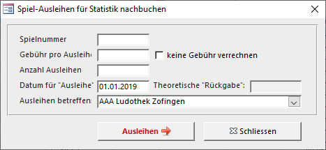

---
#Ausleihen

---

Eine Liste mit allen Spielausleihen zwischen den beiden im Fenster oben rechts eingetragenen Daten.

---
#Buchungen

---

Die Liste aller Buchungen zwischen der eingetragenen Zeitspanne.

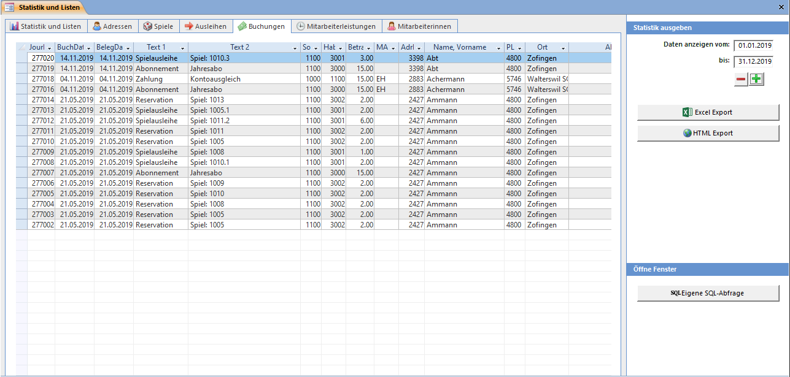

---
#Mitarbeiterleistungen

---

Liste aller erfassten Arbeitszeiten der Mitarbeiterinnen zwischen der eingetragenen Zeitspanne.

Arbeitsrapport Mitarbeiter zeigt einen Bericht mit der Summe aller Arbeitszeiten.

---
#MitarbeiterInnen

---

Liste aller aktiven Mitarbeiterinnen. Das Eintrittsdatum wurde beim anhaken der Mitarbeiter Checkbox bestimmt.

Mit Adress-Etiketten Zweckform 3664 werden alle angezeigten Adressen (ihr Filter wird beachtet!) in Seitenansicht zum Drucken auf Etiketten angezeigt.
---
# Auswertungen in Excel'

---

Da die Datenabfragen nur Zahlen in einer unübersichtlichen Tabelle zurückgeben, sind ihre Auswertungen nicht besonders für Präsentationen geeignet. Mit dem Tabellenkalkulations-Programm Excel können Sie sich auf einfache Art mit Hilfe des Assistenten die verschiedensten Diagramme erstellen oder einzelne Spalten summieren.

Markieren Sie dazu im LUPO die gewünschten Daten um diese via Zwischenablage im Excel in einer neue Mappe einzufügen oder speichern Sie die gesamte Liste in eine Excel-Datei durch drücken des Excel Export Knopfes.

---
# HTML Export'

---

Mit **HTML Export** wird die Liste als html-Datei gespeichert und kann so z.B. für Ihre Website verwendet werden. Allerdings lässt die Darstellung sehr zu wünschen übrig und erfordert einige Nachbearbeitung um ein ansehnliches Resultat zu erhalten.

---
# Eigene SQL-Abfrage'

---

Es besteht die Möglichkeit, eigene SQL-Abfragen zu Erstellen und Speichern. Damit können Daten selektiert, verändert, eingefügt oder gelöscht werden. Dies erfordert allerdings einige Datenbank-Programmierkenntnisse und im Rahmen dieses Handbuches wird nicht weiter darauf eingegangen.

Mit der Funktion SQL-Datei importieren können vordefinierte Abfragen die Sie z.B. wegen einer Supportanfrage oder mit einen Download von unserer Website erhalten haben eingelesen werden. Eine solche Datei muss auf der ersten Zeile den Abfrage-Titel und im Rest das SQL-Statement enthalten und im ANSI Dateiformat gespeichert sein.

---
# Statistik & Listen'  
---

# Statistik & Listen


<a href="{{p.url}}"><h5>{{ p.title }}</h5></a>

---
#Spielkategorien

---

Die Allgemeinen Einstellungen erreichen Sie mit **Übersicht → Einstellungen → Programmeinstellungen**

! Alle folgenden Bildschirmfotos sind mit gedrücktem Knopf Erweiterte Optionen einblenden erstellt worden. Damit werden auch Einstellungsmöglichkeiten angezeigt, welche meistens nicht verändert werden müssen, da der Standardwert für fast alle Ludotheken zutrifft.

Die hier eingetragenen Spielarten können den Spielen beim **Spiele erfassen** zugeordnet werden. Jeder Spielart kann ein Kürzel mit max. 10 Zeichen zugeordnet werden. Das Kürzel u. a. wird im **Spiele suchen** Fenster angezeigt.

Mit dem Nummernfeld kann der Bereich für die automatisch vorgeschlagene Spielnummer beim Erfassen eines neuen Spiels eingestellt werden. Tragen Sie 0 (Null) in jede Zeile ein, wenn Sie die Spielnummern - unabhängig der Spielart - fortlaufend vergeben wollen.

Die in den Feldern **ProLitteris, eSpiel, Anzahl Ausleihtage und Verlängerbar** gesetzte Werte werden beim Erfassen eines neuen Spiels zum Spiel **kopiert**. Eine Änderung dieser Daten in den Einstellungen hat keinen Einfluss auf bereits erfasste Spiele.

Wird bei **Gebühr pro Tage** eine Zahl eingetragen, so werden die Ausleihgebühren bei Spielen dieser Kategorie erst beim Zurückbringen verrechnet, und zwar einmal pro angebrochener Einheit.

Bei Spielen einer Kategorie mit einem Wert im Feld **Spezielle Mahnfrist** wird nicht die in den Mahneinstellungen definierte Anzahl Tage bis zur ersten Mahnung genommen, sondern der hier hinterlegte Wert.

Ist der **Retour-Bon** aktiviert, so wird beim retournieren eines Spiels dieser Spielkategorie ein Bon mit Informationen zur Spielkontrolle gedruckt.

!! Wenn Sie eine neue Spielart erfassen wollen, welche zwischen zwei bestehenden liegt (z.B. 4500) dann müssen Sie diese in ein neues, leeres Feld unten in der Liste erfassen. Fügen Sie die neue Gruppe **nicht** in der Mitte der Liste ein, indem Sie eine bestehende überschreiben (5000 zu 4500, 6000 zu 5000 usw.)

---
# Altersgruppen / Ausleihgebühren'

---

#### Altersgruppen

Die erfassten Altersgruppen können den Spielen zugeordnet werden. Das Kürzel kann auch hier max. 10 Zeichen lang sein.

#### Spielgebühren

Nur hier erfasste Gebühren können den Spielen zugeordnet werden. Der Text im Feld Spielpreiskategorie dient nur als Richtwert beim Bestimmen des Preises. Es besteht keine programmierte Verbindung zwischen Kaufpreis und Gebühr.

!!!! Der Wert in den Spalten Az gibt die Anzahl Spiele an, welche mit diesem Datensatz verknüpft sind. Es können nur Datensätze mit Anzahl=0 gelöscht werden. Sind Spiele damit verknüpft wird das Löschen verweigert.

!! Wird eine Gebühr geändert, ändert diese bei allen Spielen, welche dieser Spielgebühr zugeordnet sind.
---
#Spielinhalt

---

Unter Spielinhalt wird das Inventar eines Spiels verstanden (1 Spielanleitung, 3 Würfel, 21 Karten, …) Bestimmen Sie in diesem Einstellungsfenster das Erscheinungsbild des Ausdrucks.

#### Anzeigen

Setzen Sie das Häkchen für die Felder, welche auf dem Spielinhalt-Ausdruck angezeigt werden sollen. Bei den kleinen Etiketten werden diese Infos nicht angezeigt.

#### Spielinhalt Infotext

Beliebig viel Text kann für den Spielinhalt A4 zum Ausschneiden erfasst werden. Bei den Sichttaschen und dem ¼ A4-Etikett wird der Text abgeschnitten, wenn er zu lang ist. Die anderen Etiketten zeigen den Text nicht an.

#### Schriftart und Grösse

Der Textblock mit dem Spielinhalt wird in der eingetragenen Schriftart und -grösse angezeigt. Sie können auch eine eigene Schriftart eintragen. Achten Sie dabei auf die exakte Schreibweise

#### Ausgabeformat

Es stehen Ihnen drei verschiedene Ausdruckarten zur Auswahl. Der Format A4 zu Ausschneiden ist geeignet für Schachtelspiele mit beliebig viel Inhaltstext. Das Format Sichttaschenformat wird auch auf normales Papier gedruckt, kann aber ausgeschnitten und gefaltet in eine A7 / A6 Plastiktasche gesteckt werden. Dieses Format ist geeignet für Aussenspiele. Als dritte Möglichkeit kann der Spielinhalt auf ein Etikett gedruckt werden.

#### Logo-Datei

Einige Ausgabeformate haben Platz um eine Grafik anzuzeigen. Wählen Sie eine Bitmap-Grafik (.bmp)

---
#Spiel-Barcode

---

Die Etiketten zur Beschriftung der Spiele können auf A4 grosse Etikettenbogen oder einen DYMO Label-Writer gedruckt werden. Wenn Sie keinen Barcodescanner zum Einlesen der Nummer verwenden, können auch **Etiketten ohne Strichcode** gedruckt werden.

#### Format der Spiel-Barcodeetiketten

Wählen Sie eine Etikettengrösse. Je nach Format werden neben der Nummer auch noch der Barcode, die Gebühr und die Spielbezeichnung angezeigt.

#### Druckerjustierung

Damit der Ausdruck auf das Raster der Etiketten passt, ist es manchmal notwendig das Druckbild vertikal zu verschieben. Tragen Sie eine positive Zahl ein, wenn der Aufdruck im Etikett oben abgeschnitten wird, eine negative wenn er zu tief ist. Diese Einstellung gilt für alle Spiel-Etiketten und für den Spielinhalt.

#### Ludothek-Logo

Der für die Grafik reservierte Bereich hat das Seitenverhältnis 1 : 4.4 Bei einem anderen Format wird das Bild in der Mitte zentriert. Möchten Sie das Logo links ausgerichtet angezeigt bekommen, so kann rechts von der Grafik ein weisser Rand hinzugefügt werden. Der Text, welcher oberhalb des Logos definiert werden kann, wird auf Etiketten ohne Logo ausgegeben.

#### Felder Drucken

Es kann definiert werden wie die Spielbezeichnung und ob und wie die Gebühr auf das Etikett gedruckt wird.

---
# Kunden, Barcodes und Abokarten'

---

Die Kundenbarcodes können Sie entweder auf Etiketten, in Kreditkartengrösse oder auf A4-Vorlagen mit integrierter Karte (Card-in-Fold) gedruckt werden.

#### Etikettenformat

Wählen Sie das passende Etikettenformat. Oberhalb des Barcodes kann ein Text definiert werden. Dieser wird allerdings nicht bei jedem Etikettenformat ausgegeben.

#### Abokarte auf Papier

Bei den Abokarten in Kreditkartengrösse kann eine Grafik mit dem Seitenverhältnis 1:4 angezeigt werden und es stehen Ihnen zwei Textfelder zur Verfügung. Die Karten können auf handelsübliche vorperforierte A4-Bögen ausgedruckt werden.

#### Druckerjustierung

Damit der Ausdruck auf das Raster der Etiketten passt, ist es manchmal notwendig das Druckbild senkrecht zu verschieben. Tragen Sie eine positive Zahl ein, wenn der Aufdruck im Etikett oben abgeschnitten wird, eine negative wenn er zu tief ist.

Der Wert Vertikale Druckerkorrektur gilt für alle Kunden-Etiketten und Abokarten und beeinflusst den oberen Seitenrand. Für die A4-Abokarte kann zusätzlich zu dieser Einstellung noch die Y-Position des Barcodes und Kundennamens konfiguriert werden, denn je nach Fabrikat unterscheidet sich der Abstand der integrierten Karte zum unteren Seitenrand.

---
# Beiträge / Abos'

---

Die Art und Höhe der jährlichen Beiträge, welche von Kunden entrichtet werden müssen können Sie hier definieren.

#### Liste der Abonnaments

Es gibt grundsätzlich zwei Arten von Mitgliederbeiträgen: Abonnements mit fliessendem Enddatum und Jahresbeiträge mit festem Enddatum. Abonnements sind für eine bestimmte Dauer gültig, also von heute bis in X Tagen. Ein Jahresbeitrag-Abo ist bis zu einem bestimmten Tag (z. B. 31.12.2014) gültig. Tragen Sie in der Feld Dauer die Anzahl Tage ein, wenn es sich um ein Abo mit fliessendem Enddatum handelt. Für Abos mit festem Enddatum muss ein Datum in die Spalte Datum eingetragen werden.

Bei dem bei vielen Ludotheken unter Einzelausleihe bekannten Abo wird eine Gültigkeitsdauer von einen Tag erfasst. Ist die Anzahl der auf einmal ausgeliehenen Spiele oder eSpiele pro Kunde beschränkt, so kann dies pro Abo definiert werden.

Normalerweise werden Abo-Verkäufe auf das Konto 3000 gebucht. Soll bei einem eSpiel- oder einem Kombi-Abo ein anderes Konto verwendet werden kann dies in der entsprechenden Spalte definiert werden.

#### Gültiges Abo notwendig

Ist das Kontrollkästchen Um Spiele Auszuleihen benötigt der Kunde ein gültiges Abo deaktiviert kann der Kunde auch ohne ein gültiges Abo Spiele ausleihen.

#### eSpiele nur mit gültigem Abo

Ist die Option Um eSpiele auszuleihen muss der Kunde zusätzlich zum eAbo ein gültiges "normales" Abo haben aktiviert

#### Button Abo lösen anzeigen

Wenn kein Abo zur Ausleihe notwendig ist kann der Knopf Abo lösen im Spiele ausleihen und zurücknehmen Fenster unsichtbar gemacht werden. Werden aber zusätzlich Abos mit speziellen Konditionen (z.B. ein all Inclusive-Abo) angeboten, dann muss der Knopf sichtbar sein.

#### Abo exakt um ein Jahr verlängern

Mit aktivierter Option Bei aktiven Kunden das bestehende Abo um exakt ein Jahr verlängern werden abgelaufene Abos „rückwirkend" verlängert. Beispiel: Ein Kunde leiht am 28.02.2014 Spiele aus, zwei Tage später am 30.01.2014 endet sein Abo. Bei seinem nächsten Besuch vier Wochen später (25.02.2014) erneuert er sein Abo. Jetzt ist das Enddatum des neuen Abos nicht der 25.02.2015, sondern basierend auf dem „alten" Abo wird der 30.01.2015 berechnet.

#### Abo ohne Kosten lösen

Falls Kunden den Jahresbeitrag per Einzahlungsschein bezahlen und bei der Ausleihe die Quittung vorweisen können Sie ein Abo lösen ohne den Betrag in die Tageskasse zu buchen. Damit die Buchhaltung stimmt müssen die Einnahmen der per Überweisung bezahlten Abos manuell gebucht werden.

#### Abokarte nach Verkauf automatisch drucken

Mit dieser Option ist das Häkchen Nach dem Lösen Abokarte drucken im Abo-Fenster gesetzt. Bei DYMO LabelWriter Etiketten und bei der A4-Abokarte wird der Druck sofort gestartet, bei den anderen Etiketten wird der Kunde der Abokarten-Druckliste hinzugefügt.

---
#ProLitteris

---

Das schweizerische Urheberrechts-gesetz (URG) verlangt die Abgabe eines Teils der von den Benützern bezahlten Entgelte. Davon betroffen sind die Einnahmen aus Ausleihen von Ton- und Tonbildträger sowie Büchern.

Falls in Ihrer Ludothek keine entsprechenden Medien ausgeliehen werden, dann deaktivieren Sie das Häkchen ProLitteris Funktionen anzeigen.

Bei abgabepflichtigen «Spielen» muss im Spiel-Fenster das Häkchen ProLitteris gesetzt sein. Das ProLitteris-Häkchen bei den Spielkategorie-Einstellungen dient nur als Vorgabe beim Erfassen eines neuen Spieles.

Mit ProLitteris Gebühren berechnen werden neu gesetzte oder entfernte Häkchen bei den Spielen berücksichtigt und die bereits berechnete Abgabe pro Ausleihe aktualisiert. Diese Aktion kann auch direkt vor dem Ausdrucken der Abrechnung im Statistik-Fenster vorgenommen werden.

Weitere Informationen zu ProLitteris können im pdf-Dokument Gemeinsamer Tarif 6 nachgelesen werden.

---
#Ausleihen

---

Bei den Ausleih-Einstellungen kann das Aussehen und Verhalten von Funktionen im Spiele ausleihen und zurücknehmen Fensters definiert werden.

#### Normal-Ausleihdauer

Beim Öffnen des Spiele ausleihen und zurücknehmen Fenster berechnet sich das automatisch vorgeschlagene Stempeldatum aus [heute] + [Anzahl Tage]. Wird das Datum verändert (z.B. wenn Ferien sind), werden alle Spiele, deren Ausleihdauer der Normal-Ausleihdauer entsprechen, auf das angepasste Datum ausgeliehen. Bei Spielen mit einer Ausleihdauer von z.B. nur 7 Tagen (anstatt normal 28 Tage) wird das Rückgabedatum stur aus heute + 7 Tage berechnet.

#### Anzeigen

Falls Ihre Ludothek eine Stofftasche zum Transport der Spiele dem Kunden mitgibt und Sie im LUPO die Kontrolle darüber haben wollen, kann bei jedem Kunden ein Häkchen dafür gesetzt werden. Das Häkchen dazu sollte ausgeblendet werden, wenn Sie keine Tragtaschen ausleihen.

Auch der Knopf Alle Zurück (zum Zurücknehmen aller ausgeliehenen Spiele des aktuellen Kunden mit einem Knopfdruck) kann versteckt werden.

Ist das Häkchen Haftungserklärung muss akzeptiert werden aktiviert können Spiele nur ausgeliehen werden, wenn beim Kunden das Häkchen gesetzt ist.

#### Reservieren

Falls Reservationen möglich sind muss das Kontrollkästchen Reservieren zulassen aktiviert sein.

Möglichkeiten zur Verrechnung der Gebühr:

Die Reservation dauert vom Berechnen der Reservation (das Spiel ist eingetroffen) + [Anzahl Tage], bis das Spiel wieder frei zur Ausleihung zur Verfügung steht.

#### Spiele Verlängern

Beim Spiele Verlängern können Sie zwischen drei Rechnungsarten für das verlängerte Rückgabedatum auswählen. Das neue Datum kann sich aus dem alten Rückgabedatum + Anzahl Ausleihtage (unterstes Optionsfeld aktiv) berechnen, aus heute + X Tage oder es wir das aktuelle Stempeldatum verwendet.

#### Spiele ausleihen / Zurücknehmen

Um Spiele im Spiele Ausleihen und Zurücknehmen Fenster auszuleihen oder zurückzunehmen können Sie die Nummer ins Spielfeld schreiben und <kbd>Enter</kbd> drücken. Je nachdem wird das Spiel zurückgenommen oder ausgeliehen. Dies gilt auch für das Einlesen von Nummern mit dem Barcodeleser.

Wenn Sie nun wollen, dass Spiele nur durch drücken des Ausleihen Knopfes ausgeliehen werden können, müssen Sie das Kontrollkästchen Ausleihen / Zurücknehmen mit <kbd>Enter</kbd> zulassen desaktivieren.

Ist das Kontrollkästchen Mit Enter Spiele immer ausleihen aktiviert wird bei <kbd>Enter</kbd> immer versucht das Spiel auszuleihen.

Wenn Sie mit dem Barcodeleser arbeiten und die <kbd>Enter</kbd>-Taste desaktiviert ist, muss nach dem scannen der Nummer noch der entsprechende Barcode-Befehl (Ausleihen oder Rücknahme) eingelesen werden bzw. Ausleihen oder Rücknahme geklickt werden.

!
**Einstellung**  
Falls Sie mit zwei Computern arbeiten (Netzwerkversion) und in den Netzwerkeinstellungen definiert ist, dass sich die beiden PC's als Ausgabe- und Rücknahmestation unterscheiden, gilt die <kbd>Enter</kbd>-Taste so wie in den Netzwerkeinstellungen eingestellt.

Nachfragen bevor ein Spiel mit abhaken zurückgenommen wird betrifft das Häkchen vorne in der Liste der ausgeliehenen Spiele:

Ist diese Option aktiviert, so wird beim ‚abhaken' im Ausleihfenster folgende Frage gestellt:

#### Ausleihgebühren

Werden generell keine Ausleihgebühren verrechnet kann das entsprechende Häkchen gesetzt werden. Um nur gewissen Kundengruppen oder Abonnementen eine kostenlose Ausleihe zu ermöglichen kann dies mit Spezial-Ausleihen erreicht werden.

Ist dieses Kontrollkästchen Die Ausleihgebühren sind abhängig von der Ausleihdauer angewählt, so muss der Kunde für jeden Ausleihtag die Spielgebühr bezahlen. Am Tag an welchem Sie das Spiel ausliehen wird keine Ausleihgebühr verrechnet. Die Gebühr wird erst beim zurückbringen des Spiels nach der Anzahl der ausgeliehenen Tage berechnet und belastet.

Unabhängig von dieser Einstellung funktioniert der Mahnverlauf. Überschreitet das ausgeliehene Spiel das Rückgabedatum, so wird normal eine Mahnung erstellt und die Mahngebühren dem Kunden verrechnet.

---
#Spezial-Ausleihen

---

Mit Hilfe der Spezial-Ausleihe Funktion lässt sich die Spielgebühr und das Rückgabedatum einer Ausleihe verändern. Die hier definierten Spezialausleihen lassen sich im Spiele ausleihen und zurücknehmen Fenster auswählen, wenn vor dem Ausleihen das Häkchen Spezial-Ausleihe angewählt wurde.

Immer Spezialausleihe verwenden öffnet bei jeder Ausleihe das Fenster Spezial-Ausleihe.

Falls hier nur eine Spezialausleihe definiert ist, so wird beim Ausleihen mit Spezial Ausleihe das Fenster mit der Liste der Spezialausleihen nicht angezeigt sondern direkt die eine Spezialausleihe angewendet.

#### Automatische Spezial-Ausleihen

Eine Spezialausleihe kann einer Kundengruppe oder einem Abo zugeordnet werden. Soll eine Spezialausleihe für mehrere Kundengruppen/Abos verwendet werden, so muss die Spezialausleihe für jede Gruppe einzeln erfasst werden. Eine Zuordnung zu einem bestimmten Abo gilt für Kunden, welche ein gültiges haben oder wenn das Häkchen Kein gültiges Abo nötig gesetzt ist.

Es ist auch möglich eine Spezialausliehe nur für Spiele mit einer bestimmten Gebühr zu definieren. Weiter kann eine maximale Anzahl von Spielen, bei welchen die Spezialausleihe gültig ist definiert werden. Mit diesen Möglichkeiten können z.B. verschieden teure Abonnemente angeboten werden, bei welchen die ersten X Ausleihen kostenlos sind.

#### Anzeige

Die definierten Spezialausleihen werden aufsteigend nach der Anzeigereihenfolge sortiert. Falls Definitionen für automatische Spezial-Ausleihen im Ausleihfenster nicht zur Auswahl stehen sollen, dann können diese mit Anzeigen = Nein versteckt werden.

#### Buchungstext-Zusatz

Diese optionale Zeichenfolge wird dem Text 1 der Ausleihbuchung angefügt. Dies kann verwendet werden um später in der Buchhaltung Buchungen von Spezialausleihen zu erkennen.

---
# Mahnfristen und Gebühren'

---

Bringt der Kunde seine Spiele bis zum Überschreiten des Mahndatums nicht zurück, so kann er gemahnt werden. Die Strafgebühr kann sich aus einer Schreibgebühr (pro Mahnung, egal wie viele und welche Spiele) und aus den Ausleih-Gebühren der säumigen Spiele berechnen. Die Einstellung für die 3. Mahnung gilt auch für die vierte und alle weiteren.

#### Mahnfristen

**Erinnerung vor Fristende:** Ist das Häkchen Als Email senden aktiviert so kann an Kunden mit einer Emailadresse eine Erinnerung gesendet werden. Es werden Spiele berücksichtigt, deren Rückgabedatum in maximal X Tagen ist und das Mahndatum noch nicht erreicht wurde.

Beispiel mit Einstellung „Erinnerung vor Fristende: 4 Tage", „Frist bis 1. Mahnung: 7 Tage": Wenn heute der 10.02.2014 ist wird für alle Spiele mit Rückgabedatum zwischen 04.02.2014 und 14.02.2014 eine Erinnerung erstellt. Spiele mit Rückgabedatum 03.02.2014 werden bereits gemahnt.

**Frist bis 1.Mahnung:** Anzahl Tage über das Rückgabedatum hinaus, bis die 1. Mahnung erstellt werden kann.

Beispiel mit Einstellung „Frist bis 1. Mahnung: 7 Tage": Ist das Rückgabedatum der 10.02.2014 werden Spiele ab dem 17.02.2014 zum Mahnen fällig.

Die neuen Mahnfristen werden immer ab dem Datum, an welchem die Mahnung erstellt wird berechnet. Ist das Datum für die erste Mahnung der 17.02.2014, der Mahnlauf wird aber erst am 20.02.2014 gestartet, so kann eine zweite Mahnung frühestens am 27.02.2014 erstellt werden (bei Frist 7 Tage).

**Frist 1. bis 2. Mahnung (2. bis 3.):** Anzahl Tage nach dem Erstellen der ersten Mahnung, bis die zweite erstellt werden kann.

#### Mahngebühren (Schreibgebühr)

Die Mahngebühren werden bei jeder Mahnung einzeln gerechnet. Also beträgt der totale Mahnbetrag der 2. Mahnung: 1. Mahnung [2.50] + 2. Mahnung [2.50] = [5.00].

#### Mahngebühren pro Spiel

Für jede Mahnstufe kann definiert werden, ob neben der Schreibgebühr auch noch eine Gebühr für die säumigen Spiele verrechnet werden soll. Beim zu belastenden Betrag kann zwischen einem Fixbetrag pro Spiel oder der Spielgebühr bzw. einem Teil davon gewählt werden (bei 50% kostet die Spielgebühr eines Fr: 2.00 Spieles noch die Hälfte, also Fr. 1.00).

#### Kundenmemo

Da dem Kunden beim Mahnen die Strafgebühren direkt auf sein Konto belastet werden, und im Ausleihfenster nicht sofort ersichtlich ist, weshalb der Kunde Schulden hat, kann automatisch ein Text in das Kundenmemo geschrieben werden.

#### Kunden-Kontostand anzeigen

Falls der Kunde noch weitere Schulden bei der Ludothek hat als nur die bereits verrechnete Mahngebühr so wird dieser Betrag auf dem Mahnbrief angezeigt.

#### Effektiv bezahlte Gebühr verrechnen

Falls Mahngebühren pro Spiel verrechnet werden, so stellt sich die Frage, ob nun die zum Spiel definierte Gebühr verrechnet werden soll oder die effektiv vom Kunden bezahlte. Die effektiv vom Kunden bezahlte Gebühr kann von der Standard-Spielgebühr abweichen, wenn sie Spezial-Ausleihen verwenden.

#### Maximal drei Mahnungen automatisch erstellen

Ist diese Option aktiviert, so wird nach der dritten Mahnung keine vierte und weitere Mahnung mehr erstellt. Das Spiel bleibt allerdings als gemahnt in der Liste.

#### MitarbeiterInnen oder Kunden nicht Mahnen

Mitarbeiterinnen oder Kunden, bei denen Keine Mahngebühr verrechnen gesetzt ist, werden nicht gemahnt. Die Adresse erscheint dennoch in der Mahnliste des Mahnen-Fensters, hat aber das Häkchen Nicht Mahnen gesetzt. Um einem solchen Kunden auf Wunsch trotzdem eine Mahnung zuzustellen, kann vor dem Verrechnen der Gebühren das Häkchen entfernt werden.

#### Konto für Spiel-Mahngebühren

Es kann definiert werden ob zusätzlich mit der Mahnung verrechneten Spielgebühren auf das Ausleihkonto oder das Mahnkonto verbucht werden.

#### Mindest-Mahn-Spielgebühr

Wird pro verspätetem Spiel eine Gebühr erhoben kann ein minimal-Betrag definiert werden. So ist es möglich, wenn z.B. bei der zweiten Mahnung 50% der Spielgebühren zu verlangt werden, für Spiele mit einer Ausleihgebühr von Fr. 1.- anstelle von 50 Rappen den Betrag von Fr. 1.- zu verrechnen.

#### Mahn-Spielgebühr für eSpiele

Da bei eSpielen keine Ausleihgebühr verlangt werden darf kann ein Fixbetrag pro verspätetem eSpiel verrechnet werden.

---
# Wertkarte / Vorauszahlungen'

---

Gutschriftenkarten können verwendet werden, wenn auf im Voraus bezahlte Ausleihgebühren ein Rabatt gewährt werden soll oder wenn ein Kunde einen Geschenkgutschein der Ludo einlösen will.

#### Gutschriftenkarte

Jeder Kunde hat sein 'normales' Konto und ein Gutschriften-Konto für Ausleihgebühren. Das Gutschriften-Konto wird solange mit den Ausleihgebühren belastet bis es aufgebraucht (0) ist. Kauft ein Kunde eine Gutschriftenkarte, so leistet er eine Vorauszahlung für die Ausleihgebühren. Eine Gutschriftenkarte ist unpersönlich solange sie nicht eingelöst wurde.

Ist das Häkchen bei Die Ludothek verwendet das Gutschriftenkarten-System. (Anzeigen der GS-Elemente) nicht gesetzt, so sind die Knöpfe zum Verkauf und Einlösen von Gutschriften im Ausleihen-Fenster nicht sichtbar.

#### Meldung "Negativer Bar-Kontostand"

Ist das Kontrollkästchen abgewählt, erscheint im Ausleihen-Fenster beim Kundenwechsel eine Meldung (natürlich nur dann, wenn der Kunde auch Schulden hat).

#### Meldung "Gutschriftenkonto aufgebraucht"

Ist das Kontrollkästchen Eine Meldung beim Ausleihen anzeigen wenn das Ausleihkonto aufgebraucht ist angekreuzt, stoppt das Programm die Ausleihe und fragt, ob noch eine Gutschriftenkate verkauft werden soll:

---
#Bondrucker

---

Der Bon wird mit den von Ihnen ausgewählten Informationen und eingegebenen Texte ausgedruckt. Ein Bon soll den Kunden über seine aktuell ausgeliehenen Spiele informieren und nicht als Kassenzettel gelten.

#### POS-Printer

Wählen Sie hier das von Ihnen verwendete Modell aus.

#### Netzwerkeinstellungen

Falls Sie mit zwei PC's im Netzwerk arbeiten und vom PC ohne Bondrucker auf den anderen gedruckt werden soll, dann muss das Häkchen Drucken im Netzwerk aktivieren gesetzt werden. Die Einstellung An diesem Computer ist ein Bondrucker angeschlossen muss auf jedem PC im Netzwerk entsprechend gesetzt werden.

#### Setup POS-Version

Das Häkchen EPSON SetupPOS Version 2.7 oder höher (CCO) muss mit der installierten Version korrespondieren. Für Bixolon / Metapace Bondrucker ist diese Einstellung bedeutungslos.

Um den Bondrucker und die SetupPOS-Software zu installieren lesen Sie bitte die separate Anleitung.

#### Logo auf dem Bon

Das Logo ist in der monochromen (schwarz/weiss) Bitmap-Datei Logo_Bondrucker.bmp gespeichert und wird immer auf die volle Breite des Bons ausgedruckt. Soll das Logo verkleinert ausgedruckt werden, so wird dies durch Hinzufügen eines weissen Randes auf der linken und rechten Seite der Grafik erreicht.

#### Text oben (Unter dem Logo)

Der Text wird zentriert unter dem Logo ausgedruckt. Wenn eine Zeile Text mit grosser Schrift gedruckt werden soll dann kann als erstes Zeichen ein ^ geschrieben werden.

#### Text am Ende des Bons

Dieser Text wird am Ende des Bons gedruckt. Falls Sie ein zweifarbiges (schwarz/rot) Druckerband verwenden (nur Nadeldrucker) kann der Text in der zweiten Farbe gedruckt werden. Bei einem Thermodrucker kann der Text optional fett ausgegeben werden.

!!!! Die Texte werden zentriert ausgegeben. Möchten Sie den Text links oder rechts ausgerichtet haben, so kann dies durch auffüllen mit Leerzeichen erreicht werden.

#### Abo Ablauf-Datum anzeigen

Das Datum, an welchem der Kunde sein Abo erneuern muss, wird ausgedruckt.

#### Bezahlten Betrag anzeigen

Wenn der Kunde bezahlt, wird auf dem anschliessend ausgedruckten Bon der bezahlte Betrag ausgewiesen.

#### Kundenkontostand anzeigen

Der Kundenkontostand wird ausgedruckt. Diese Information sollte nicht ausgedruckt werden, wenn bereits der bezahlte Betrag angezeigt wird.

#### Ausleihkontostand anzeigen

Falls der Kunde Geld auf seinem Ausleihkonto hat, wird der Betrag auf den Bon gedruckt.

#### Liste der ausgeliehenen Spiele anzeigen

Definieren Sie hier die Darstellung der Liste mit den ausgeliehenen Spielen.

#### QR-Code

Falls der Bon mit einem Thermodrucker (ausgenommen EPSON TM-T88III) gedruckt wird, besteht die Möglichkeit einen QR-Code zum Erstellen eines Eintrages im Kalender des Smartphones zu drucken.

**Bon mit QR-Code:**

**QR-Code Reader:**

**Kalendereintrag:**

Der QR-Code enthält das Rückgabedatum und eine Liste mit den Namen aller ausgeliehenen Spiele des Kunden. Bei verschiedenen Rückgabedaten wird pro Datum ein QR-Code gedruckt.

Der Code besteht aus einen im iCalendar-Format codierten Termin und kann mit einer QR-Reader App unter Android und iOS gelesen werden. Windows Phone 8.1 unterstützt iCalendar-Termine nicht.

---
#MitarbeiterInnen

---

Als Mitarbeiterinnen gelten Adressen, bei welchen das Häkchen Mitarbeiterin gesetzt ist.

#### Mitarbeiter benötigen kein Abo

Ist das Häkchen gesetzt, können Mitarbeiter auch dann Spiele ausleihen, wenn ihr Abo abgelaufen ist.

#### Mitarbeiter bezahlen keine Spielgebühren

Den Mitarbeitern wird beim Ausleihen eines Spiels keine Gebühr verrechnet.

#### Mitarbeiter bezahlen keine Mahngebühren

Mahnungen werden auch für Mitarbeiter erstellt. Ist jedoch das Kontrollkästchen aktiviert, wird dem Mitarbeiter keine Schreib- und Mahn-Spielgebühr verrechnet.

#### Mitarbeiter bezahlen keine Reservationsgebühren

Der Mitarbeiterin wird weder beim Ausleihen noch beim Reservieren eine Reservationsgebühr verrechnet.

#### Arbeitsrapport-Tätigkeiten

Die hier eingetragenen Tätigkeiten können im Fenster zum Erfassen der Arbeitszeiten ausgewählt werden. Einzelne Einträge werden mit einem Semikolon (;) voneinander getrennt.

Als Arbeitszeit in Stunden wird im Feld Vorgabezeit definierte Zahl vorgeschlagen.

 
!!! Beim Erfassen der Tätigkeiten kann nicht nur ein vordefinierter Text gewählt werden, sondern es be-steht auch die Möglichkeit einen freien Text einzutragen. Beachten Sie jedoch, dass eine statistische Auswertung besser gelingt, wenn einheitliche Texte verwendet werden.

#### MitarbeiterIn erfassen

Bei Spielbewegungen und Buchungen wird die den Computer bedienende Mitarbeiterin erfasst. Ist das Häkchen nicht aktiviert, dann kann trotzdem im Ausleihfenster die arbeitende Mitarbeiterin bestimmt werden.

#### Ausleihen nicht in Statistik speichern

Ist diese Option aktiviert werden Spielausleihen von Mitarbeiterinnen bei der Rückgabe komplett gelöscht und sind somit später in keiner Statistik ersichtlich.

---
#Ferien

---

Der Ferienplan hilft Ihnen das Rückgabdatum (Stempeldatum) beim Ausleihen oder Verlängern so anzupassen, dass der Kunde das Spiel nicht dann zurückbringen muss, wenn die Ludothek geschlossen ist. Es besteht jederzeit die Möglichkeit das von der Software berechnete Rückgabedatum manuell zu verändern.

#### Ferienplan

Zum Erfassen der Schulferien oder auch einzelner regulärer Öffnungstage, an welchen die Ludo geschlossen bleibt. Falls Sie den ersten Öffnungstag nicht wissen, dann kann dasselbe Datum wie im Feld Bis eintragen werden.

Wenn in den Ferien die Ludothek lediglich reduzierte Öffnungszeiten hat kann der Tag oder die Tage, an welchen die Ludothek geöffnet hat, mit einem Häkchen in der Spalte Mo – Sa definiert werden. Ist ein Tag gewählt so wird das im Feld Erster Öffnungstag eingetragene Datum ignoriert.

Wenn das automatische berechnete Stempeldatum (**[heute] + [Anzahl Ausleihtage]**) beim Öffnen des Spiele ausleihen und zurücknehmen Fenster auf einen Ferientag fällt, erscheint folgende Meldung:

#### Heutiger Wochentag

Mit der Option Das Rückgabedatum immer auf den ersten heutigen Wochentag ab dem ersten Öffnungstag setzen wird das automatisch berechnete Rückgabedatum stets auf denselben Wochentag wie der heute aktuelle Tag gesetzt. Will heissen: Wenn heute Donnerstag Ausleihe ist, dann wird das Rückgabedatum auf den ersten Donnerstag nach den Ferien gesetzt, auch wenn der erste Öffnungstag an einem Dienstag ist.

#### Rückgabedatum vor den Ferien

Spiele bis [Anzahl Tage] vor Ferienbeginn müssen noch zurückgebracht werden. Fällt das Rückgabedatum weniger als die eingestellten [Anzahl Tage] vor die Ferien meldet das Programm, die Kunden auf allfällige Verlängerungen aufmerksam zu machen. Tragen Sie 0 (Null) ein um diese Meldung zu deaktivieren.

---
#Email

visible: true
---

Mit LUPO können Mahnungen für verspätete Spiele und die Information, dass ein reserviertes Spiel abholbereit ist, per Email versendet werden.

#### E-Mails mit Outlook versenden

Dazu muss Microsoft Outlook installiert und ein Email-Konto eingerichtet sein. Falls Sie die Emails vor dem Versand anschauen möchten kann in Outlook die Einstellung Offline arbeiten aktiviert werden. Damit landen Emails im Postausgang und können dort geöffnet werden.

#### E-Mails mit Mozilla Thunderbird versenden

Um Emails mit Thunderbird zu versenden muss der Pfad zur exe-Datei definiert werden. Beim Versenden wird jedes Email in einem eigenen Fenster geöffnet und muss manuell durch Drücken von Senden abgeschickt werden.

#### E-Mails direkt versenden

Emails werden direkt aus LUPO an einen SMTP-Server geschickt und von diesem versendet. Sie können dies über den Server smtp.ludothekprogramm.ch tun oder einen eigenen verwenden. Dazu müssen Sie die Server-Adresse, der Port, Benutzername und Kennwort kennen.

Email von ist die Absenderadresse des Emails, Antwort an ist optional und kann verwendet werden wenn Antwort-Emails an eine andere Adresse als den Absender geschickt werden sollen.

Die Signatur wird unten an jede Email angefügt (aber nicht bei Versand mit Outlook oder Thunderbird).

!! Falls der Direkt-Versand von Emails nicht klappt, prüfen Sie ob Ihre Firewall oder der Virenscanner den Port blockt. Je nach System und Aufbau des Netzwerkes kann auch ihr Internet-Router eine Firewall haben und ausgehende Emails blockieren.

#### Test E-Mail versenden

Es wird eine Test-Email mit der von Ihnen gewählten Konfiguration versendet. Konnte das Email fehlerfrei von LUPO ausgeliefert werden wird hinter dem Knopf ein grünes Häkchen angezeigt:

---
#Diverses

visible: true
---

#### Datensicherung

Tragen Sie den kompletten Pfad mit Laufwerk ein. Beim Erstellen einer Datensicherung wird die USB-/ Disketten-Sicherungsdatei (rar-Archiv) an diesem Ort gespeichert. Ohne Häkchen bei Vor dem Sichern auf Speichermedium eine Meldung zur Bestätigung anzeigen wird beim Sichern via Beenden-Assistent keine Meldung mit der Info „USB-Stick an Laufwerk E: anschliessen" angezeigt. Diese Meldung kann deaktiviert werden wenn das Speichermedium immer verfügbar ist, z.B. bei einer Sicherung auf eine stets angeschlossene externe Harddisk.

#### Adressengruppe / Anreden

Im Adressfenster stehen Ihnen die durch eine Semikolon getrennten Einträge zur Auswahl. Im Adressgruppe sowie Anrede-Feld (im Adressfenster) kann anstelle einer Vorgabe auch ein freier Text erfasst werden.

#### Kinder-Tabelle anzeigen

Hier definieren Sie ob und wenn Ja, welche Informationen Sie beim Kunden erfassen möchten.

#### Ludothek-Adresse

Hier muss die Adresse der Ludothek ausgewählt sein. Alle System-Buchungen (z.B. Tagesabschluss) werden diesem Datensatz zugeordnet.

#### Sprache

Wählen Sie, ob die Texte in LUPO auf Deutsch, Französisch oder Italienisch angezeigt werden. Um die Sprache komplett zu wechseln, ist die Installation der entsprechenden Version der Access-Runtime notwendig.

#### Währung

Die Währung kann auch auf Euro gesetzt werden.

#### Tagesabschluss und Kassenstock

Beim Drucken des Tagesjournals nach der Tagesabschlussbuchung werden so viele Exemplare ausgedruckt, wie hier eingestellt. Zusätzlich zum Tagesjournal kann automatisch eine Liste mit allen Buchungen und / oder Ausleihen und Rücknahmen gedruckt werden.

Definieren Sie, was standardmässig mit den Tageseinnahmen beim Tagesabschluss geschehen soll. Der Betrag, welcher an die Hauptkasse gebucht wird, kann bei jedem Tagesabschluss beliebig angepasst werden.

Bei der vereinfachten Darstellung der Einnahmen und Ausgaben wird im Tagesjournal nur der Saldo der einzelnen Konten angezeigt, sonst werden auch das Soll und Haben ausgegeben.

---
# Allgemeine Einstellungen' 
---

# Allgemeine Programmeinstellungen

<a href="{{p.url}}"><h5>{{ p.title }}</h5></a>

---
#Briefeinstellung

visible: true
---

Das Aussehen der Briefe Mahnbrief, Reservationsbrief und Infobrief kann (mit beschränkten Möglichkeiten) Ihren Bedürfnissen entsprechend angepasst werden.

#### Schriftart und -grösse

Die Schriftart und Grösse der Textfelder kann durch Klicken auf A angepasst werden. Bei Textfeldern ohne diesen Knopf kann die Schrift mit der Formatierungs-Symbolleiste angepasst werden.

#### Logo im Briefkopf / Fuss auswählen

Die Einstellung der Position (Links / Mitte / Rechts) der Logo-Dateien hat nur einen Einfluss auf die Darstellung, wenn das Logo nach dem automatischen Einpassen in die verfügbare Fläche nicht bereits die volle Breite einnimmt.

#### Logo Grösse ändern

Falls Ihr Ludothek-Logo kleiner als die mögliche volle Grösse sein soll, müssen Sie das Logo in einem Bildbearbeitungsprogramm öffnen und ihm einen weissen Rand hinzufügen.

#### Absender oberhalb Anschrift

Im Textfeld oberhalb der Anschrift kann die Ludothek-Adresse eingetragen werden. Der Text ist durch das Fenster im Couvert sichtbar und wird von der Post als Absender akzeptiert.

#### Anschrift

Die Anschrift (Adresse des Kunden) kann links oder rechts ausgerichtet werden und mit dem Textfeld Abstand in ihrer vertikalen Position verschoben werden.

#### Textkörper

Die zwei grossen Textfelder und die Emailfelder können bei jedem Brief einen anderen Inhalt haben. Alle anderen Einstellungen gelten für jeden Brief.

!!! Weitere Informationen zur Gestaltung der Briefe erhalten Sie, wenn Sie den Musterbrief anzeigen.

---
#Netzwerkeinstellungen

visible: true
---

In die Netzwerkeinstellungen gelangen Sie durch die Übersicht mit **Einstellungen → Netzwerkeinstellungen**. Falls Sie mit zwei Computern arbeiten, muss der eine PC über das Netzwerk auf die Daten des anderen Computers zugreifen. Vorzugsweise sollten die Daten auf dem Ausleih-Computer gespeichert sein.

#### Einstellung auf dem Ausleih-PC (Server)

#### Einstellung auf dem Rücknahme-PC (Client)

!!! Der Computer, welcher die Daten über das Netzwerk liest (der Rücknahme-PC), kann nur verwendet werden, wenn der „Server" (Ausleih-PC) hochgefahren und angemeldet ist.

#### Datenbank

Wählen Sie die LUPO Datenbank **Lupo10_Daten.accdb** über den Dateiwahl-Dialog aus oder schreiben Sie den korrekten Pfad inkl. Datei in das Textfeld. Auch Netzwerkpfade wie **\PC-AusleiheCLupo_Daten** sind erlaubt.

#### Spiele ausleihen und zurücknehmen Fenster

Wenn Sie das Kontrollkästchen Der Ausleih- und Rücknahme Computer unterscheiden sich indem... aktivieren muss der eine Computer als Rücknahme- der andere als Ausleihstation definiert sein.

Auf der Ausleihstation werden Spiele mit <kbd>Enter</kbd> im Spielnummerfeld immer ausgeliehen (gilt auch beim Einlesen von Barcodes), bei der Rückgabestation immer zurückgenommen.

Ist ein Spiel bereits ausgeliehen (und Sie weisen LUPO trotzdem an das Spiel auszuleihen) so erscheint folgende Meldung:

Die Knöpfe Ausleihen und Rücknahme funktionieren auf beiden Arbeitsplätzen gleich. Sie können problemlos auf der Ausleihstation Spiele zurücknehmen oder mit dem Rückgabecomputer Spiele ausleihen.

#### Bondrucker

Setzen Sie das Häkchen wenn auf dem entsprechenden PC ein Bondrucker angeschlossen ist.

---
#Passwörter

visible: true
---

Jedes Fenster kann mit einem Passwort geschützt werden.

Fenster, bei welchen im Feld Passwort eine Zeichenfolge eingetragen ist, können nur durch Eingabe des korrekten Passwortes geöffnet werden.

---
# LUPO registrieren'

visible: true
---

Die Registrierungsinformationen können Sie mit dem Übersichtsbefehl **Einstellungen → Registrierung** anzeigen.

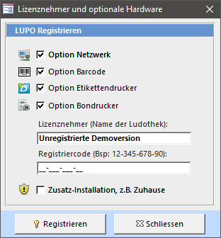

Aktivieren Sie die von Ihnen bestellten Programmoptionen (Netzwerk, Barcode, Bondrucker) und tragen Sie den Namen Ihrer Ludothek sowie den Registriercode in die vorgesehenen Textfelder ein. Achten Sie auf die genaue Schreibweise. Drücken Sie auf Registrieren um die Demoversion-Einschränkungen aufzuheben.

---
#Einstellungen
---

# Einstellungen


<a href="{{p.url}}"><h5>{{ p.title }}</h5></a>

---
# Aufbau der Webseite'

visible: true
---

## Aufbau der Webseite

Der Inhalt der Website ist in verschiedene Bereiche unterteilt. Beiträge können direkt im Frontend bearbeitet werden, der andere Inhalt (Module) wird im Administrator verwaltet.

---
# Inhalt bearbeiten'

visible: true
---

Der Inhalt der Website ist in verschiedene Bereiche unterteilt. Beiträge können direkt im Frontend bearbeitet werden, der andere Inhalt (Module) wird im Administrator verwaltet.

| Menu | Objekt-Typ | Bearbeiten | 
| --- |--- |--- |
| Start |  Modul Home Slideshow (Widgetkit) / Modul Home Willkommen |  Administrator| 
| Sortiment |  Spiele aus LUPO |  Administrator | 
| Aktuell |  Alle Beiträge der Kategorie Aktuell |  Frontend oder Administrator |  
| Agenda |  Alle Beiträge der Kategorie Agenda |  Frontend oder Administrator |  
| Reglement |  Beitrag |  Frontend oder Administrator |  
| Über uns |  Beitrag |  Frontend oder Administrator |  
| Kontakt |  Erweiterung «Kontakt» |  Administrator | 

#### Artikel im Frontend bearbeiten

Änderungen an bestehenden Beiträgen können direkt im Frontend vorgenommen werden. Dazu müssen Sie sich auf der Seite Impressum im Login-Bereich oben rechts anmelden:

**Im Frontend können nur Beiträge bearbeitet werden.** Änderungen am Modulen, Menüs, Links und dem Spielangebot müssen im Administrator ausgeführt werden.

#### Modul bearbeiten

Um den Inhalt eines Moduls zu bearbeiten kann im Frontend auf das Icon oben links geklickt werden:

---
# Administrator Login'

visible: true
---

Sämtliche Inhalte der Website können über den Administrator kontrolliert werden. Melden Sie sich mit Ihrem Webseiten-Login unter **http://www.[ihre-ludothek-domain].ch/administrator/** an.

Nach erfolgter Anmeldung im Administrator sehen Sie die Administrator-Startseite:

---
#Beiträge

visible: true
---

Ein Klick auf den Menüpunkt Inhalt → Beiträge öffnet die Seite zum Bearbeiten oder Erstellen von Beiträgen:

Es existieren drei Beitrags-Kategorien: Ohne Kategorie, Über uns und Aktuell. Beiträge der Kategorie Aktuell werden in der Webseite beim Menüpunkt Aktuell aufgeführt die mit Über uns unter dem entsprechenden Menülink.

#### Hauptbeiträge

Hauptbeiträge werden auf der **Startseite** angezeigt. Um einen Beitrag als Hauptbeitrag zu definieren muss unter Status der Stern gesetzt werden.

#### Beitrag bearbeiten

Ein Klick auf den Beitrag-Link öffnet die Seite zur Bearbeitung:

Soll der Beitrag unter Aktuell aufgeführt werden, muss die Kategorie entsprechend gesetzt werden.

Ein Beitrag kann geteilt werden, so dass nur der Anriss angezeigt wird und der volle Text erst durch mit einem Klick auf Weiterlesen angezeigt wird. Dies wird erreicht, indem im Editor an entsprechender Stelle mit dem Knopf Weiterlesen ein Trennbalken eingefügt wird.

Wenn formatierter Text, z.B. aus einem Word-Dokument, kopiert wurde sollte der Text ohne Formatierung eingefügt werden. Dies kann mit folgendem Editor-Symbol erreicht werden:

#### Beiträge unter "Aktuell"

Bei Beiträgen in der Kategorie Aktuell wird das Datum angezeigt, welches unter Erstellungsdatum gespeichert ist. Der Zeitraum, in welchem der Artikel auf der Website angezeigt wird, kann mit den beiden Daten Veröffentlichung starten und Veröffentlichung beenden definiert werden.

#### Beiträge unter "Agenda"

Agenda-Einträge werden sortiert nach dem Veranstaltungsdatum (=Erstellungsdatum) angezeigt. Im Menüpunkt „Agenda" werden alle Beträge der Kategorie aufgelistet und zusätzlich können auf der Startseite die aktuellsten Anlässe durch ein Modul angezeigt werden. In den Modul-Einstellungen kann die Anzahl der Veranstaltungen definiert werden.

Die Daten **Veröffentlichung starten** und **Veröffentlichung beenden** steuern die Sichtbarkeit der Veranstaltung.

Das **Erstellungsdatum** muss auf das Veranstaltungsdatum gesetzt werden und wird auf der Webseite angezeigt:

Unter **Bilder und Links** kann ein Einleitungsbild und eine Beitragsbild definiert werden:

Für eine optisch anspruchsvolle Liste sollten alle Einleitungsbilder ein etwa gleiches Seitenverhältnis haben. Weiter ist zu empfehlen die Einleitungsbilder vor dem Hochladen in einem Grafikprogramm zu verkleinern. Empfehlenswert ist eine Grösse von maximal 800 x 600 Pixel und unter 100 KB.

#### Bilder und Dateien hochladen und in Beitrag einfügen

Bilder und Dateien können auch direkt im Artikel-Text eingefügt werden. Mit folgendem Icon öffnet sich der Bilder-Manager:

Klicken Sie auf das Icon  um ein neues Bild hochzuladen. Folgendes Fenster öffnet sich:

Bitte beachten Sie, dass Fotos nicht in voller Auflösung (der Digi-Cam) hochgeladen werden sollten. Es besteht zwar die Möglichkeit durch Aktivierung des Häkchens „Grösse ändern" die Bilder nach dem Hochladen klein zu rechnen, allerdings empfiehlt es sich, dies bereits vorher in einem Grafikprogramm zu erledigen.

---
#Module

visible: true
---

Ein Klick auf den Menüpunkt Module (im Kontrollzentrum Links unter Struktur) öffnet die Seite zum Bearbeiten der Module:

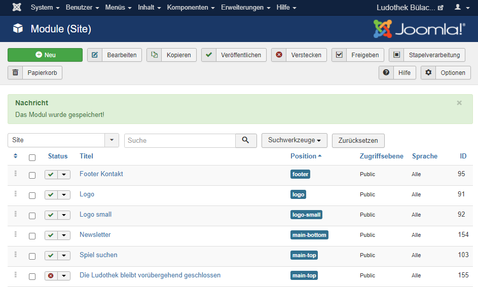

Bearbeiten Sie ein Modul um den Inhalt oder die Position zu ändern.

---
#Widgetkit

visible: true
---

Mit der Erweiterung Widgetkit kann eine Slideshow wie auf der Frontseite erstellt werden. Ebenfalls der Lageplan mit der Google-Maps Karte ist mit Widgetkit erstellt.

Um neue Widgets zu erstellen oder bestehende zu bearbeiten ist im Administrator unter Komponenten → Widgetkit folgendes Fenster zu öffnen:

Auf das Element (z.B. «Lageplan») klicken um die Slideshow zu bearbeiten:

Im Editier-Fenster der Slideshow können Bilder hinzugefügt, verändert neu sortiert oder gelöscht werden.

Um die Anzeigeeinstellungen des Widgets zu verändern muss das Modul geöffnet werden. Die Module sind im Administrator unter **Erweiterungen → Module** zu finden:

Im geöffneten Modul kann auf den Knopf Widgetkit geklickt werden um die Anzeige-Einstellungen zu öffnen:

---
# Spielliste aus LUPO exportieren'

visible: true
---

Das Exportfenster kann im LUPO-Menü mit dem Button Joomla! / Wordpress geöffnet werden:

Das Internetexport-Fenster öffnen Sie mit dem Menübefehl **Joomla! / Wordpress:**

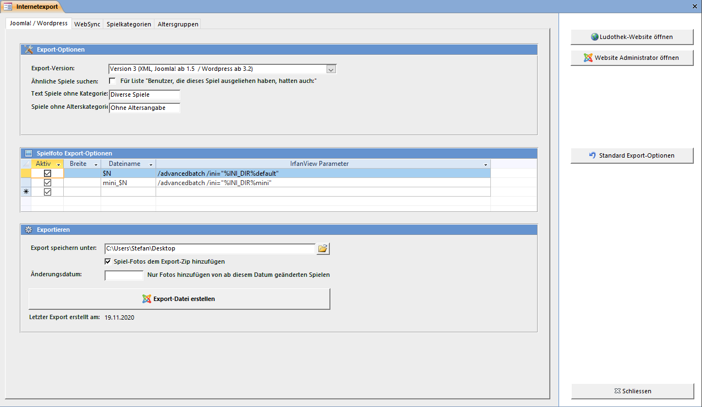

Mit dem Knopf **Exportdatei erstellen** wird eine zip-Datei mit den gewählten Einstellungen und Inhalten erstellt.

#### Spiele in Joomla importieren

Das aus dem LUPO erstellte zip mit den Spielen kann im **Joomla-Administrator** hochgeladen werden. Dazu ist das Fenster unter **Komponenten  LUPO Spielliste** zu öffnen:

Um die aus dem LUPO exportierte Spieleliste ins Joomla zu importieren, die **zip-Datei Auswählen** und dann mit dem Knopf **Datei hochladen** auf dem Server speichern. Danach können mit der Funktion **Hochgeladene Daten verarbeiten ** die Spiele eingelesen werden

---
# Spiele in Joomla importieren'

visible: true
---

Das aus dem LUPO erstellte zip mit den Spielen kann im **Joomla-Administrator** hochgeladen werden. Dazu ist das Fenster unter **Komponenten  LUPO Spielliste** zu öffnen:

Um die aus dem LUPO exportierte Spieleliste ins Joomla zu importieren, die **zip-Datei Auswählen** und dann mit dem Knopf **Datei hochladen** auf dem Server speichern. Danach können mit der Funktion **Hochgeladene Daten verarbeiten ** die Spiele eingelesen werden

---
# WebSync'

visible: true
---

Auf der Webseite kann der Ausleihhstatus (ausgeliehen/verfügbar) des Spiels angezeigt werden:

Neben dem Ausleihstatus ist das WebSync Programm auch zuständig zur Übermittlung der vom Kunden ausgeliehenen Spiele (für Kundenlogin auf der Webseite) sowie zum Einlesen der durch den Kunden online getätigten Verlängerungen.

##Websync einrichten

Das WebSync-Programm kann vom LUPO her gestartet werden:

Bei gesetztem Häkchen öffnet sich das Programm automatisch und minimiert sich nach dem Start in die Taskleiste.

In den WebSync-Einstellungen können folgende Werte definiert werden:

**Webseite URL**  
Tragen Sie hier die Adresse Ihrer Webseite ein, z.B. https://ludothek-zofingen.ch/

**Authentifizierungs-Code**  
Dies ist das "Passwort" für den Dienst zum Schreiben und Lesen der Daten auf Ihrer Webseite. 
Derselbe Wert muss im Joomla-Administrator bei den LUPO-Optionen gespeichert werden:

Vergessen Sie nicht vor dem Herunterfahren des PCs auch das WebSynx-Programm zu schliessen.

---
# Ludothek Webseite' 
---

# Ludothek Webseite


<a href="{{p.url}}"><h5>{{ p.title }}</h5></a>

---
# Datenbackup erstellen'

visible: true
---

Standardmässig speichert LUPO alle Benutzer-Daten im Ordner **C:\Lupo_Daten**. In diesem Verzeichnis sind die Datenbank **Lupo12_Daten.accdb**, die Logo-Dateien und die Spiel-Fotos abgelegt. Die Datensicherung, welche beim entsprechenden Punkt im Beenden-Assistent durchgeführt wird, enthält aber nur die Daten-Datei. Eine Sicherung mit allen Benutzer-Daten kann manuell erstellt werden. Klicken Sie dazu im Menü auf den Knopf Datensicherung:

Die ausgewählten Dateien werden komprimiert in einem RAR-Archiv gespeichert. Um den Inhalt von RAR-Dateien zu extrahieren kann die kostenlose Software WinRAR (Shareware-Version) verwendet werden.

#### Logo-Dateien sichern

Sicherung folgender Dateien im Ordner Lupo_Daten: *.bmp / *.jpg / *.png / *.gif

#### Spiel-Fotos sichern

Sichert die Dateien **[Lupo_Daten]\Spiele-Fotos\\*.***

---
# Sicherung wiederherstellen'

visible: true
---

Die Datensicherung kann nicht direkt aus LUPO zurück gelesen werden. Auf diese Funktion wurde bewusst verzichtet, da die aktuellen Daten dabei überschrieben werden. Sie müssen die Sicherung mit dem Programm **LUPO Datensicherung** zurück lesen.

Öffnen Sie dieses durch Drücken der Windows-Taste und anschliessendem Suchen nach **LUPO Datensicherung**:

Falls die LUPO-Einstellung Jeder Sicherung einen anderen Namen geben aktiviert ist, wird die Sicherungsdatei mit dem Datum und der Uhrzeit im Dateinamen abgespeichert. Solche Dateien haben auf der Festplatte oder dem USB-Stick Dateinamen wie **LupoSave2015-02-10_15-31.rar**

Der erste Button (USB-Stick) öffnet den im LUPO als externes Speichermedium definierter Pfad.

Der zweite Knopf (Smiley) öffnet das lokale Standard-Backupverzeichnis **C:Lupo8Backup**.

Mit dem dritten Knopf (Ordner) wird das Fenster zur Auswahl eines Ordners angezeigt. Wählen Sie z.B. unter „Arbeitsplatz" den USB-Speicherstick mit Ihren Sicherungen.

Wenn im angegebenen Ordner LUPO-Sicherungen vorhanden sind, so werden dies aufgelistet. Wählen Sie eine Datei aus der Liste aus oder klicken Sie auf den Durchsuchen-Knopf um eine Sicherungsdatei auszuwählen.

Mit Datensicherung zurücklesen wird die aktuelle LUPO Datendatei mit den Daten aus dem Rar-Archiv der Sicherungsdatei überschrieben.

!!! Beim Zurücklesen der Datensicherung wird ein Backup der vorhandenen Datei erstellt, bevor diese überschrieben wird.

!! Es können nur Sicherungen der aktuellen LUPO Version eingelesen werden. Sicherungen einer früheren LUPO-Version müssen nach dem zurücklesen mit dem LUPO-Update Programm ins aktuelle Format konvertiert werden.

---
# LUPO Admin'

visible: true
---

Das LUPO Admin Fenster enthält erweiterte Funktionen und ist für fortgeschrittene Benutzer und Administratoren gedacht. Das Fenster kann durch einen Button in den Allgemeinen Programmeinstellungen oder durch Drücken der Tastenkombination **[Ctrl] + [F12]** geöffnet werden.

Diese Funktionen sollten nur von erfahrenen LUPO- und Computerbenutzern verwendet werden! Wenn Sie Daten in der Tabellenansicht verändern, sollten Sie sich bewusst sein, was Sie tun. Es sind fast keine Kontrollmechanismen aktiv; Sie können die Daten so verändern, dass das LUPO-Programm danach nicht mehr korrekt funktioniert!

#### Zusatzfunktionen

#### Alte Adressen löschen

Mit dieser Funktion werden alle Adressen deren Abo-Enddatum kleiner als Ihre Eingabe ist auf den Status gelöscht gesetzt. Gelöschte Adressen können im Kunden-Fenster mit Nur Gelöschte Adressen anzeigen angezeigt und wieder aktiviert (wiederhergestellt) werden.

#### Adressen endgültig löschen

Adressen, welche den Status gelöscht haben werden **ENDGÜLTIG** gelöscht werden. Dieser Befehl kann ausgeführt werden nachdem die alten Adressen mit der oberhalb beschriebenen Funktion gelöscht wurden.

#### Leere Adressnummern finden / Leere Spielnummern finden

Findet alle unbenutzten Nummern zwischen 1 und der grössten, bereits vergebenen. Die gefundenen freien Nummern werden der **manuellen Barcode-Druckliste** hinzugefügt.

#### Liquidierte Spiele endgültig löschen

Diese löscht die liquidierten Spiele inkl. aller Ausleihen und statistischen Daten deren. **Dies ist nicht zu empfehlen. Verwenden Sie stattdessen die Funktion Nummern liquidierter Spiele freigeben im Spiele-Fenster**.

#### Rückgabedatum-Ferien-Rechner
Mit dieser Funktion kann das Berechnen des Rückgabedatums simuliert werden. Im Feld **Heute** kann ein beliebiges Datum ausgewählt werden. Das **Rückgabedatum** wird dann dem eingegebenen Datum unter Berücksichtigung des Ferienplans entsprechend berechnet. 

#### Windows-Explorer öffnen

Öffnet den Windows-Explorer und zeigt den LUPO-Datenordner **(C:Lupo_Daten)** an. Der Windows-Explorer wird zum Kopieren und Verwalten von Dateien verwendet.

#### Kontenplan bearbeiten

Sie können neue Konten erfassen und bestehende ändern. Allerdings ist hier besondere Vorsicht geboten. Werden gewisse Konten gelöscht oder deren Kontonummern verändert funktioniert LUPO nicht mehr korrekt.

#### Adresstabelle / Spieltabelle öffnen

Zeigt alle Adress- oder Spieldaten in einer Tabelle an. Sie können die Daten **sortieren** und mit dem Menübefehl **Suchen und Ersetzen** mehrere Zeilen auf einmal verändern.

#### Tabellen-Editor

Mit dem Tabellen-Editor kann jede im LUPO verwendete Tabelle angezeigt und deren Inhalt verändert werden.

#### Oberfläche

Hier kann die Hintergrundfarbe und die Grafik-Datei in der Übersicht definiert werden. Die ideale Abmessung der Grafikdatei ist **394 x 382** Pixel (Breite x Höhe).

Unter Office Farbschema können die Farben der Oberfläche bestimmt werden. Die Bildschirmfotos in diesem Handbuch sind alle mit dem Farbschema Blau aufgenommen worden. So sieht das Fenster mit Silber aus:

#### Übersetzung

#### Sprache wechseln

Mit diesem Befehl werden alle Sprachbasierten Texte neu initialisiert. Einstellungen, welche einen Text enthalten (z.B. der Infotext für auf den Spielinhalt) werden mit dem Standard überschreiben. Um nur die Sprache der Oberfläche zu wechseln nutzen Sie die entsprechende Funktion in den Einstellungen (Reiter Diverses).

#### Benutzerdefinierte Texte

Mit dieser Funktion können Texte und Wörter umbenannt werden, z.B. wenn anstelle von Tragtasche das Wort Stofftasche angezeigt werden soll. Achten Sie auf die exakte Schreibweise. Es muss immer der gesamte Text eingetragen werden, das Beispiel unterhalb ändert nur den Text Tragtasche im Ausleihfenster, aber nicht Häkchen ‚Tragtasche' anzeigen in den Einstellungen.

#### Translation Tools

Für Übersetzter der Software nützliche Funktionen und Listen.

#### Barcode / POS-Printer

#### Barcode

Scanner von Datalogic (Touch / QuickScan Mobile / Gryphon) können so programmiert werden, dass die LUPO Steuerzeichen für Barcodes ($=preamble, %=postamble) automatisch beim Scannen einen Barcodes gesendet werden. Für andere Scanner, die diese Funktion nicht unterstützen, können diese Steuerzeichen direkt in den Barcode kodiert werden.

Mit dem Barcode-Handler kann das Verhalten von LUPO beim Verarbeiten von gescannten Barcodes definiert werden. Ist Freier Code gesetzt können x-beliebige Codes mit einem Kunden oder Spiel gepaart werden (z.B. der EAN Produktecode eines Spieles oder der Migros-Cumulus Strichcode zur Identifikation des Kunden). In diesem Modus muss der Barcodescanner so konfiguriert werden, dass neben dem $ auch noch das Zeichen X als Preamble gesendet wird.

Der Knopf Barcode Befehle anzeigen druckt die verfügbaren Barcode-Befehle auf Etiketten im Format Zweckform 3664 (LUPO-Standardgrösse).

#### Bondrucker

Wird der Bondrucker synchron angesteuert (Syncmode=True), dann ist das LUPO während des Druckvorgangs blockiert. Verwenden Sie diese Option nur wenn Probleme mit der asynchronen Ansteuerung auftreten.

Wird von einem Computer ohne Bondrucker ein Bon gedruckt landet dieser in einer Warteschlange, welche vom PC mit angeschlossenem Bondrucker in einem bestimmten Intervall abgefragt wird. Bei einem kleinen Abfrageintervall (< 1000ms) kann das System spürbar träge werden, bei einem grossen Wert (>5000ms) dauert es zu lange vom Befehl zum Drucken des Bons bis zur tatsächlichen Ausgabe. Ein guter Wert ist 1500ms.

Der Knopf TEST-printout full ASCII druckt einen Bon mit dem gesamten Zeichensatz des Bondruckers. Diese Funktion ist hilfreich wenn Sonderzeichen wie z.B. Umlaute falsch dargestellt werden.

Die **SetupPOS** Software für einen EPSON oder Bixolon Bondrucker kann durch Drücken des entsprechenden Knopfes gestartet werden. Eine detaillierte Anleitung zum Konfigurieren der OPOS-Druckertreiber entnehmen Sie bitte der separaten Anleitung.

#### Diverses

#### Online Support-Forum

Hier kann der Benutzername und das Passwort für den Zugriff auf die online Frage-Antwort Datenbank definiert werden. Per Vorgabe sind die Werte für den Benutzer ludothek gesetzt. Wenn Sie Sich auf unserer Website mit einem eigenen Benutzer registriert haben können hier Ihre persönlichen Zugangsdaten eingetragen werden.

#### Datensicherung

Die Datensicherungsdatei (LupoSave2014-08-11_10-41.rar), welche am eingestellten Ort (z.B. der Laufwerksbuchstabe des USB-Sticks) gespeichert wird, ist stets eine Kopie der zuvor im Backup-Arbeitsverzeichnis erstellten Sicherung.

Ohne einen eingetragenen Wert wird der Ordner C:Lupo10backup verwendet. Es kann ein beliebiger verfügbarer Pfad eingetragen werden, z.B. ein Dropbox- oder OneDrive Ordner, um so die Sicherungs-Dateien automatisch neben der USB-Stick Sicherung noch Ihrem Cloud-Storage Account hinzuzufügen.

Unter Run Shell Command kann ein benutzerdefiniertes Script, z. B. ein Batch (.bat) oder eine VBScript-Datei (.vbs) definiert werden. Ist ein Pfad zu einer Datei eingetragen so wird dieser Befehl beim Sichern ausgeführt anstelle der LUPO Sicherung per WinRAR.

Der erste Knopf hinter dem Textfeld kann zu Testzwecken das Script ausführen, der zweite öffnet diese in einem Texteditor.

#### Bildersuche

Diese Adresse wird im Browser geöffnet wenn im Spielfenster die Web-Suche nach Bilder gestartet wird. Es können die Platzhalter %LANGUAGE%, %NAME% und %HERSTELLER% verwendet werden.

#### Grafikprogramm

Das Grafikprogramm mit welchem Grafik-Dateien geöffnet werden wenn auf den entsprechenden Button geklickt wird. Geben Sie den ganzen Pfad zur ausführbaren Datei an.

#### Entwicklung

Hier sind für Entwickler und Programmierer gedachte Funktionen enthalten.

---
#Fehlermeldungen

visible: true
---

Falls eine Fehlermeldung erscheint, das LUPO-Programm abstürzt, ein Blue-Screen erscheint oder der PC unsanft durch einen Stromausfall abgeschaltet wird gehen keine Daten verloren. (Lediglich die letzte Eingabe ist ev. nicht gespeichert)

Nachfolgend finden sie einige bekannte oder gängige Probleme sowie passende Lösungsvorschläge.

#### Sicherheitsmeldung beim Start

Beim Start von LUPO oder einem anderen LUPO-Programm (z.B. dem Datenupdate-Programm) erscheint folgende Meldung oben im Fenster:

LUPO wurde unter einem anderen Benutzer installiert als der aktuell angemeldete. Führen Sie das Programm **LUPO Installation reparieren** unter dem aktuellen Benutzer aus um den Inhalt dauerhaft zu aktivieren.

#### Datenbank nicht gefunden

Sofort nach dem Start von LUPO erscheint diese Fehlermeldung:

LUPO kann die Daten-Datenbank (die Datei, in welcher alle Daten wie Adressen, Spiele, Ausleihen usw. gespeichert sind) nicht öffnen. Normalerweise ist diese Datei unter C:Lupo_DatenLupo10_Daten.accdb auf dem Haupt-PC und unter Z:Lupo10_Daten.accdb auf dem Netzwerk-PC gespeichert. Wenn die Meldung auf dem PC erscheint, welcher via Netzwerk auf den anderen zugreifen soll überprüfen Sie ob im Windows-Explorer das Netzlaufwerk (Z:) angezeigt wird und ob Sie darauf zugreifen können.

#### Nicht erkennbares Datenbankformat

Diese Fehlermeldung erscheint wenn die LUPO-Datendatei beschädigt ist. Dies kann z. B. geschehen wenn der PC abstürzt oder abgeschaltet wurde ohne herunterzufahren. Klicken Sie auf OK und im nächsten Dateiauswahl-Fenster auf Öffnen . Wenn LUPO danach ohne weitere Fehlermeldungen startet hat das Reparieren funktioniert und Sie können normal weiterarbeiten.

#### Unzulässiger Wert

Sie haben z.B. einen Buchstaben in ein Zahlenfeld eingegeben. Bestätigen Sie die Fehlermeldung und korrigieren Sie den Feldinhalt auf einen gültigen Wert oder drücken Sie [ESC] um Ihre Eingabe rückgängig zu machen und das Feld zu verlassen.

#### Kein Wert aus der Auswahlliste

Sie haben in einer Auswahlliste einen Wert eingegeben der nicht in der Liste vorkommt. Bestätigen Sie die Fehlermeldung und wählen Sie ein Element aus der Liste oder drücken Sie [ESC] um das Feld zu verlassen.

#### Datensatz löschen geht nicht

Sie versuchen einen Datensatz zu löschen, z.B. eine Spielkategorie in den Einstellungen, welcher noch einem anderen Datensatz zugeordnet ist. Heben Sie zuerst alle Verknüpfungen zu diesem Datensatz auf.

#### Schwarzer Bildschirm

Überprüfen Sie ob der Bildschirm am Strom und am PC angeschlossen ist. Schalten Sie den Bildschirm aus und wieder an.

#### Tastatur oder Maus geht nicht

Überprüfen sie ob das Kabel des betreffenden Geräts am Computer richtig angeschlossen ist. (Mag zwar blöd klingen, ist jedoch meistens die Ursache des Problems)

#### Druckerprobleme

Wenn Sie nicht Drucken können, überprüfen Sie ob der Drucker auf ON-LINE steht, Papier vorhanden ist und keine Fehlermeldung (rotes Lämpchen oder so) am Drucker angezeigt wird. Stellen Sie sicher, dass der Drucker richtig am Computer angeschlossen ist.

Überprüfen Sie ob Ihr Drucker als Standarddrucker definiert ist (Windows Systemsteuerung  Drucker und Geräte).

Probieren Sie, ob das Drucken aus einem anderen Programm funktioniert (z.B. Word)

#### Programm Absturz

Bill Gates lässt grüssen... Drücken Sie auf Programm schliessen und starten Sie LUPO neu.

#### Task-Manager ([Ctrl]+[Alt]+[Esc])

Falls LUPO überhaupt nicht mehr reagiert oder Sie eine Fehlermeldung oder ein Fenster nicht wegbringen, dann kann LUPO mit dem Task-Manager geschlossen werden. Drücken Sie dazu gleichzeitig die Tasten [Ctrl]+[Alt]+[Esc] oder klicken Sie mit der rechten Maustaste auf die Uhr im Bildschirm unten rechts um den Windows Task-Manager zu öffnen.

Zuerst markieren Sie LUPO in der Liste der laufenden Anwendungen, dann klicken Sie auf Task beenden , danach auf Sofort beenden .

#### Andere Fehlermeldungen

Erscheint eine komische Fehlermeldung, oder funktioniert es sonst nicht richtig, schliessen sie das Fenster und öffnen es erneut. Nützt dies nichts, schliessen Sie das LUPO-Programm und starten es erneut.

Falls die Fehlermeldung weiterhin besteht, dann können Sie uns ihre Datensicherungs-Datei schicken. Beschreiben Sie genau wann und wo der Fehler auftritt, so dass wir diesen reproduzieren können. Sobald der Fehler gefunden und behoben wurde kann ein Update auf unserer Website heruntergeladen werden.

---
# LUPO reparieren'

visible: true
---

Wenn LUPO nicht mehr gestartet werden kann oder beim Start nur eine Fehlermeldung angezeigt wird, dann können Sie versuchen ob das Programm **LUPO Installation reparieren** das Problem behebt.

Öffnen Sie dieses durch Drücken der Windows-Taste und anschliessendem Suchen nach **LUPO**:

 
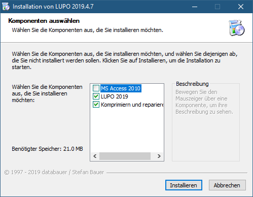
---
# Fernwartung mit TeamViewer'

visible: true
---

Zusammen mit LUPO wird die Software TeamViewer installiert, mit welcher von einem anderen Computer via Internetverbindung Ihr PC ferngesteuert werden kann.

Starten Sie den TeamViewer mit dem Desktop-Icon oder durch Drücken der Windows-Taste und anschliessendem Suchen nach TeamViewer oder direkt mit dem Symbolleistenbefehl im LUPO:

Bei aktivierter Benutzerkontensteuerung erscheint folgender Dialog, welcher mit Ja beantwortet werden muss:

Wenn das LUPO Quick-Support Fenster erscheint kann Ihr Support-Partner eine Verbindung zu Ihrem PC aufbauen.

Die Support-Verbindung zu Ihrem PC muss nun noch durch Sie bestätigt werden:

Nach erfolgter Verbindung können Sie sich zurücklehnen und zuschauen.

---
# Dymo LabelWriter'

visible: true
---

#### Druckertreiber und «DYMO Label v.8»-Software installieren

Installieren Sie – bevor Sie den Drucker am PC anschliessen – die Software mit der dem Drucker beigelegten CD. Eine Anleitung mit detaillierten Anweisungen liegt dem Drucker bei.

Bei der Installation von LUPO werden folgende drei Etiketten-Vorlagedateien in den Ordner C:Lupo_daten kopiert:

Dies sind alles Vorlagen der Etikettengrösse 32 mm x 57 mm (Art. N° 11354). Sie können selbstverständlich jedes beliebige andere Etikettenformat verwenden.

Öffnen Sie mit der DYMO Label v.8 Software eine Label-Datei:

Unter dem Reiter Einfügen können Sie frei Texte und Bilder dem Etikett hinzufügen oder bestehende Elemente anpassen.

#### Etiketten einrichten

Damit Lupo den Barcode oder Spielnamen mit Inhalt füllen kann müssen die Objekte mit dem korrekten Objektnamen versehen werden. Klicken Sie dazu im **Einfügen-Modus** mit der rechten Maustaste auf ein Objekt, dann wählen Sie **Eigenschaften**.

Gültige Objektnamen, welche von LUPO mit Inhalt gefüllt werden können

**Spiel-Barcode**

* LUDOTHEK
* BARCODE
* SPNR
* GEBÜHR
* SPIELNAME
* AUSFÜHRUNG
* SPIELNAME-AUSFÜHRUNG
* ART
* ARTKURZ
* ALTER
* LAGERORT
* INHALT
* LIEFERANT
* HERSTELLER
* AZSPIELER
* SPIELDAUER
* AUSLEIHTAGE
* KAUFPREIS
* KATALOGPREIS
* BESCHREIBUNG
* BESCHREIBUNG_TITEL

**Kunden-Barcode**
* LUDOTHEK
* BARCODE
* ADRNR
* VORNAME
* NACHNAME
* VORNAME_NACHNAME
* GRUPPE
* STRASSE
* PLZ
* ORT
* PLZ-ORT
* ABOENDDAT

#### LUPO-Einstellungen

Unter **Übersicht --> Einstellungen --> Programmeinstellungen** bei Spiel-Barcode den entsprechenden Etikettentyp sowie die Label-Datei wählen:

Und für die Kunden-Barcodes:

#### Einzelne Etikette drucken

Die Etikette eines Spiels kann durch Klicken auf den Barcode-Knopf in **Spiele Erfassen** Fenster gedruckt werden:

Im **Adressfenster** befindet sich hinter der Adressnummer ein Barcode-Knopf zum Drucken des Etiketts.

Ebenfalls kann im Fenster **Neue Adresse** direkt nach dem Eintippen der Adresse ein Etikett gedruckt werden:

!! Die DYMO-LabelWriter drucken mit dem Thermodirekt-Verfahren. Ein Nachteil von Thermopapier ist, dass die Etiketten mit der Zeit etwas verblassen. Hitze, direktes Sonnenlicht aber auch die Kunststoff-ausdunstung von Plastikfolien können diesen Prozess noch beschleunigen. Deshalb sollten die Etiketten nicht mit einer Schutzfolie überklebt werden.

---
# EPSON Bondrucker'

visible: true
---

## EPSON Bondrucker installieren

Diese Installationsanleitung gilt für die EPSON-Drucker **TM-U220D / TM-T88III / TM-T88IV / TM-T20 / TM-T20II / TM-T20III** Der Bondrucker wird direkt über die OPOS / UPOS Schnittstelle angesteuert und muss nicht als Windows-Drucker installiert werden. Der Drucker muss bei den Windows-Einstellungen unter **Drucker & Scanner** nicht aufgelistet sein.

#### EPSON OPOS ADK 3.0 installieren

Die Bondrucker-Software kann zusammen mit den LUPO-Programmdateien installiert werden. Wählen Sie dazu im LUPO Installationsassistent das Häkchen **EPSON Bondrucker** an:

Falls bereits eine aktuelle LUPO-Version installiert ist, dann kann das Programm zur Ansteuerung des Druckers auch von unserer Webseite heruntergeladen werden: 

!! **SetupPOS Version 2.5 oder älter **  
!! Wenn eine ältere Version des Bondrucker-Treibers installiert ist, z.B. für den TM-T210D Drucker, dann muss diese zuerst deinstalliert werden. Das «darüber installieren» der Version 3.0 funktioniert nicht.

!! **Windows Drucker**  
!! Der Drucker wird direkt aus LUPO über spezielle Drucker-Kommandos angesteuert. Es muss NICHT als Windows-Drucker (unter Drucker und Scanner) installiert werden.

#### Druckertreiber konfigurieren

Nach erfolgreicher Installation muss der Bondrucker konfiguriert werden. Starten Sie dazu das Programm **SetupPOS**( __ -Taste drücken, dann **SetupPOS** schreiben / suchen

Mit einem Klick auf das Symbol ganz links (Add New Device) öffnet sich folgendes Fenster. Wählen Sie **POSPrinter** als DeviceClass falls Sie danach gefragt werden.

1. **Ihr Druckermodell auswählen:** TM-U220D TM-T88III TM-T88IV TM-T20 TM-T20II TM-T20III
2. **Ihr Druckermodell schreiben:** TM-U220D TM-T88III TM-T88IV TM-T20 TM-T20II TM-T20III
3. **Weiter mit Next**

4. **Drucker testen.** CheckHealth Interactive öffnet ein Fenster zum Testen des Druckers. Werden beim Klicken auf **Start** einige Zeilen gedruckt, so ist der Druckertreiber korrekt installiert.

Wenn bei TMPORT Settings „(none)" steht, dann muss ein Port ausgewählt werden oder mit Make Port ein neuer erstellt werden. Mit Finish wird die Installation abgeschlossen.

#### LUPO konfigurieren

Nach der Installation und Konfiguration des Druckertreibers muss im LUPO unter **Übersicht --> Einstellungen --> Programmeinstellungen** noch das Druckermodell bestimmt werden. Wählen Sie dazu im Auswahlfeld POS-Printer Ihr Bondruckermodell (TM-U220D, TM-T88III, TM-T88IV, TM-T20 oder TM-T20II) aus.

Wenn im Netzwerk gearbeitet wird muss auf dem PC mit angeschlossenem Bondrucker das Häkchen An diesem Computer ist ein Bondrucker angeschlossen aktiviert sein. Die Option Drucken via Netzwerk aktivieren muss auf beiden Computern aktiviert sein. Der Druckertreiber (Setup-POS) muss nur auf dem PC, an welchem der Bondrucker angeschlossen ist, installiert werden.

#### Bondrucker-Modelle (EPSON)

Wenn Sie nicht sicher sind, welchen Bondrucker Sie verwenden, können Sie anhand der folgenden Bilder Ihr Druckermodell bestimmen:

---
# Technische Informationen'

visible: true
---

#### Computeranforderungen

LUPO ist eine MS-Access 2010 Datenbank und läuft auf jedem PC ab Windows XP SP3.

Ihr Computer muss mindestens folgenden Anforderungen entsprechen:

\- Windows Vista oder später (mindestens Win XP Service Pack 3) - Pentium 4 1GHz - 1 GB Arbeitsspeicher / 500 MB freier Festplattenspeicher - CD-ROM oder DVD Laufwerk (zur Installation ab CD) - 4 x USB-Anschluss (für Datensicherung auf USB-Stick / Drucker / Bondrucker / Barcodescanner) - Bildschirmauflösung min. 1280 x 768 Pixel

Falls Sie sich einen neuen Computer anschaffen, sollte er folgende minimale Leistungsmerkmale aufweisen:

\- Windows 10 - Pentium 3GHz - 4 GB Arbeitsspeicher - 128 GB Festplatte oder SSD - Combo CD-RW/DVD (optional, nur zur Installation ab CD notwendig) - 6 x USB 2.0 Anschluss, 2 x USB 3.0 - Bildschirmauflösung 1440 x 900 Pixel

#### Bondrucker

Der Bondrucker wird mit einer speziellen Software (POS, OPOS) angesteuert und muss nicht als Windows-Drucker installiert werden. Bitte beachten Sie die separate Anleitung zur Installation eines Bondruckers.

Unterstützte Modelle:

**EPSON:**

TM-U210D / TM-U220D / TM-T88III / TM-T88IV / TM-T20 / TM-T20II

**Bixolon:**

SRP-350 / SRP-350plus

**Metapace:**

T-2

Bei einer Neuanschaffung empfehlen wir den EPSON TM-T20II

Die Bondrucker EPSON TM-U210D / TM-U220D / TM-T88III werden über die serielle Schnittstelle gesteuert und an einem seriellen 9-Pol Stecker (COM, RS232) am Computer angeschlossen. Verfügt Ihr PC über keinen solchen Anschluss (was bei neueren PCs meist der Fall ist) kann dieser mit einer PCI oder PCI-Express Karte nachgerüstet werden. Eine solche Karte kostet um die Fr. 40.-

Die TM-U Drucker verwenden normales Rollen-Papier von 76 mm Breite und drucken mit einem Farbband vom Typ ERC-38 in violett, schwarz oder rot-schwarz.

Die TM-T88 und TM-T20 Drucker von EPSON und die Drucker von Bixolon und Metapace benötigen Thermopapier mit einer Rollenbreite 79,5 mm +/-0,5 und einem maximalen Durchmesser von 83 mm. Eine gängige Produktbezeichnung ist „Thermopapierrollen 80/80/80" (80mm breit, 80mm Ø, 80m lang).

#### Barcodescanner

Der Barcodescanner wird an einer USB-Buchse angeschlossen und erfordert keine weitere Hardware oder freie Steckplätze.

Ältere Barcodescanner (z.B. vom Hersteller Intermec) haben ein Kabel mit Weiche (Keyboard-wedge) und werden an den PS/2 Tastaturanschluss angeschlossen. Hat der PC keinen solchen Anschluss kann der Scanner eventuell nicht verwendet werden, da PS/2 zu USB Adapter nicht auf allen Systemen zuverlässig funktionieren.

LUPO verwendet Barcodes mit CODE 39 und der Scanner muss so konfiguriert sein, dass weder die * (Asterisk) noch der Zeilenumbruch am Ende der gelesenen Zeichensequenz übermittelt werden.

#### Internet

Eine Internetverbindung ist nicht zwingend notwendig, bietet aber einige Vorteile. So können über das Internet die LUPO-Updates heruntergeladen werden oder der PC mit dem Fernwartungstool TeamViewer ferngesteuert werden.

#### Netzwerk

Falls Sie LUPO im Netzwerk betreiben wollen müssen die beiden Computer miteinander verbunden sein. Ein 'normales' Windows Netzwerk genügt. Es ist empfehlenswert die PC's mit einem Netzwerk-Switch (kleines Gerät, ab Fr. 40.-) zu verkabeln. Wireless-Netzwerke sind nicht zu empfehlen!

#### Drucker

Sie sollten über einen Tintenstrahl- oder Laserdrucker verfügen. Wenn Sie LUPO mit der Zusatzfunktion Barcode nutzen, sollten Sie für den Druck der Barcode-Etiketten einen Laserdrucker verwenden.

#### Windows Vista / 7 / 8 / 8.1 / 10

LUPO kann auf jeder Windows-Version ab Windows Vista problemlos installiert werden. Je nach Benutzerkonten-Einstellung und -Rechten muss das Programm mit Administrator-Rechten installiert werden.

#### Windows XP

Office Access 2010, auf welchem LUPO basiert, wird von Microsoft offiziell nicht unterstützt unter Windows XP. Unsere Tests zeigten aber, dass die Software trotzdem stabil läuft. Windows XP Service Pack 3 ist erforderlich.

#### Microsoft-Access 2010 Runtime (32 Bit)

Mit dem Softwarepaket LUPO wird eine Access-Runtime Version mitgeliefert. Sie benötigen also keine installierte Access-Vollversion damit LUPO auf Ihrem Computer läuft.

#### Microsoft Office 2010 64 Bit

Es darf kein 64-Bit Office installiert sein, LUPO läuft NUR in einer Office 2010 32 Bit Umgebung. Das Betriebssystem hingegen darf 64 Bit sein.

#### Microsoft Office 2003 / 2007 / 2010 / 2013 / 2016

Auch wenn eine andere Office-Version als 2010 installiert ist, funktioniert LUPO einwandfrei. Falls Sie ein Access installiert haben, dürfen Sie die LUPO Datenbank zwar öffnen, aber nicht in eine andre Version konvertieren.

