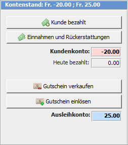
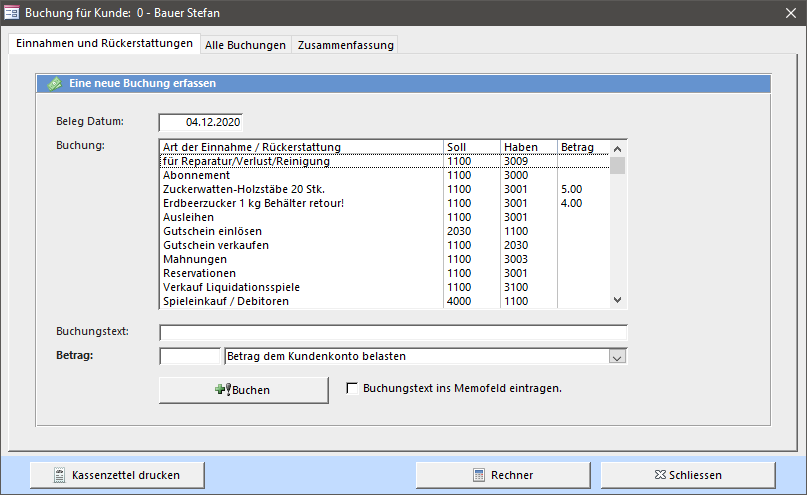
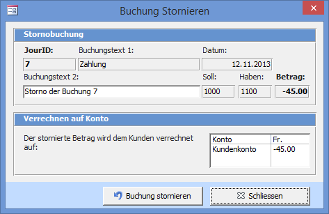
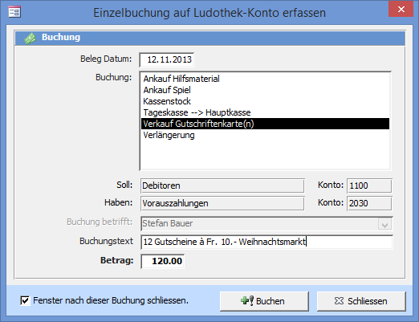

Jeder Kunde hat zwei Konten, ein Kundenkonto und ein Ausleihkonto. Das Geld auf dem Ausleihkonto wird über das Einlösen eines Gutscheins deponiert und kann nur für Ausleihgebühren verwendet werden. Der Kunden¬konto¬stand kann mit dem Knopf Kunde bezahlt auf 0 gesetzt werden. Der Kunde bezahlt in Bar.

>>> **Einstellung**  
Das Feld Ausleihkonto und die Knöpfe **Gutschein verkaufen** und **Gutschein einlösen** können im Fenster **Einstellungen => Wertkarte** ein- bzw. ausgeblendet werden.

### Kunde bezahlt

Der Kunde bezahlt 20.00 Fr. Sein Kontostand wird wieder zu 0.00. Bezahlt er einen anderen Betrag, so können Sie diesen in das Textfeld eintragen. Bezahlt er zu wenig wird diese Zahlung als Teilzahlung, bezahlt er zu viel, als Vorauszahlung im Journal eingetragen.

Normalerweise bezahlt der Kunde in Bar und es wird vom Kunden-Debitorenkonto (1100) in die Tageskasse (1000) gebucht. Wurde das Geld aber per Überweisung eingezahlt, so kann das Soll-Konto auf die Hauptkasse (PC- oder Bankkonto) geändert werden.

Falls Sie LUPO mit der Option Bondrucker installiert haben, besteht die Möglichkeit direkt nach dem Bezahlen den Bon auszudrucken.

!!!! Wenn z.B. das Bondrucker-Papier ausgegangen ist, so kann der aktuelle Zustand des Häkchens durch Klicken auf das kleine Diskettenbild gespeichert werden.

### Einnahmen und Rückerstattungen

Mit dem Button Einnahmen und Rückerstattungen öffnen Sie das Fenster **Buchung für Kunde**.

In diesem Fenster kann dem Kunden (z.B. für ein verlorenes Spiel) ein Betrag verrechnet oder gutgeschrieben werden.

Die Buchungen, welche Sie erfassen werden dem Kunden- oder Ausleihkonto belastet bzw. gutgeschrieben.

Um dem Kunden eine Gutschrift zu machen, wählen Sie im Auswahlfeld rechts des Betrages Betrag dem Kundenkonto gutschreiben oder schreiben Sie eine negative Zahl in Feld.

Buchen speichert die Buchung und verrechnet den Betrag dem Kunden. Der Buchungstext kann automatisch ins Kundenmemo übertragen werden.

>>> **Einstellung**  
Die Buchungs-Vorgaben können im Fenster **Übersicht => Buchhaltung => Buchungstexte** bearbeiten definiert werden.

### Liste aller Buchungen

Klicken Sie auf den Reiter Alle Buchungen um die Journaleinträge des aktuellen Kunden angezeigt zu bekommen.

Bei Buchungen von heute wird das Buchungsdatum blau dargestellt.

#### Kassenzettel Drucken

Druckt alle Buchungen eines definierten Zeitraums auf den Bondrucker aus.

#### Markierte Buchung stornieren

Markieren Sie eine Buchung in der Liste und klicken Sie auf den Knopf Markierte Buchung stornieren um die ausgewählte Buchung zu stornieren.

Wird eine Buchung storniert, welche den Kunden- oder Ausleihkontostand des aktuellen Kunden betrifft, so wird dieser angepasst.

!!!! Anstatt eine Buchung zu stornieren, kann auch eine neue Buchung mit einer Gutschrift erfasst werden.

### Gutscheine verkaufen und einlösen

Jeder Kunde hat ein 'normales' Konto mit Bargeld-Schulden oder -Guthaben und ein Ausleih-Konto für vorausbezahlte Ausleihgebühren. Das Ausleih-Konto wird solange mit den Ausleihgebühren belastet bis es aufgebraucht (0) ist. Kauft ein Kunde einen Gutschein, so leistet er eine Vorauszahlung für die Ausleihgebühren. Der Gutschein ist unpersönlich solange sie nicht eingelöst wird.

>>> **Einstellung**  
Das Ausleihkonto und die Funktionen zum Verkaufen und Einlösen von Gutscheinen können in den Einstellungen deaktiviert werden.

#### Gutschein verkaufen

Aktivieren Sie das Kontrollkästchen Dem Ausleihkonto von Kunde xxx Verrechnen um den Gutschein direkt dem aktuellen Kunden seinem Ausleihkonto gutzuschreiben.

Falls der Kunde Schulden auf seinem Kundenkonto hat (die Spiele wurden bereits ausgeliehen und erst jetzt will der Kunde eine Gutscheinkarte kaufen) und diese nachträglich mit dem Ausleihkonto bezahlt werden sollen, aktivieren Sie das Kontrollkästchen Bar-Kontostand (Schulden) jetzt dem Ausleihkonto abziehen.

#### Gutschein einlösen

Drücken Sie Gutschein einlösen um dem Kunden eine Gutschrift auf sein Ausleihkonto zu buchen. Geben Sie den effektiven Wert (also inkl. Rabatt) der Karte ein.

#### Manuelle Sammelbuchung für Wertkarten-Verkauf

Sie haben (z.B. am Weihnachtsmarkt) 12 Karten als Geschenk verkauft, Sie wissen also noch nicht wer die Gutschrift einlöst. Wenn Sie diese Einnahmen in die Tageskasse legen müssen Sie das Geld auch verbuchen.

Öffnen Sie dazu das Fenster **Übersicht => Buchhaltung => Einzelbuchung (mit Vorgaben)** und führen Sie folgende Buchung durch.

