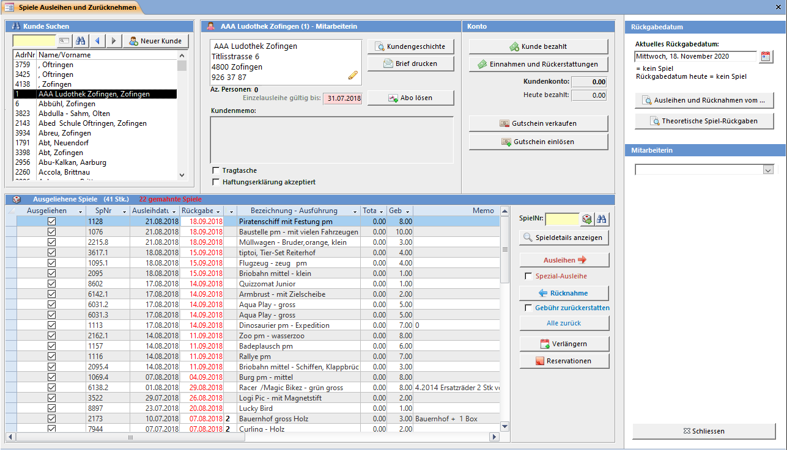
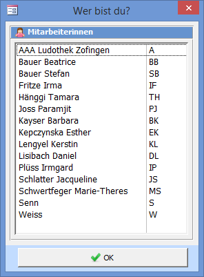

Das **Spiele ausleihen und zurücknehmen** Fenster können Sie mit der Übersicht oder der Symbolleiste öffnen.
* Die wichtigsten Aktionen, welche Sie in diesem Fenster durchführen können sind:
    * Spiele ausleihen und zurücknehmen
    * Spiele verlängern
    * Spiele reservieren
    * Abonnement (Mitgliederbeitrag) verkaufen
    * Dem Kunden einen Betrag verrechnen oder zurückerstatten
    * Gutscheinkarte (Vorauszahlung) verkaufen und einlösen
    * Die Adressdaten des Kunden verändern
    * Einen neuen Kunden erfassen

#### Rückgabedatum bestimmen (Stempeldatum)

Die Spiele, welche Sie ausleihen, erhalten das im Feld Aktuelles Rückgabedatum eingetragene Datum. Das Rückgabedatum wird standardmässig auf **[heute] + [Anzahl eingestellte Tage]** vorgeschlagen. Die Anzahl der vorgeschlagenen Ausleihtage können Sie in den **Einstellungen → Ausleihen** ändern. Sie können das vorgeschlagene Rückgabedatum auf ein x-beliebiges Datum ändern. Doppelklicken Sie auf das Datum um den **Kalender** zu öffnen.

Unter dem Rückgabedatum werden die Anzahl Spiele angezeigt, welche heute ausgeliehen wurden. In der zweiten Zeile bei Rückgabedatum heute wird die Summe der Spiele, welche theoretisch am heutigen Tag zurückgebracht werden angezeigt.

!!! Wenn ein Spiel nicht die Normalausleihdauer (meistens 28 Tage) hat, wird das Rückgabedatum immer aus **[heute] + [Anzahl Ausleihtage des Spiels]** berechnet.

#### Rückgabedatum fällt vor oder in die Ferien

Wenn das automatisch berechnete Rückgabedatum kurz vor oder in die Ferien fällt, erscheint eine Meldung.

! **Einstellung Ferienplan**  
! Der Ferienplan kann in den Allgemeinen Programmeinstellungen definiert werden.

#### Alle Ausleihen und Rücknahmen von …

Dieser Knopf zeigt eine Liste mit den Spielausleihen und -rücknahmen eines bestimmten Datums an.

#### Theoretische Spiel-Rückgaben

Zeigt jedes Rückgabedatum und die Anzahl der zu erwartenden Spiel-Rückgaben an.

#### Mitarbeitern

Die am PC arbeitende Mitarbeiterin. Die hier eingetragene Person wird zu jeder Ausleihe, Rückgabe oder Buchung gespeichert.

Ist in den Einstellungen im Reiter Mitarbeiterinnen die Option Erfassen welche Mitarbeiterin Spiele ausleiht und zurücknimmt aktiviert, dann ist diese Information Pflicht. Wenn keine Person ausgewählt ist, dann erscheint vor der Ausleihe folgendes Fenster:

#### Spielliste des Kunden

Die Liste mit den ausgeliehenen Spielen des aktuellen Kunden zeigt verschiedene Farbcodes an.

| **Farbe** |  **Status** |
| --- |---				  |
| Ausleihdatum blau |  Das Spiel wurde heute ausgeliehen |  
| Ausleihdatum pink |  Die Ausleihfrist wurde verlängert |  
| Rückgabedatum orange |  Die Ausleifrist ist abgelaufen, es wurde aber noch nicht gemahnt |  
| Rückgabedatum rot |  Das Spiel wurde gemahnt |  
| Spielname grün |  Dies ist ein eSpiel |  
| Memo gelb |  Ersatzteile sind vorhanden |  
| Memo rot |  Das Spiel ist reserviert | 
