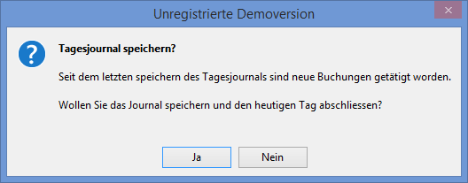
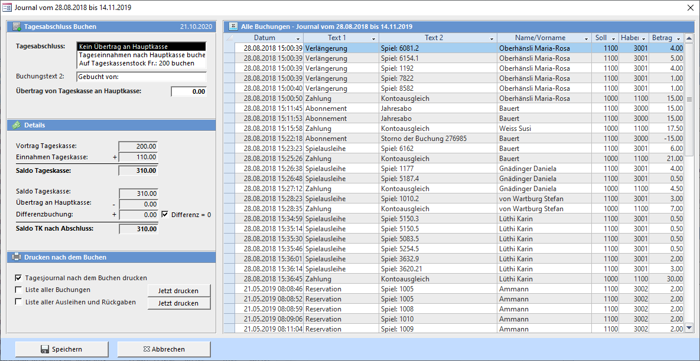
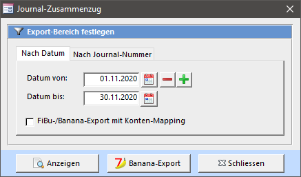
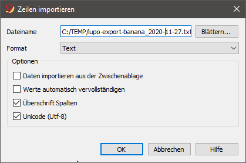

Das Fenster zum Speichern und Drucken des Tagesjournals kann vom Beenden Assistent her, mit der Übersicht oder der Symbolleiste geöffnet werden.

Nach jedem Ausleihtag sollten Sie den Tag abschliessen. Das Tagesjournal enthält Informationen über den Tageskasseninhalt, Mitarbeiterleistungen und Statistiken.

Wenn seit dem letzten Speichern des Tagesjournals neue Buchungen vorhanden sind kann ein neues Journal gespeichert werden. Es können auch mehrere Tagesjournale an einem Tag gespeichert werden.

#### Gespeicherte Tagesjournale (Liste links)

In dieser Liste werden alle gespeicherten Tagesjournale angezeigt. Die Felder Von und Bis zeigen die Buchungsnummer an.

#### Journal Zusammenfassung (Liste rechts)

In dieser Liste werden alle Buchungen des gespeicherten Tagesjournals gruppiert nach Buchungssatz angezeigt.

Durch einen Doppelklick auf eine Tabellenzelle wird ein Fenster mit allen Buchungen angezeigt:

#### Journal Anzeigen / Drucken

Gibt das ausgewählte Journal in der Seitenansicht oder auf den Drucker aus.

## Tagesabschluss

Diese Aktion speichert im Tagesjournal alle Buchungen, die seit dem letzten Speichern neu dazugekommen sind.

Wenn Sie die vorhergehende Frage mit Ja beantwortet haben öffnet sich das Tagesabschluss buchen Fenster:

#### Tagesabschluss

Sie können aus drei verschiedenen Tagesabschlussarten auswählen. Die Auswahl beeinflusst nur das Berechnen des Betrages im Feld **Übertrag von Tageskasse an Hauptkasse**.

Wenn Sie die Tageseinnahmen in der Tageskasse belassen wollen, den Tag aber trotzdem abschliessen, müssen den Betrag Übertrag an Hauptkasse auf 0 abändern. Wählen Sie dazu die Abschlussart Kein Übertrag an Hauptkasse. Das Geld bleibt nun in der Tageskasse und ergibt den Saldovortrag für das nächste Tagesjournal.

#### Differenz = 0

Wenn die Kasse nicht stimmt (es ist zu viel oder zu wenig Geld in der Kasse) kann eine Differenzbuchung durchgeführt werden. Wenn Sie auf das Kästchen Differenz = 0 klicken werden Sie gefragt, wie viel Geld Sie aus der Kasse nehmen und wie viel der Kassenstock danach beträgt. Es wird der Betrag, um welcher die Kasse nicht stimmt berechnet und im Feld Differenzbuchung eingetragen.

#### Speichern

Die Tagesabschlussbuchung wird durchgeführt. Wenn das Häkchen Tagesjournal nach dem Buchen drucken gesetzt ist, werden so viele Exemplare wie in den Einstellungen → [Diverses](/einstellungen/allgemeine-einstellungen/diverses) definiert sind auf den Drucker ausgegeben.

! **Einstellung**  
! Der Bestand der Tageskasse sowie der Soll-Tageskasseninhalt kann unter **Einstellungen → [Diverses](/einstellungen/allgemeine-einstellungen/diverses)** angepasst werden.

## Journal Zusammenzug

Sie können ein Journal über eine x-beliebige Zeitspanne ausdrucken. Dabei werden unabhängig von bereits gespeicherten Tagesabschlüssen die Daten zusammengefasst und wie auf einem Tagesjournal angezeigt.

Mit den Plus- und Minus-Buttons können die Daten monatsweise durchgeblättert werden.

#### Banana-Export

Exportiert alle Buchungen der ausgewählten Zeitspanne ins Textdatei-Format des Buchhaltungsprogrammes Banana. Diese Datei kann dann anschliessend im Banana über den Menübefehl Daten → Zeilen importieren eingelesen werden.

Ist das Häkchen *Fibu-/Banan-Export mit Konten-Mapping** aktiviert, wo wird im Bericht bzw. der Banana-Importdatei das beim Kontenplan in der Spalte Export-Konto als Konto verwendet.

Damit die Konten in Banana mit denen im LUPO korrespondieren, sollte die Buchhaltung auf der bei der LUPO Installation nach C\\:Lupo_Daten kopierten Datei **buchhaltung-lupo.ac2** basieren.

