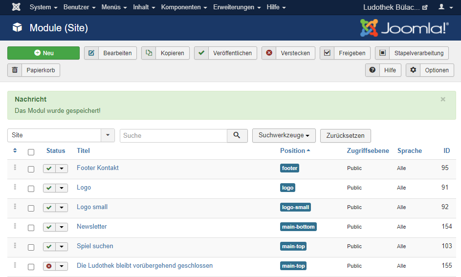
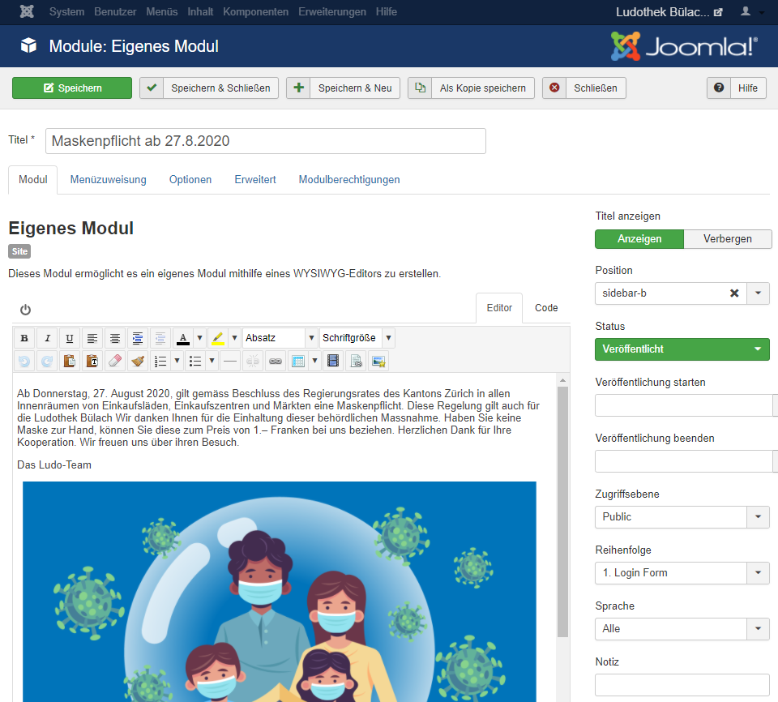
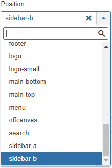
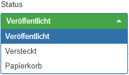
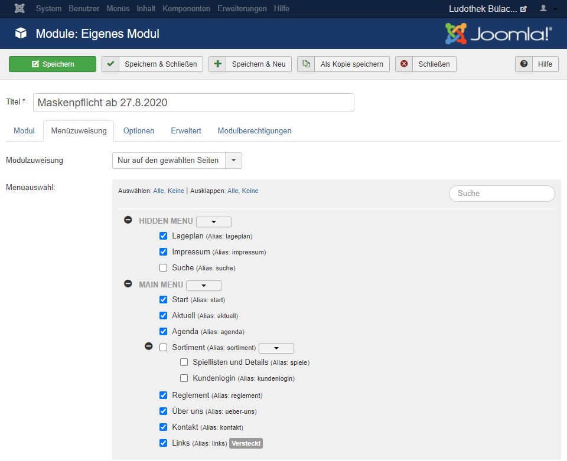

Ein Klick auf den Menüpunkt Module (im Kontrollzentrum Links unter Struktur) öffnet die Seite zum Bearbeiten der Module:

Um die Position oder den Inhalt eines Modules zu ändern müssen Sie auf den Titel des Modules klicken. 

Mit dem Editor können Sie direkt den Inhalt ändern. 
Beim Dropdown **Position** können Sie die Position des Modules ändern. "sidebar-a" steht für links, "sidebar-b" steht für rechts, etc. 

Mithilfe des Knopfes **Status** können Sie auswählen, ob das Modul auf der Webseite sichtbar sein sollte (Veröffentlicht) oder nicht (Versteckt). 

Wenn Sie das Modul nur auf benutzerdefinierten Seiten haben wollen, müssen Sie auf **Menüzuweisung** klicken. 

Unter **Modulzuweisung** können Sie verschiedene Funktionen einsetzen. Wenn Sie "Nur auf den gewählten Seiten" klicken, wird das Modul **NUR** auf den gewählten Seiten vorkommen. Wählen Sie "Auf allen, ausser den gewählten Seiten" aus, kommt das Modul **NICHT** bei den ausgewählten Seiten vor.

Nachdem Sie alles bearbeitet haben, klicken Sie oben bei der Übersicht auf Speichern und danach anschliessend auf Schliessen. Sie können aber auch direkt auf Speicher & Schliessen klicken.

