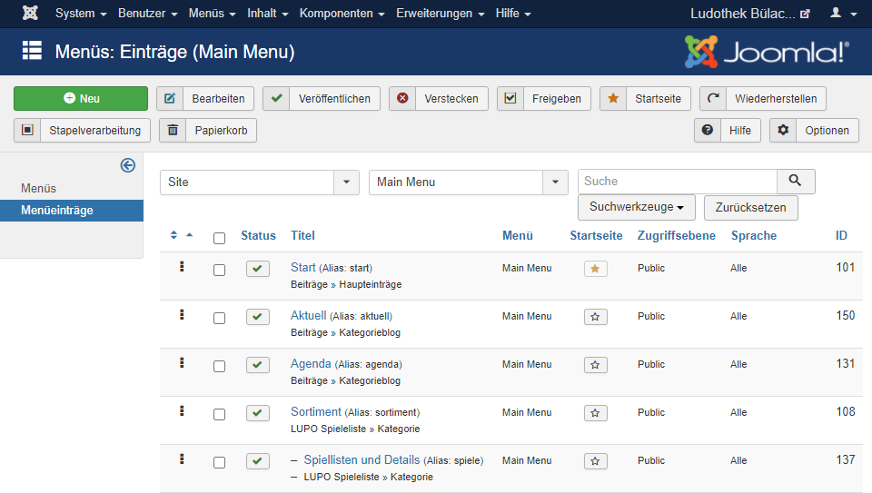
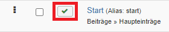
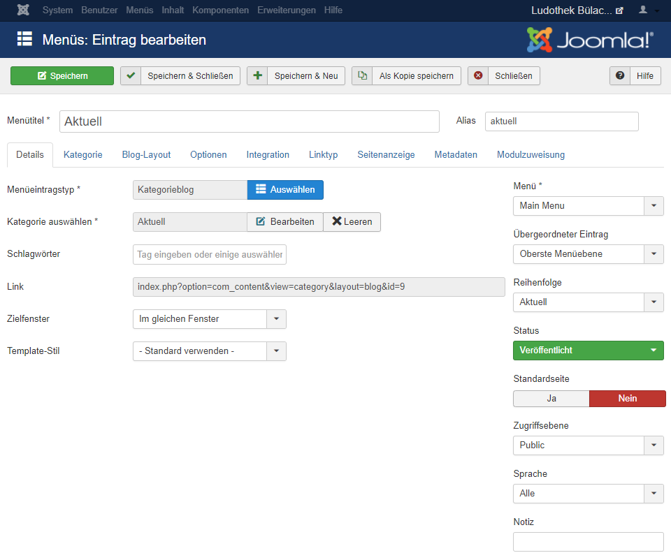
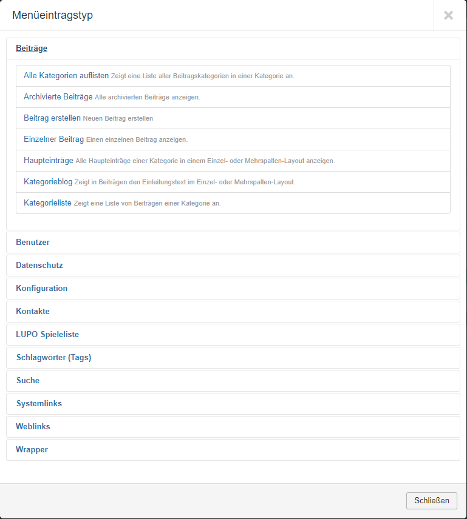

In diesem Kapitel geht es darum, wie man die Menüleiste bearbeiten kann.

Um das Menü zu bearbeiten, müssen Sie oben auf der Übersicht auf **Menü** und danach auf **Main-Menu** klicken.

Sie gelangen auf diese Seite:

Sie können die einzelnen Menü-Einträge links bei den drei Punkten verschieben. 

Wenn Sie z.B. den Menü-Eintrag "Start" ganz links haben wollen, müssen Sie den ganz hochziehen.

Die Häckchen unter Status zeigen an, ob der Menüpunkt sichtbar ist oder nicht. Ist im Kästchen ein **grünes Häckchen**, so ist der Menü-Eintrag sichtbar. Ist im Kästchen ein **rotes Kreuz** heisst das, dass der Menü-Eintrag nicht sichtbar ist.

Wenn Sie einen neuen Menü-Eintrag machen wollen, müssen Sie oben links auf das grüne + Neu klicken.

Um einen Menü-Eintrag bearbeiten zu können, müssen Sie auf den **Titel** des Menü-Eintrages klicken. 

Nun können Sie dem Menü-Eintrag eine Seite zuweisen. Als erstes müssen Sie auf **Menüeintragstyp** → **Auswählen** klicken und dann den Menüeintragstyp auswählen, der Ihrer zugewiesenen Seite zuspricht. 

<!---  --->

Auf **Zielfenster** können Sie einstellen, ob sich die Seite im gleichen Fenster öffnen soll oder ob sich die Seite in einem neuen Fenster öffnen soll.

