Mit einem Content-Plugins kann ein Platzhalter in einem Beitrag oder Modul automatisch mit berechnetem Inhalt ersetzt werden.

Es stehen mehrere LUPO Inhalt-Plugins, **Anzahl Spiele**, **Zufälliges Zitat**, **Spiel** und **Datenschutz** zur Verfügung:

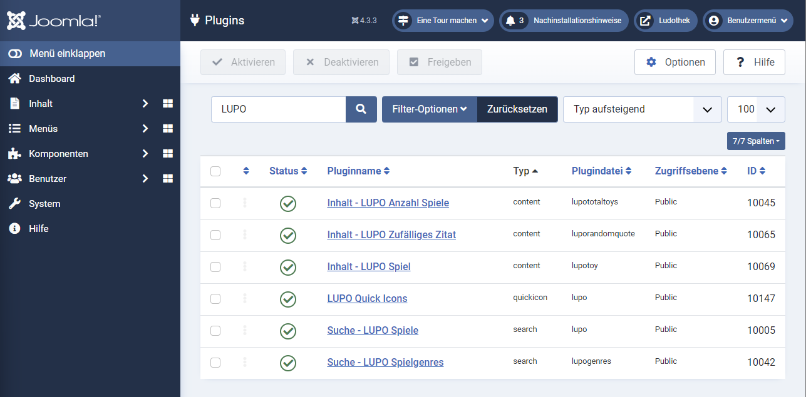

## Inhalt - LUPO Anzahl Spiele

Damit kann die Anzahl der in der Spieldatenbank gespeicherten Spiele im Text eingefügt werden. 

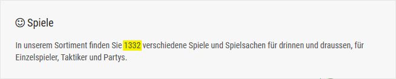

Im Editor wird dazu der Platzhalter angezeigt `[totalspiele]` gesetzt:

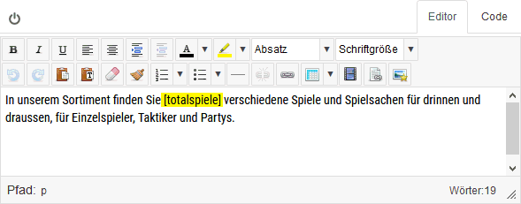

## Inhalt - LUPO Spiel

Damit kann man ein Spiel der aus der Spieldatenbank im Text eingefügen.

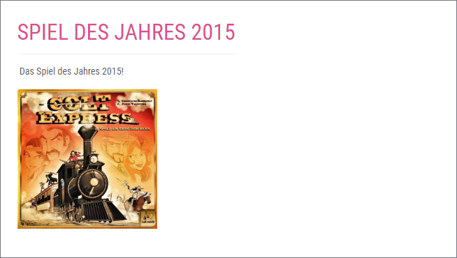

Im Editor wird dazu der Platzhalter `[spiel SPIELNUMMER]` gesetzt:

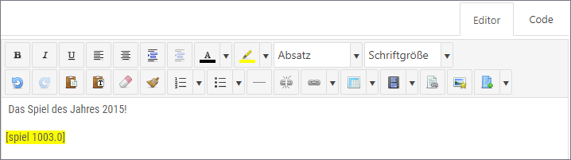

Um mehrere Spiele anzuzeigen, wird der Platzhalter `[spiel SPIELNUMMER_1;SPIELNUMMER_2; ...]` gesetzt:

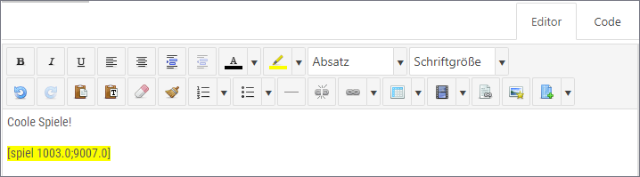

Es kann im Shorttag 'tabelle' angegeben werden:

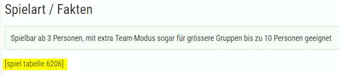

Dann werden die Spiel-Informationen in einer Tabelle dargestellt:

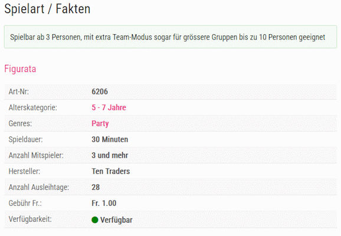

_Dieser Shortcode ist veraltet und durch den neuen `[lupo]`-Shortocde des LUPO-Spiel Editor-Button ersetzt worden. Er wird aber weiterhin unterstützt._

## LUPO-Spiel Editor-Button

Unterhalb des Editors wird neben den Joomla Editor-Buttons der LUPO-Spiel Button angezeigt: 

Dadurch kann ein `[lupo]`-Shortcode in den Beitrag eingefügt werden, welcher dann auf der Webseite als Spielfoto oder Tabelle mit den Spiel-Infos angezeigt wird:

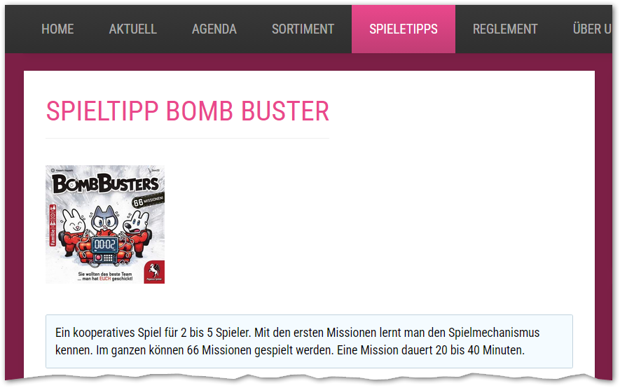

Im Editor im Joomla-Administrator wurde dazu der Shortcode `[lupo spiele="7268" nolink="1" columns="4"]` gespeichert.

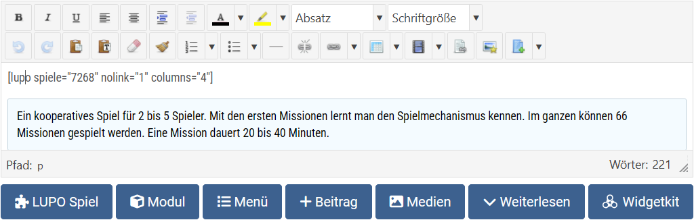

Der Clou am **LUPO Spiel** Button ist, dass der Syntax nicht auswendig gelernt werden muss, sondern Inhalt und Aussehen der Anzeige des Spiels im Formular definiert werden kann:

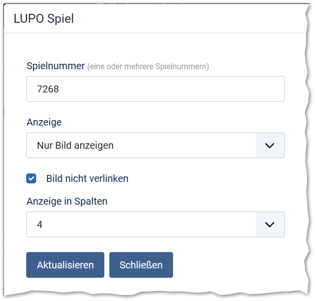

### Spielnummer(n):
Es können eine oder mehrere Spielnummern in das Feld eingetragen werden, getrennt mit Leerschlag oder Komma.

### Anzeige:
- Nur Bild anzeigen
- Nur Tabelle anzeigen
- Alles anzeigen

### Bild nicht verlinken:
Der Link zu der Spiel-Detailseite kann deaktiviert werden. Dies ist z. B. dann wünschenswert, wenn das Spiel in einer Artikel-Vorschau auf der Webseite angezeigt wird und man erwartet, dass der Besucher "Weiterlesen" klickt um alles im Beitrag angezeigt zu bekommen

### Anzeige in Spalten:
Bestimmt die Breite des angezeigten Bildes:
- 1 = 100%
- 2 = 50%
- 3 = 33%
- 4 = 25%
- 5 = 20%
- 6 = 16.6%

Werden mehrere Spielnummern aufgelistet werden die Spielfotos nebeneinander und untereinander entsprechend der Spalteneinstellung angezeigt.
Bei 9 aufgeführten Spielen und 6 Spalten sieht es folgendermassen aus:

Shortcode: `[lupo spiele="1000,1002,1003;1005;1006;1007;1008;1009;1010;1000" columns="6"]`

Wenn bei Anzeige **"Tabelle"** gewählt wird, dann wird das Spiel so angezeigt:

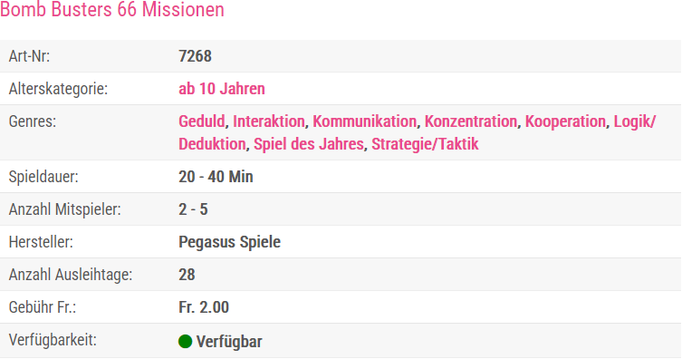

Und bei der Einstellung **"Alles anzeigen"** wird dasselbe Layout, wie bei der Detailansicht im Sortiment angezeigt:

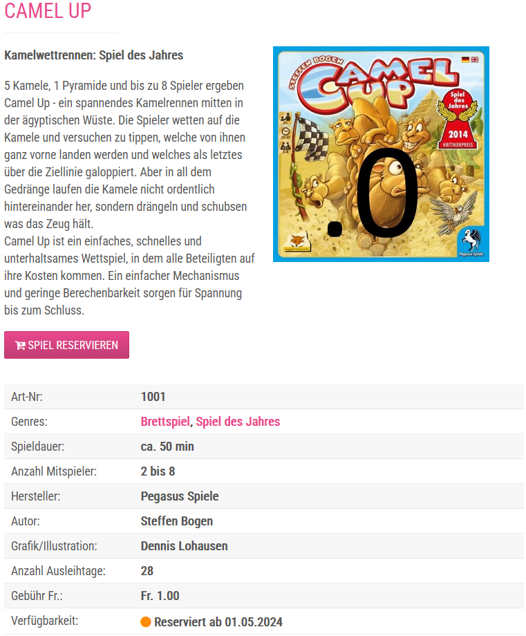

Sämtliche Darstellungsoptionen in der Tabellen- und Komplett-Ansicht werden bei den LUPO-Spielliste Komponenten Optionen kontrolliert. Wenn z. B. der Reservations-Button nicht angezeigt werden soll, dann kann das nur erreicht werden, wenn die Reservations-Funktion bei den Joomla-Optionen der LUPO-Komponente deaktiviert wird.

Sind mehrere Spielnummern aufgelistet und die Anzeige ist nicht Bild, dann werden die einzelnen Spiele untereinander und nicht in Spalten dargestellt.

## Inhalt - LUPO Zufälliges Zitat

Mit diesem Plugin ist es möglich, ein zufälliges Zitat gemäss dem definiertem Anzeige-Template in der Webseite einzubetten:

Die zur Auswahl stehenden Zitate sind unter **Erweiterungen → Plugins** bei den Plugin-Optionen definiert:

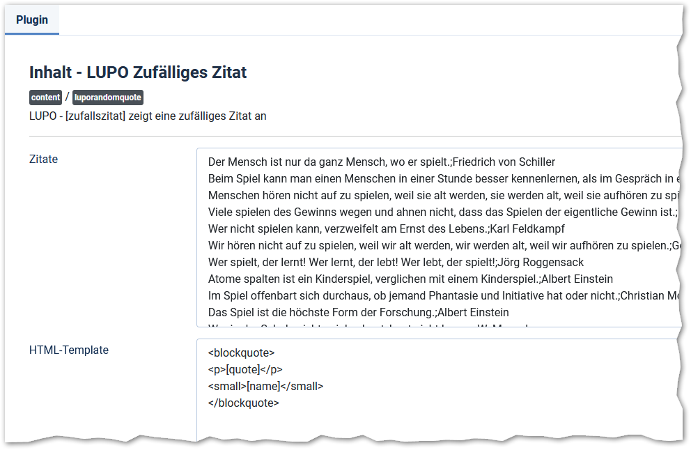

Im Textefeld **Zitate** sind alle zur Auswahl stehenden Zitate definiert. Das Plugin wird mit einer Auswahl an vordefinierten Zitaten ausgeliefert. Sie können nicht erwünschte Zitate löschen oder weitere hinzufügen. Ein einzelnes Zitat muss aus einer Zeile stehen und der Urheber des Zitates mit einem Semikolon getrennt werden.

In die bei der Option **HTML-Template** definierte Design-Vorlage wird das Zitat gerendert. Im Platzhalter **[quote]** wird das Zitat platziert, bei **[name]** der Urheber.

Anstelle des vorgegebenen Templates könnte z.B. auch folgendes Layout verwendet werden:

`
[quote] <em>[name]</em>
`

!! **Platzhalter in eigenen Modulen**  
!! Beachten Sie, dass Platzhalter in einem eigenen Modul nur verarbeitet werden, wenn unter **Optionen** bei **Inhalte vorbereiten** der Wert **Ja** gespeichert ist.

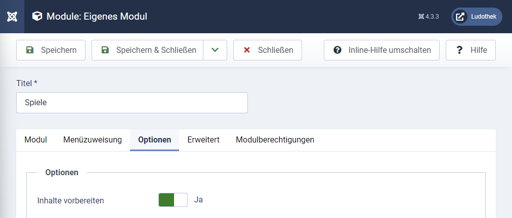

## Inhalt - LUPO Datenschutzerklärung

Mit den Shortcode `[datenschutz]` kann die Datenschutzerklärung im Text eingefügt werden.

Bei den Plugin-Optionen kann definiert werden, welche Abschnitte der Datenschutzerklärung angezeigt werden sollen.
