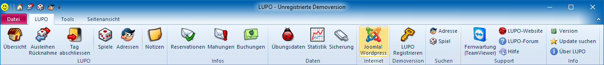
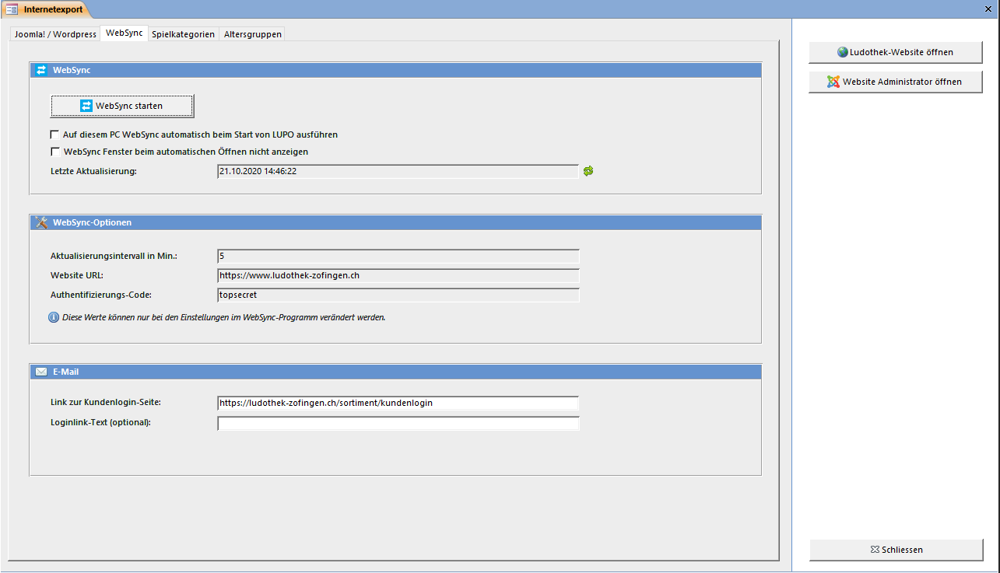

Das Exportfenster kann im LUPO-Menü mit dem Button Joomla! / Wordpress geöffnet werden:

Das Internetexport-Fenster öffnen Sie mit dem Menübefehl **Joomla! / Wordpress:**

Mit dem Knopf **Exportdatei erstellen** wird eine zip-Datei mit den gewählten Einstellungen und Inhalten erstellt.

