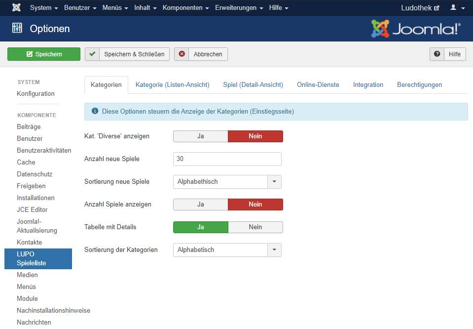
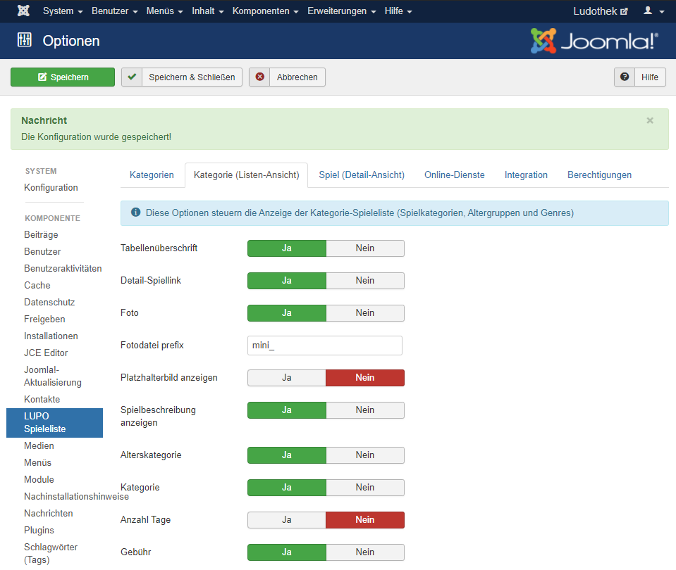
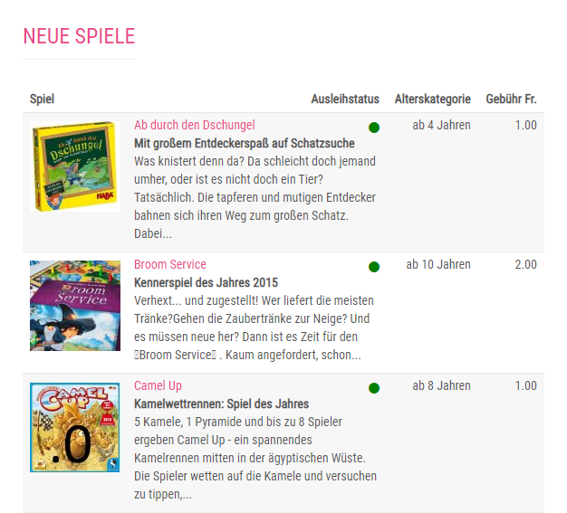
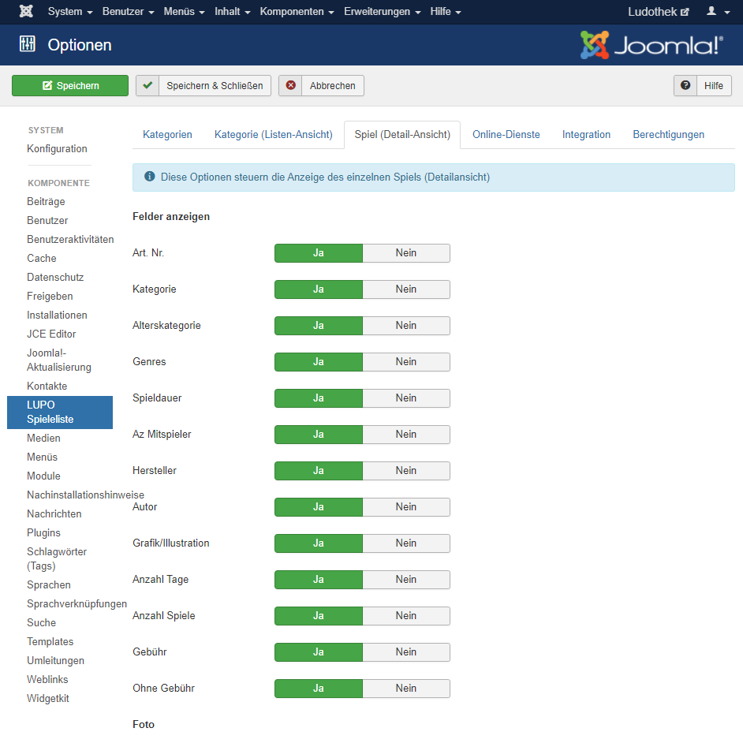
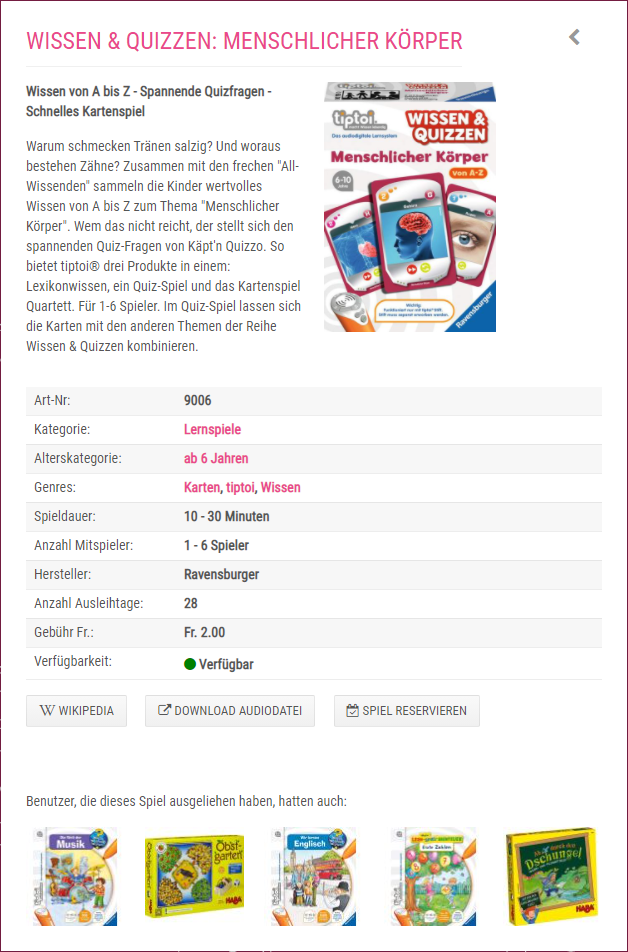
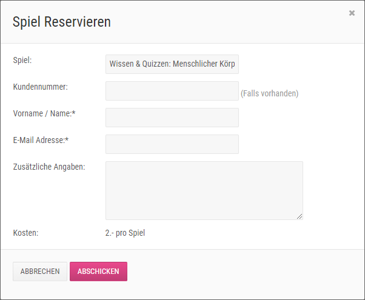
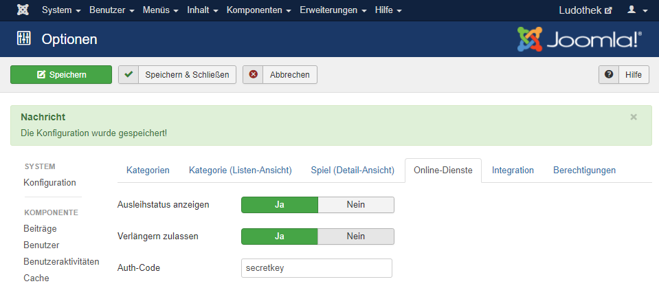
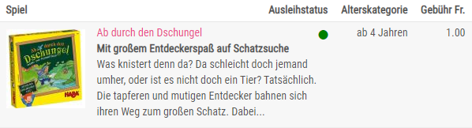
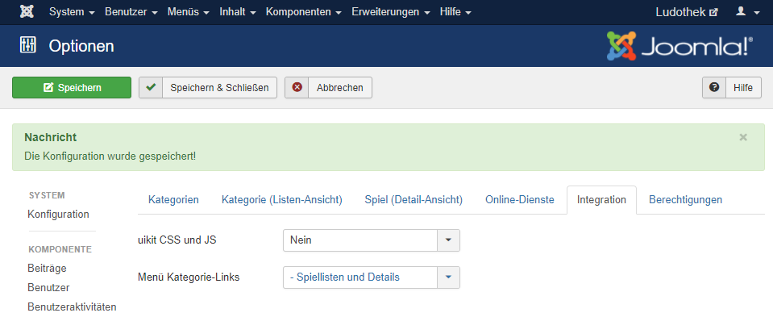

Unter **System** → **Konfiguration** → **LUPO Spielliste** befindet sich diese Kategorie. Mithilfe der Kategorie **LUPO Spielliste** kann die Seitenansicht bearbeitet werden.

Unter **Kategorie (Listen-Ansicht)** kann der Vorschau, der Spiele bearbeitet werden. **Anzahl-Tage** zeigt die Anzahl Tage zum Ausleihen an.

Unter **Spiel (Detail-Asnicht)** kann man die Detailansicht des Spiels bearbeiten. 

Unter **Reservation** können Sie das "Spiel Reservieren-Formular" bearbeiten. Um auf dieses Formular zu gelangen, muss man bei der Detailanischt des Spiels auf Spiel Reservieren klicken.

Unter **Online-Dienste** kann der Ausleihstatus ein- und ausgeschaltet werden.

Unter **Integration** kann man bei **Menü Kategorie-Links** einstellen, ...?

