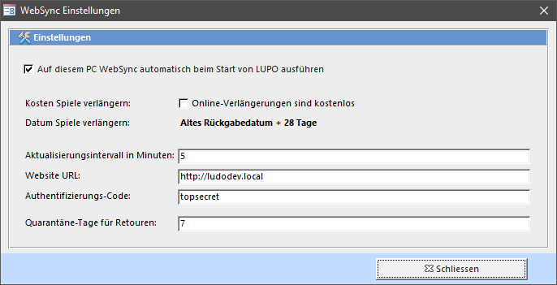

Auf der Webseite kann der Ausleihhstatus (ausgeliehen/verfügbar) des Spiels angezeigt werden:

Neben dem Ausleihstatus ist das WebSync Programm auch zuständig zur Übermittlung der vom Kunden ausgeliehenen Spiele (für Kundenlogin auf der Webseite) sowie zum Einlesen der durch den Kunden online getätigten Verlängerungen.

##WebSync einrichten

Das WebSync-Programm kann vom LUPO her gestartet werden:

Bei gesetztem Häkchen öffnet sich das Programm automatisch.

In den WebSync-Einstellungen können folgende Werte definiert werden:

**Aktualisierungsintervall in Minuten**  
In diesem Intervall werden die Daten auf den WebServer geladen bzw. von diesem abgerufen. Der Mindestwert beträgt 5 Minuten.

**Webseite URL**  
Tragen Sie hier die Adresse Ihrer Webseite ein, z.B. https://ludothek-zofingen.ch

**Authentifizierungs-Code**  
Dies ist das "Passwort" für den Dienst zum Schreiben und Lesen der Daten auf Ihrer Webseite. 
Derselbe Wert muss im Joomla-Administrator bei den LUPO-Optionen gespeichert werden:

**Quarantäne-Tage für Retouren**  
Falls bei Quarantäne-Tage eine Zahl eingetragen ist gelten zurückgebrachte Spiele für die Anzahl eingetragenene Tages über das Rückgabedatum hinaus als ausgeliehen.

##Einstellungen in Joomla  

Im Joomla-Administrator bei der LUPO-Komponente unter Optionen kann im Reiter **Online-Dienste** folgendes definiert werden:

Der Auth-Code muss mit dem im LUPO eingetragenen Wert korrespondieren. 
