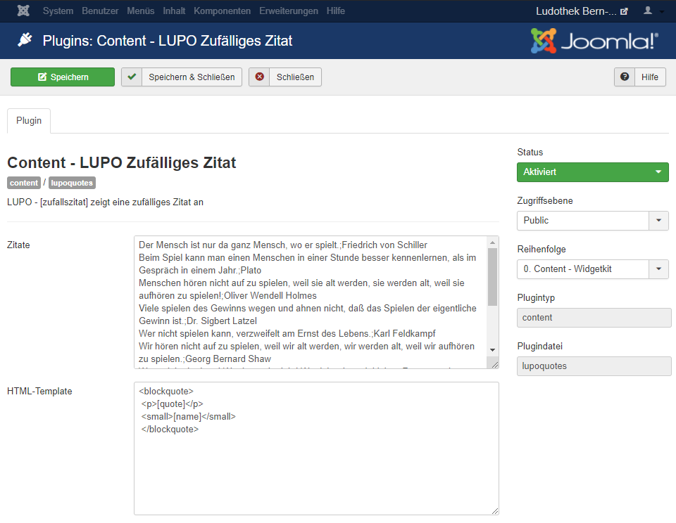
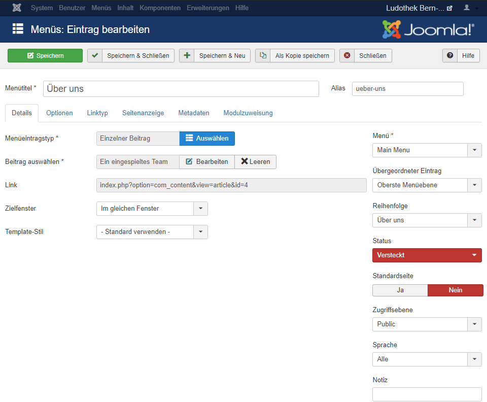
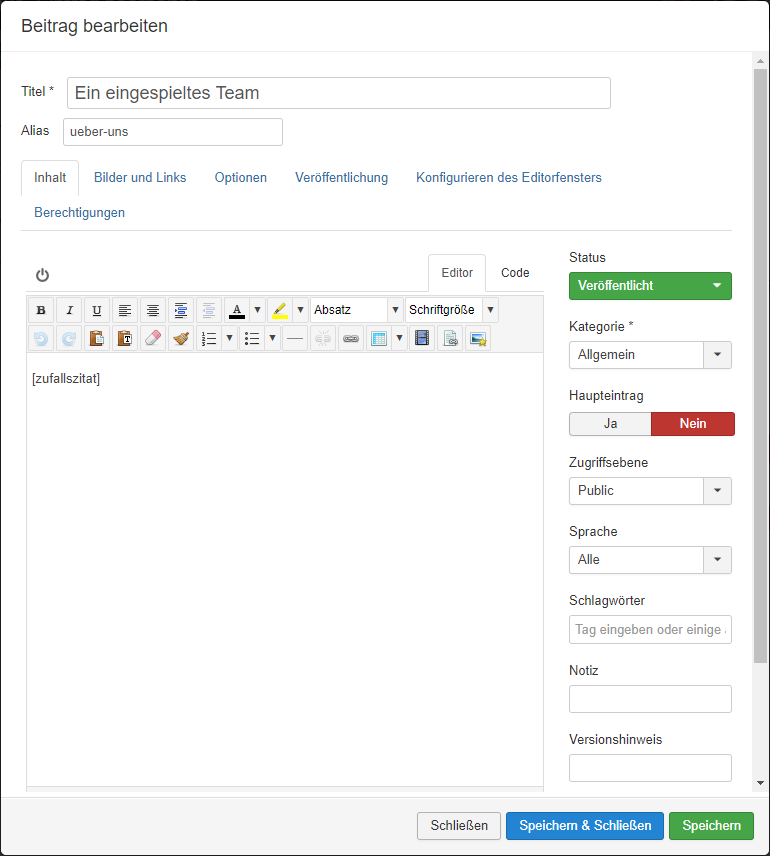

##Zitate erstellen und einrichten

Mit diesem Plugin ist es möglich, ein beliebiges Zitat beim Öffnen der Webseite anzuzeigen. Bsp:

Um eigene Zitate reinschreiben zu können, müssen Sie unter **Erweiterung** auf **Plugins** klicken. Bei der folgenden Liste befindet sich **Inhalt - LUPO Zufälliges Zitat**. Klicken Sie drauf.

 
Bei **Zitate** können Sie Ihre Zitate reinschreiben. Beachten Sie dabei, dass Sie den Autor mit einer Semikolon (;) abtrennen und nach einem Zitat einen Absatz machen. 

Wenn Sie dies getan haben, vergessen Sie nicht das zu speichern. Um dies zu tun, müssen Sie obenlinks auf **Speichern** klicken. 

##Zitate auf der Webseite anzeigen lassen

Diese Funktion funktioniert auf jeder beliebigen Seite. Ob Sie ein Zitat beim Start oder beim Kontakt haben wollen, spielt keine Rolle. 

Gehen Sie auf eine beliebige Seite, wo Sie ein Zitat haben wollen, Z.B. bei 'Über uns'.

Klicken Sie neben **Beitrag auswählen \* ** auf **Bearbeiten**. Im Editor können Sie bei einer beliebigen Stelle "[zufallszitat]" schreiben. Beachten Sie dabei, dass Sie ales speichern wenn Sie fertig sind. 

!! **Einstellung**  
!! Beachten Sie, dass Sie bei Module zusätlich noch unter **Optionen** bei **Inhalte vorbereiten** auf **Ja** drücken müssen, da dies ansonsten nicht funktionieren würde.